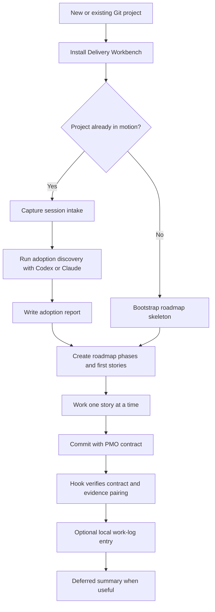
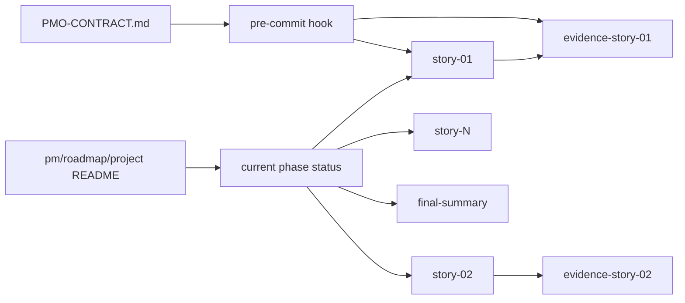
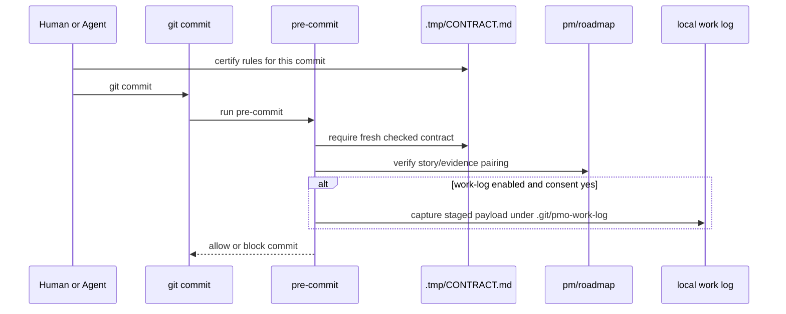
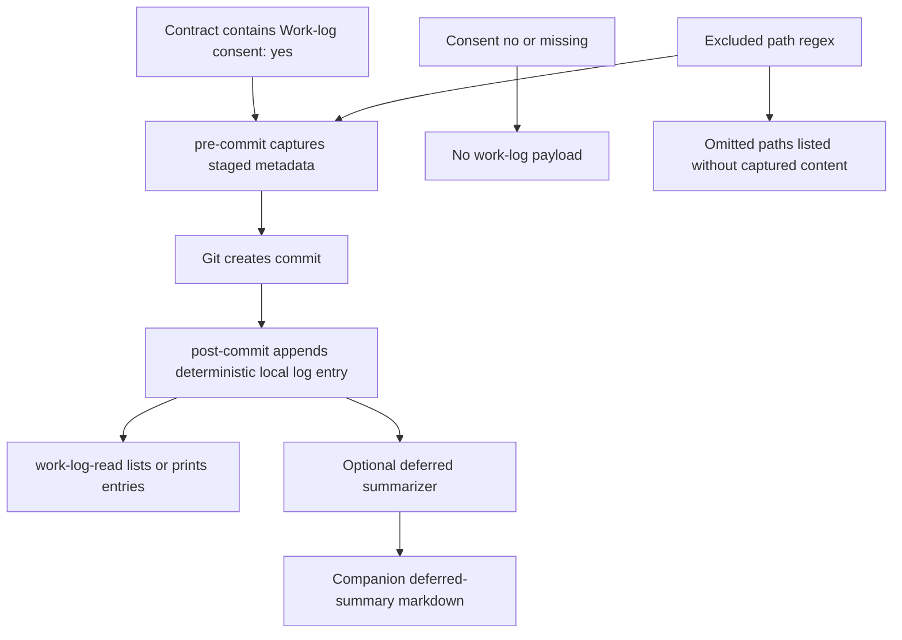

# Delivery Workbench


Delivery Workbench is an evidence-first operating framework for agentic
software delivery.

It gives an existing or new Git project:

- roadmap structure for phases, stories, and evidence
- commit-time PMO contracts
- mechanical story/evidence pairing checks
- optional local daily work logs
- deferred work-log summarization
- mid-project adoption discovery with Codex or Claude

The framework currently lives in [`pmo-roadmap/`](./pmo-roadmap/).

## Status

Experimental but usable. The project is intentionally opinionated and designed
for builders who want agent-assisted software work to leave a durable evidence
trail.

## System Flow



## Artifact Model



## Quick Start

Install into an existing Git project:

```bash
cd pmo-roadmap
./install.sh /path/to/project --skip-bootstrap
```

Run adoption discovery for an existing project:

```bash
./bootstrap/session-intake.sh /path/to/project \
  --project-name "My Project" \
  --project-slug myproject \
  --project-prefix MP

./bootstrap/adopt-project.sh /path/to/project \
  --project-name "My Project" \
  --project-slug myproject \
  --project-prefix MP \
  --require-intake
```

`session-intake.sh` runs as a guided terminal interview when attached to a TTY:
it shows a compact banner, offers numbered choices, captures checkbox-style
priorities, and asks for the goal, direction, constraints, and handoff. In
automation, pass the same values as flags and add `--no-prompt`.

Bootstrap a new roadmap:

```bash
./bootstrap/new-project.sh /path/to/project myproject "My Project" MP
```

## Terminal Demos

Charm VHS tapes live in [`demos/`](./demos/):

- [`demos/onboarding.vhs`](./demos/onboarding.vhs) records guided intake and
  adoption prompt generation.
- [`demos/commit-gate.vhs`](./demos/commit-gate.vhs) records the commit hook
  blocking an uncontracted commit, then accepting a fresh contract and writing
  the consented work log.

### Onboarding


### Commit Gate


Render them with:

```bash
vhs demos/onboarding.vhs
vhs demos/commit-gate.vhs
```

## Commit-Time Flow



## Work-Log Flow



## Why

Agentic coding work can move fast enough that project memory becomes the
bottleneck. Delivery Workbench treats planning, verification, and commit-time
intent as first-class artifacts.

The goal is not ceremony. The goal is recoverable delivery: a future human or
agent should be able to inspect the repository and understand what shipped,
why it mattered, what proved it, and where the next responsible move begins.

## Documentation

- [Framework README](./pmo-roadmap/README.md)
- [PMO contract](./pmo-roadmap/templates/PMO-CONTRACT.md)
- [Roadmap builder methodology](./pmo-roadmap/templates/roadmap-builder.md)
- [Brand notes](./pmo-roadmap/brand/delivery-workbench.md)

## Validation

```bash
bash -n pmo-roadmap/bin/work-log-read \
  pmo-roadmap/bin/work-log-summarize \
  pmo-roadmap/bootstrap/adopt-project.sh \
  pmo-roadmap/bootstrap/new-project.sh \
  pmo-roadmap/bootstrap/session-intake.sh \
  pmo-roadmap/hooks/pre-commit \
  pmo-roadmap/hooks/post-commit \
  pmo-roadmap/install.sh \
  pmo-roadmap/update.sh \
  pmo-roadmap/tests/adoption-discovery.sh \
  pmo-roadmap/tests/work-log-mvp.sh

pmo-roadmap/tests/adoption-discovery.sh
pmo-roadmap/tests/work-log-mvp.sh
```

## License

MIT.
