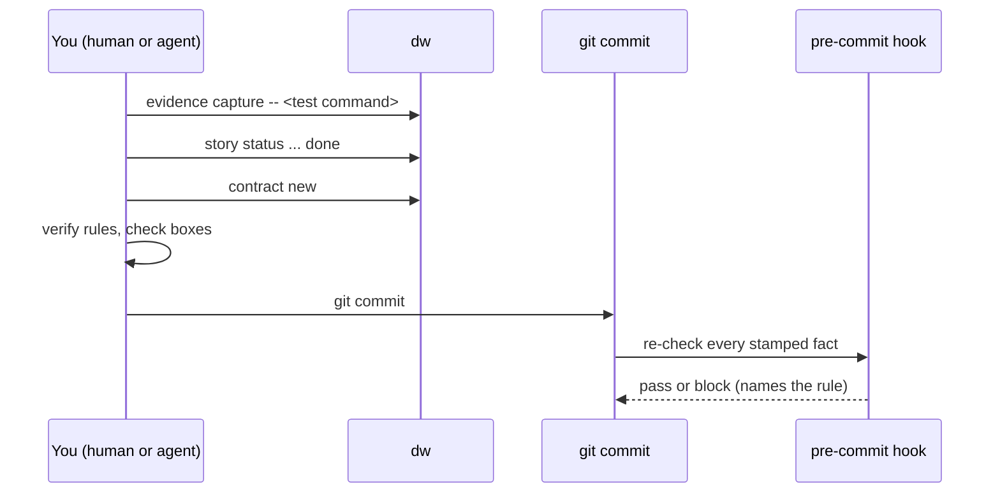

# Delivery Workbench

[](https://github.com/karolswdev/delivery-workbench/actions/workflows/validation.yml)
[](https://pypi.org/project/delivery-workbench/)
[](./LICENSE)


<!-- BEGIN EVERYDAY PRODUCT GUIDE -->
Delivery Workbench keeps your work honest. You plan in Markdown, prove
your work ran, and every commit checks that the proof matches. Humans
and AI agents use the same commands and see the same facts.
<!-- END EVERYDAY PRODUCT GUIDE -->

## Install

```bash
pipx install delivery-workbench   # or: brew install karolswdev/tap/delivery-workbench
```

Set up any Git repo:

```bash
dw install /path/to/repo
```

Or start fresh:

```bash
mkdir my-project && dw init my-project
```

## The loop

The whole workflow is four steps:

```bash
# 1. See where you are
dw status

# 2. Do the work, then prove it
dw evidence capture myapp 2 3 -- npm test

# 3. Mark it done (refuses without proof)
dw story status myapp 2 3 done

# 4. Commit (the gate checks everything)
git add -A && dw contract new
# read .tmp/CONTRACT.md, verify each rule, check the boxes
git commit
```

That's it. The pre-commit hook re-derives every fact in the contract.
If something doesn't match, it tells you what failed and how to fix it.


```mermaid
sequenceDiagram
  participant You as You (human or agent)
  participant DW as dw
  participant Git as git commit
  participant Gate as pre-commit hook

  You->>DW: evidence capture -- <test command>
  You->>DW: story status ... done
  You->>DW: contract new
  You->>You: verify rules, check boxes
  You->>Git: git commit
  Git->>Gate: re-check every stamped fact
  Gate-->>Git: pass or block (names the rule)
```

## What you get

Every commit carries its receipt:

```
$ git log -1 --format='%h %s%n%(trailers:key=PMO-Story)'
ec1fb4a Complete WLA-10-03: guarded mutation tools
PMO-Story: WLA-10-03
```

The story file states what had to be true. The evidence file proves
it was. The archived contract binds both to the exact staged tree.
`dw verify --all` re-checks the whole history from pushed commits
alone — CI catches anything that bypassed a local hook.

## Common commands

| Command | What it does |
|---|---|
| `dw status` | Where am I? What's next? |
| `dw next` | The next story to work on |
| `dw board` | Kanban view of all stories |
| `dw evidence capture <p> <ph> <st> -- <cmd>` | Run a command and record the proof |
| `dw story status <p> <ph> <st> <status>` | Move a story (refuses done without evidence) |
| `dw contract new` | Stamp the facts for your commit |
| `dw gate` | Dry-run the commit check |
| `dw check` | Lint the roadmap for issues |
| `dw doctor` | Diagnose the wiring in this clone |
| `dw verify [--all]` | Re-check history from pushed commits |

Run any command with `--help` for details. Most support `--json` for
machine-readable output.

## The web view

```bash
dw-workbench --root /path/to/repo
```

A localhost page for browsing phases, stories, evidence, and the
kanban board. It can preview and apply roadmap changes but never
commits for you.


## AI agents

The same CLI works from Claude Code, Codex, or any MCP client.
`dw install` vendors an MCP server (`.githooks/dw-mcp`) that
exposes the same operations as tool calls. An agent can take a story
from backlog to done through tools alone — with the same refusals a
human gets.

Two things stay manual on purpose: verifying the contract and
creating the commit.

## Going further

Delivery Workbench has optional layers for teams that need more
structure. These are all opt-in and don't change ordinary use:

- **Bounded runs** — compiled coordination scores with typed agents,
  checks, failure routes, budgets, and grants
  ([docs/orchestration.md](./docs/orchestration.md))
- **Delivery programs** — multi-phase workflows with roles,
  independent verification, and replay-safe conductors
  ([docs/programs.md](./docs/programs.md))
- **Mission control** — watch and steer from Telegram, HoldSpeak,
  or any client that reads the event feed
  ([docs/mission-control.md](./docs/mission-control.md))

## This repo runs on it

Every phase and story of this project shipped through its own gate.
The full trail is in
[pmo-roadmap/pm/roadmap/work-log-automation/](./pmo-roadmap/pm/roadmap/work-log-automation/).

## Docs

- [Everyday delivery](./docs/everyday-delivery.md) — the full walkthrough
- [Architecture](./docs/architecture.md) — how it works, with the test that proves each claim
- [MCP surface](./docs/mcp.md) — tool schemas and design
- [The contract rules](./pmo-roadmap/templates/PMO-CONTRACT.md)
- [Contributing](./CONTRIBUTING.md) and [changelog](./CHANGELOG.md)

Full documentation index: [docs/](./docs/)

## Tests

```bash
cd pmo-roadmap/tests && python3 dw-core-tests.py
```

CI runs the full suite on Ubuntu and macOS, with floor-version
coverage on Python 3.9 and history verification on every push.

## License

[MIT](./LICENSE)
