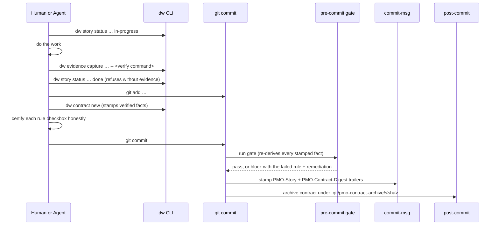
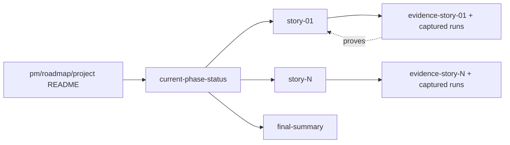
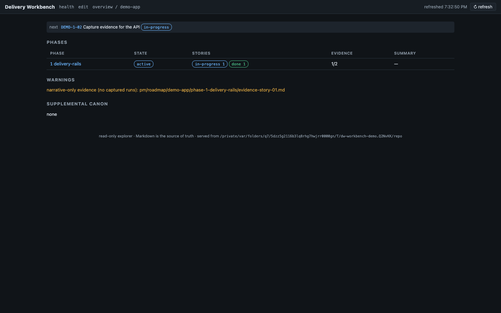
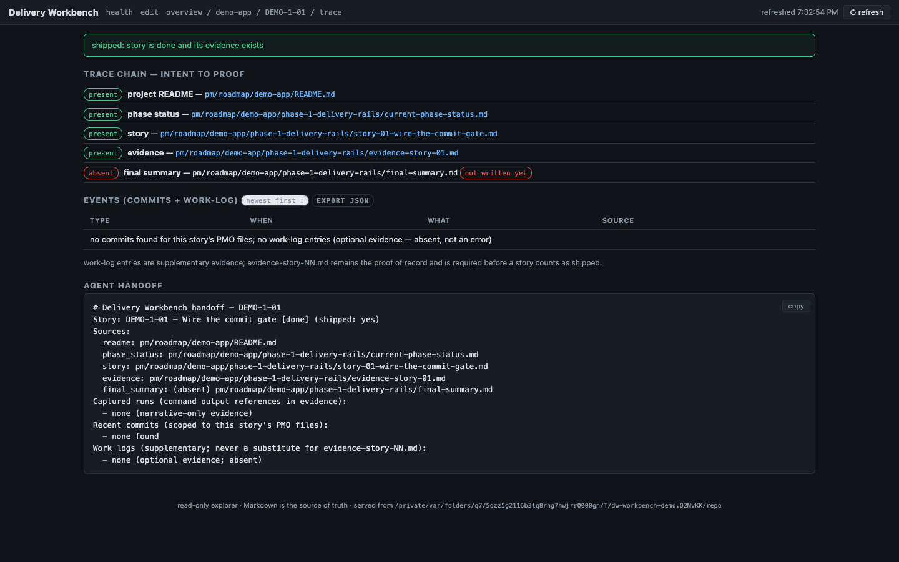
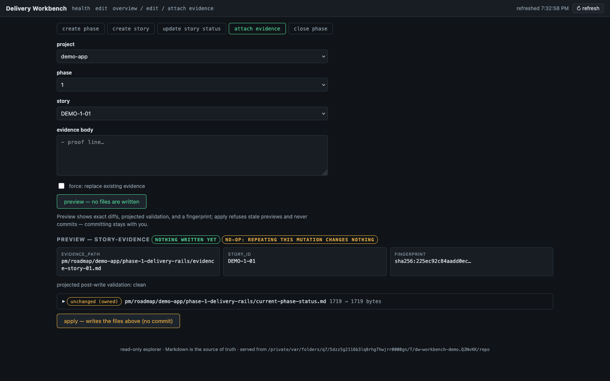

# Delivery Workbench


**Evidence-first rails for agentic software delivery.** Delivery
Workbench turns a Git repository into a self-verifying delivery
system: work is planned as Markdown roadmaps, proven by paired
evidence files with captured command runs, and gated at commit time
by machine-verified contracts. It is built for humans and AI agents
working the same repo — and it ships its own roadmap, built entirely
on its own rails.

Adopt an existing project in three commands:

```bash
pmo-roadmap/install.sh /path/to/project --skip-bootstrap
pmo-roadmap/bootstrap/adopt-project.sh /path/to/project \
  --project-slug myproject --project-prefix MP --with-intake --agent claude
# then, inside the project:
.githooks/dw adopt --from-report pm/roadmap/myproject/adoption/adoption-discovery.md --apply
```

Finish with `.githooks/dw doctor` (proves the wiring) and pick up work
with `.githooks/dw next`.

What to expect from step 2: `--agent claude` spawns a read-only
discovery agent whose stdout becomes the report — it typically takes
5–15 minutes and needs the `claude` CLI authenticated in headless
contexts; when stdin is not a TTY, `--with-intake` records a
placeholder intake and discovery flags intent as unresolved (fill the
intake, or pass answers as flags, to get a directed roadmap).

## Install without cloning

The framework also builds as the `delivery-workbench` package: a
global `dw` carrying the bootstrap verbs (`install`, `update`,
`adopt-project`, `new-project`, `intake`) plus the full vendorable
payload. Inside an adopted repository the global `dw` always defers
to the repo's own `.githooks/dw` — the vendored rails remain the
only gating authority (see
[docs/distribution.md](./docs/distribution.md)).

Until PyPI/tap publication lands, both channels install from a local
build of this repository:

```bash
# pipx / pip
pipx run build && pipx install dist/*.whl

# Homebrew (from the tracked formula; the smoke test wires a local tap)
pmo-roadmap/tests/brew-formula-smoke.sh
```

Then adopt any repo with `dw install /path/to/repo` and keep it
fresh with `dw update /path/to/repo` (`--check` reports staleness
without writing).

## What you get

- **A Markdown roadmap** under `pm/roadmap/<project>/` — phases,
  stories, paired evidence files, final summaries. No database, no
  tracker: the files are the source of truth.
- **The `dw` CLI** — orient (`next`, `context`, `check`), maintain
  (`phase`/`story` commands with preview-safe writes), and prove
  (`evidence capture` records real command runs into evidence).
- **A commit gate with verified contracts** — `dw contract new`
  stamps machine-checked facts (branch, HEAD, `git write-tree` index
  tree, staged sample, story IDs); the gate re-derives each at commit
  time. One story ships per commit, always with its evidence.
- **A durable audit trail** — every gated commit carries `PMO-Story:`
  and `PMO-Contract-Digest:` trailers, and the exact certified
  contract is archived under `.git/pmo-contract-archive/<sha>`.
- **History verification** — `dw verify` re-derives the structural
  rules from pushed commits alone (story flips, evidence pairing,
  trailers), so CI catches what a bypassed local gate let through;
  see [docs/remote-verification.md](./docs/remote-verification.md).
- **The workbench** — a localhost web view (`dw-workbench`): project
  overview, health console, intent-to-proof trace timeline, and a
  guarded editor whose writes go through preview → diff →
  fingerprint-verified apply. It never commits.
- **Optional local work logs** — consent-gated daily delivery logs
  with mechanical path exclusion and deferred summarization.
- **An agent surface** — a managed `CLAUDE.md` block, slash commands,
  JSON/porcelain outputs, and strict exit-code contracts so agents
  can operate the rails headlessly.

## How a change ships


```mermaid
sequenceDiagram
  participant Dev as Human or Agent
  participant DW as dw CLI
  participant Git as git commit
  participant Gate as pre-commit gate
  participant Msg as commit-msg
  participant Post as post-commit

  Dev->>DW: dw story status … in-progress
  Dev->>Dev: do the work
  Dev->>DW: dw evidence capture … -- <verify command>
  Dev->>DW: dw story status … done (refuses without evidence)
  Dev->>Git: git add … 
  Dev->>DW: dw contract new (stamps verified facts)
  Dev->>Dev: certify each rule checkbox honestly
  Dev->>Git: git commit
  Git->>Gate: run gate (re-derives every stamped fact)
  Gate-->>Git: pass, or block with the failed rule + remediation
  Git->>Msg: stamp PMO-Story + PMO-Contract-Digest trailers
  Git->>Post: archive contract under .git/pmo-contract-archive/<sha>
```

The artifact model behind it:


```mermaid
flowchart LR
  R[pm/roadmap/project README] --> P[current-phase-status]
  P --> S1[story-01]
  P --> S2[story-N]
  S1 --> E1[evidence-story-01 + captured runs]
  S2 --> E2[evidence-story-N + captured runs]
  P --> F[final-summary]
  E1 -.proves.-> S1
```

## The workbench

`dw-workbench --root /path/to/repo` serves a localhost-only web view
of the roadmap: browse projects and phases, read story/evidence pairs,
see validation drift on the health console, follow a story's
intent-to-proof trace (files → trailer-stamped commits → work logs),
and edit through guarded preview→apply mutations. The runtime boundary
is strict and tested: localhost binding, one repo root, writes only
inside `pm/roadmap/**`, no staging, no commits. See the
[framework README](./pmo-roadmap/README.md#workbench-the-local-web-view)
for usage and the full API.







The screenshots are real captures of the workbench serving a fixture
roadmap, regenerated by
[`demos/scripts/capture-workbench-demo.sh`](./demos/scripts/capture-workbench-demo.sh)
— which also renders an animated tour, in
[`demos/`](./demos/README.md).

## Terminal demos

Charm VHS tapes live in [`demos/`](./demos/), each regenerated by the
script named next to it there:


Render them with `vhs demos/onboarding.vhs` and
`vhs demos/commit-gate.vhs`.

## Why

Agentic coding moves fast enough that project memory becomes the
bottleneck — and "done" claims outrun proof. Delivery Workbench makes
planning, verification, and commit-time intent first-class, mechanical
artifacts. The goal is recoverable delivery: a future human or agent
can inspect the repository and understand what shipped, why it
mattered, what proved it, and where the next responsible move begins.

This repository practices what it enforces: every phase and story of
the framework itself was shipped through its own gate, with evidence,
contracts, trailers, and archives — inspect
[`pmo-roadmap/pm/roadmap/work-log-automation/`](./pmo-roadmap/pm/roadmap/work-log-automation/)
for the complete audit trail.

## Documentation

- [Architecture guide](./docs/architecture.md) — how the six
  subsystems work and what proves each claim
- [Framework README](./pmo-roadmap/README.md) — install, update,
  adopt, operate
- [PMO contract](./pmo-roadmap/templates/PMO-CONTRACT.md) — the rules
  and the contract template (canonical)
- [Roadmap builder methodology](./pmo-roadmap/templates/roadmap-builder.md)
- [Contributing](./CONTRIBUTING.md) — clone to gated commit, on the
  rails you are contributing to
- [Changelog](./CHANGELOG.md) — releases derived from the phase final
  summaries
- [Security and privacy](./SECURITY.md)
- [Brand notes](./pmo-roadmap/brand/delivery-workbench.md)

## Validation

```bash
python3 -m py_compile pmo-roadmap/bin/dw pmo-roadmap/bin/dw-workbench
python3 -m compileall -q pmo-roadmap/lib/dw_pmo
python3 pmo-roadmap/tests/dw-core-tests.py
pmo-roadmap/tests/adoption-discovery.sh
pmo-roadmap/tests/agent-surface.sh
pmo-roadmap/tests/canon-lint.sh
pmo-roadmap/tests/gate-parity.sh
pmo-roadmap/tests/roadmap-cli.sh
pmo-roadmap/tests/work-log-mvp.sh
pmo-roadmap/tests/workbench-explorer.sh
pmo-roadmap/tests/workbench-ui-smoke.sh
pmo-roadmap/tests/plugin-validate.sh
pmo-roadmap/tests/docs-lint.sh
pmo-roadmap/tests/docs-snippet-smoke.sh
pmo-roadmap/bin/dw check work-log-automation
shellcheck -e SC2317 pmo-roadmap/install.sh pmo-roadmap/update.sh \
  pmo-roadmap/hooks/* pmo-roadmap/bin/work-log-* \
  pmo-roadmap/bootstrap/*.sh pmo-roadmap/tests/*.sh demos/scripts/*.sh
```

CI runs all of it on ubuntu and macos, plus the core suite on the
declared python3 3.9 floor and the headless viewport smoke where
Firefox is available.

## Status

Experimental but battle-used: the framework has shipped its own
seven-phase roadmap through its own gate. Intentionally opinionated,
built for builders who want agent-assisted work to leave a durable
evidence trail.

## License

[MIT](./LICENSE).

