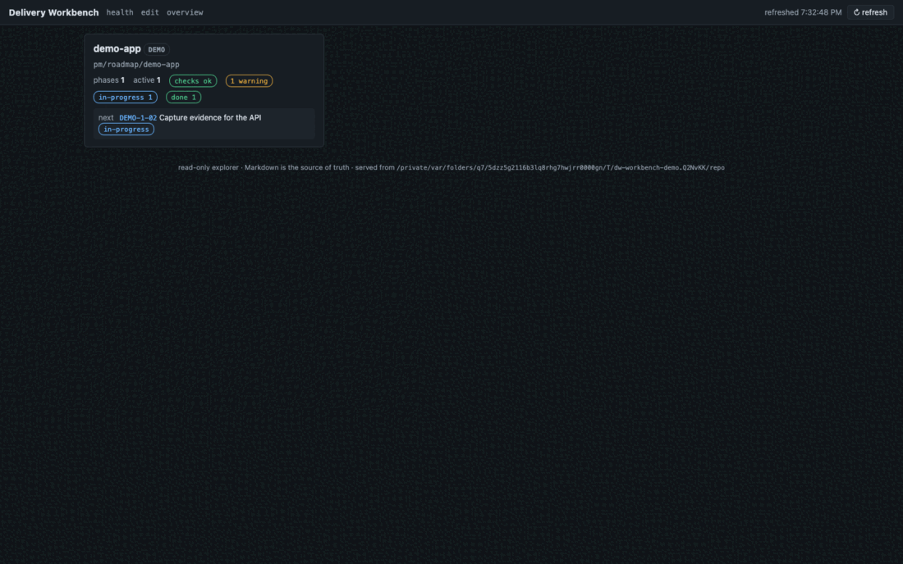

# Demos

Every rendered demo in this repository is regenerated from current
sources by a checked-in script — assets are documentation and get the
same treatment as code.

| Asset | Shows | Regenerate with |
|---|---|---|
| `rendered/onboarding.gif` | guided session intake, then adoption prompt generation | `vhs demos/onboarding.vhs` |
| `rendered/commit-gate.gif` | the commit hook blocking a missing contract, then accepting a certified one and appending a consented work-log entry | `vhs demos/commit-gate.vhs` |
| `rendered/workbench-tour.gif` | the workbench web view: overview → project → health → trace → guarded editor → preview/diff | `demos/scripts/capture-workbench-demo.sh` |
| `rendered/full-pipeline.mp4` | the whole pipeline on film: empty directory → `dw init` → intake → Workbench review → setup lease → gated adopt → finite grant → live claude+codex delivery → certified handoff → operator ship → the game played in two browser clients | the segment ritual in [`full-pipeline/README.md`](./full-pipeline/README.md) (live riders; costs real provider money) |

The terminal tapes are Charm VHS sources and require the `vhs` CLI;
run them from the repository root. Their helper scripts
(`scripts/prepare-*.sh`) build throwaway repositories under `/tmp` and
never touch the current checkout. The workbench tour needs Firefox and
ImageMagick: it drives a fixture roadmap through `bin/dw`, serves it
with `bin/dw-workbench`, and screenshots the live UI headlessly — the
same script also produces the README stills under
[`assets/`](../assets/). `--smoke` runs the full capture into a temp
directory (used by CI; skips cleanly when the tools are absent).

## Rendered assets

Only the published GIFs above are tracked; other generated files in
`demos/rendered/` stay ignored.
