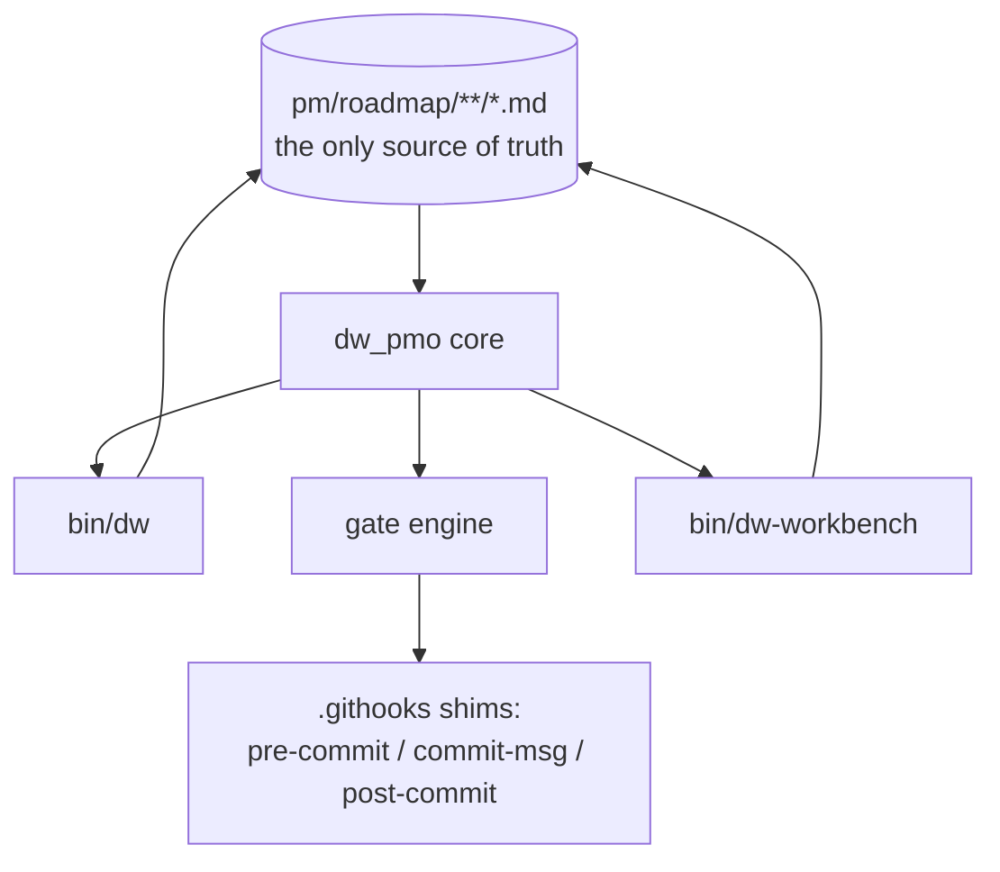
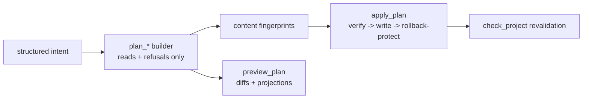
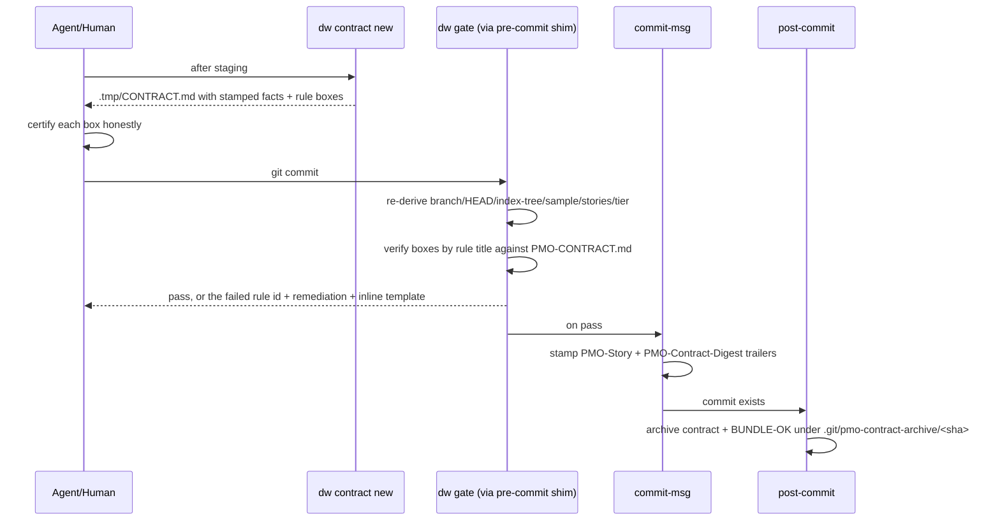
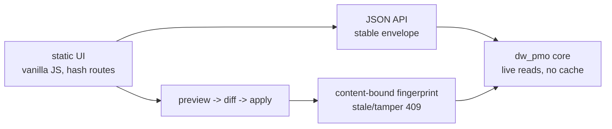

# Delivery Workbench — Architecture

How the six subsystems fit, and — because this framework distrusts
unproven claims, including its own — **every behavioral statement here
names the test or command that proves it.** The proving suites run in
CI on every push (`.github/workflows/validation.yml`).

One core, three adapters. The CLI, the commit gate, and the workbench
all call the same parsers, validators, planners, and renderers — there
is no second implementation of any rule anywhere (proof: the hooks are
shims with zero rule logic, `tests/gate-parity.sh` runs identical
fixtures through `dw gate` and a real `git commit` and asserts the
verdicts match).

## 1. The core (`lib/dw_pmo/`)

Pure-python (stdlib only, floor 3.9 — proof: the `python-floor` CI job
runs the full unit suite on 3.9), organized as small modules: `model`
(vocabulary and dataclasses), `paths`/`gitio` (filesystem and git
plumbing), `parse` (roadmap discovery), `validate` (structural checks
and drift warnings), `trace` (commit and work-log correlation),
`render`/`mutations` (content generation and guarded writes), `api`
(context envelopes, timelines, handoffs), plus `gate`, `contract`,
`evidence`, `agentdocs`, `doctor`, `status`, `adopt`, and `workbench`.

`status` is the read-only composition root for an agent's first question. It
joins doctor, roadmap validation, git/contract/gate state, current progress,
holds, and the next story into the versioned
`delivery-workbench-status@1` object, then applies one explicit action
precedence. It performs no network access or writes—not even a state-feed
event—and repeated calls over unchanged inputs are byte-identical (proof:
`StatusBriefingTest` in `tests/dw-core-tests.py` and the installed-repository
assertions in `tests/roadmap-cli.sh`). The packaged system proof is
`tests/guided-status-loop.sh`: one fresh consumer receives equal CLI, MCP,
and HTTP objects at each transition and reaches a verified gated commit by
executing the recommended argv (manual certification remains manual).

The status vocabulary is defined once (`model.STORY_STATUSES`:
`backlog | ready | in-progress | blocked | done`, with done-synonyms
`complete | closed | shipped`) and a doc-parity unit test fails if the
methodology document disagrees (proof:
`tests/dw-core-tests.py::test_story_vocabulary_doc_parity`).

Mutations are two-step primitives: a `plan_*` builder performs all
refusal checks and records each target's current content; `apply_plan`
re-verifies those fingerprints, writes atomically with rollback, and
revalidates (proof: `test_apply_rolls_back_on_write_failure` shows the
first write restored when a later one fails).

## 2. The commit gate and contract v2

The contract is generated, never hand-typed: `dw contract new` stamps
machine-verified facts — branch, HEAD, the staged `git write-tree`
index tree, a staged-path sample, detected story IDs, and the
contract tier — and the gate re-derives every fact at commit time.
Freshness is cryptographic: restaging changes the index tree, so the
old contract is refused, and `touch` cannot resurrect it (proof:
`test_index_tree_mismatch_and_touch_bypass_dead`).

Structural rules enforced per commit (each with a stable rule id in
porcelain output — proof: every failing scenario in
`tests/gate-parity.sh` asserts its exact `rule=` id, and the unit
suite covers the full rule family): one story flips done per commit
(bundles need an explicit `BUNDLE-OK.md` rationale), the flipped
story's evidence ships in the same commit, evidence never appears or
disappears orphaned, and checked boxes must match the rules document
by title — canonical rules plus any project extensions (proof:
gate-parity S13 adds an 8th rule and watches both generator and gate
require it).

Ceremony is proportional: commits that touch no roadmap files get a
short tier (one no-bypasses box); roadmap commits and story flips get
the full contract; `--tests-capture` references a passing captured
run in staged evidence to discharge the "Tests ran." box mechanically,
re-verified by the gate (proof: `test_tests_capture_discharge_and_tamper`).

The trail is durable and queryable: trailers on every gated commit,
the exact certified contract archived per sha, and an aborted commit
leaves the contract in place for the retry (proof:
`tests/work-log-mvp.sh` aborted-commit scenario; inspect any commit
with `git log --format='%(trailers)'`).

## 3. Evidence capture

Evidence files carry proof, not prose. `dw evidence capture <project>
<phase> <story> -- <command>` appends a machine-parseable block — UTC
timestamp, exact command, cwd, exit code, index tree, and byte-capped
fenced output with an explicit truncation marker — and mirrors the
command's exit code (proof: `tests/roadmap-cli.sh` capture scenarios,
including nonzero exits and oversized output).

`dw check` refuses done stories whose evidence is a placeholder or
empty, and existence-checks referenced assets under `assets/`;
narrative-only evidence (no captured run) is a named warning, not an
error (proof: unit tests for `evidence_content_issues` and the
`narrative-only evidence` warning).

## 4. The workbench

A localhost web view over the same core: explorer, health console
(structured drift classification with explanations), the
intent-to-proof trace timeline (chain hops with explicit absent
states; commit events carry the PMO trailers; work-log entries merge
in), agent handoff text, a work-log viewer, and a guarded editor.

The runtime boundary is deliberately boring and fully tested
(`tests/workbench-explorer.sh`, plus the WLA-5-09 unit family):
127.0.0.1 only; refuses roots without a roadmap and busy ports with
remediation in the message; rejects non-local `Host` headers, CORS
preflights, path traversal, and slugs outside `[a-z0-9-]`; reads
degrade to explicit absent states; repeated reads leave the tree
checksum-identical; writes happen only through fingerprint-verified
apply inside `pm/roadmap/**`; and **no endpoint stages or commits**
(proof: the suite asserts `git ls-files` stays empty through every
preview/apply cycle). Mutations are guarded while validation issues
exist — except mutations whose projected post-write issue set strictly
shrinks the current one, because a fix is never ambiguous (proof:
`test_guard_lets_remediation_through`).

The overview's first component renders `GET /api/status` without adding
policy: verdict, selected project, workspace/contract/gate facts, and exactly
one action. Command arrays stay visually tokenized as argv; judgment calls say
`manual act`; there is no execute or commit control. Attention and ambiguous
selection get stronger visual treatment than normal ready state (proof:
`tests/workbench-ui-smoke.sh` renders ready, attention, and multi-project
manual states at both desktop and mobile widths, while its renderer contract
rejects raw JSON or an action button).

Viewport rendering is smoke-tested headlessly at desktop and mobile
(`tests/workbench-ui-smoke.sh`, CI-run where Firefox exists).

## 5. Work logs

Opt-in, consent-gated, deterministic. With `PMO_WORK_LOG_ENABLED=1`
and explicit `**Work-log consent:** yes` in the contract, `pre-commit`
captures the staged payload (exclusion regex applied mechanically —
omitted paths are listed, never contented) and `post-commit` appends a
deterministic entry to the local daily log after the commit exists.
No LLM runs in the commit path; a deferred summarizer adapter can
digest logs afterwards with timeout/fallback/truncation safety
(proof: `tests/work-log-mvp.sh` covers consent denial, exclusion,
aborted commits, amend, and every summarizer failure mode).
`PMO_WORK_LOG_DIR` resolves config > environment > default everywhere
it is read (proof: `test_work_log_dir_precedence`).

## 6. Adoption and the agent surface

Adoption is three commands — install, intake+discovery, `dw adopt` —
and the bridge is preview-first: `dw adopt --from-report` parses the
discovery report's stabilized tables, previews every file it would
create, writes nothing without `--apply`, and refuses malformed tables
with line-numbered errors (proof: `tests/adoption-discovery.sh`,
including a hostile project name and idempotent re-runs).

The agent surface is generated from one constant: the managed
`CLAUDE.md` block (markers, refreshed by install/update/`dw
agent-docs`, user content never touched), slash commands, the versioned
`dw status` opening answer, `dw next`'s strict exit contract (0 found / 2
nothing actionable / 1 error), and
gate porcelain (proof: `tests/agent-surface.sh` drives a full story
lifecycle headlessly using only commands the managed block names).

## Design invariants

1. **Markdown is the only state.** Nothing above holds state outside
   `pm/roadmap/**`, git itself, and the opt-in local work log.
2. **Verification beats certification.** Wherever a rule can be
   machine-derived, it is; checkboxes remain only for judgment calls.
3. **Refusals name their remediation.** Every blocked path — gate,
   CLI, workbench, adoption — says what to do next, and the suites
   assert the message content, not just the failure.
4. **The framework rides its own rails.** Its roadmap, this document
   included, ships through its own gate — the audit trail under
   `pmo-roadmap/pm/roadmap/work-log-automation/` is the proof.
