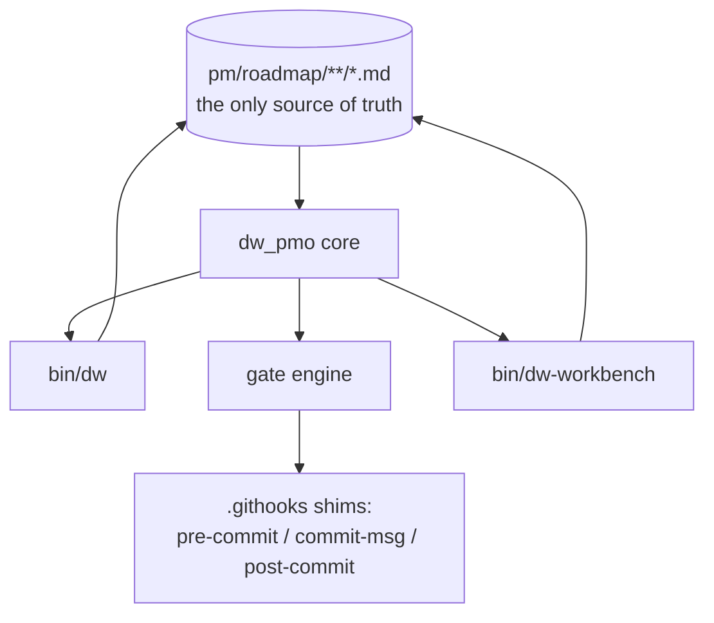
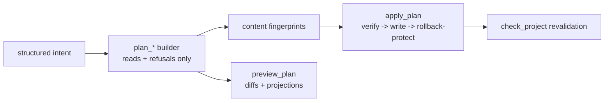
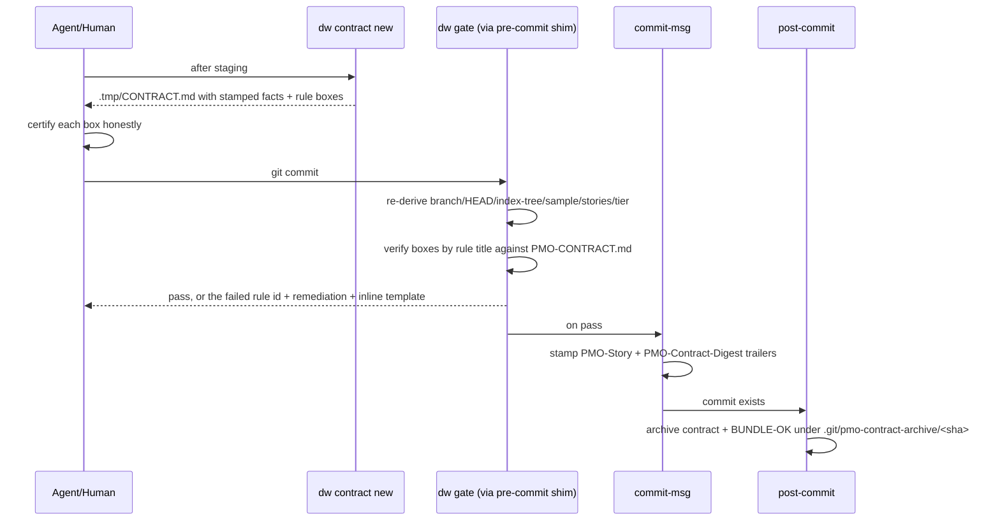
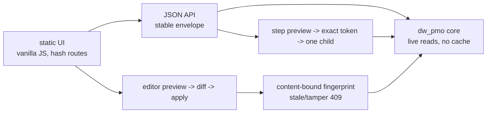

# Delivery Workbench — Architecture

How the six subsystems fit, and — because this framework distrusts
unproven claims, including its own — **every behavioral statement here
names the test or command that proves it.** The proving suites run in
CI on every push (`.github/workflows/validation.yml`).

One core, three adapters. The CLI, the commit gate, and the workbench
all call the same parsers, validators, planners, and renderers — there
is no second implementation of any rule anywhere (proof: the hooks are
shims with zero rule logic, `tests/gate-parity.sh` runs identical
fixtures through `dw gate` and a real `git commit` and asserts the
verdicts match).

## 1. The core (`lib/dw_pmo/`)

Pure-python (stdlib only, floor 3.9 — proof: the `python-floor` CI job
runs the full unit suite on 3.9), organized as small modules: `model`
(vocabulary and dataclasses), `paths`/`gitio` (filesystem and git
plumbing), `parse` (roadmap discovery), `validate` (structural checks
and drift warnings), `trace` (commit and work-log correlation),
`render`/`mutations` (content generation and guarded writes), `api`
(context envelopes, timelines, handoffs), plus `gate`, `contract`,
`evidence`, `agentdocs`, `doctor`, `status`, `step`, `adopt`, and `workbench`.
Phase 24 adds `orchestration` (pure compiler), `orchestration_edit` (guarded
score writes), `orchestration_run` (grants and ledger),
`orchestration_driver` (provider-neutral execution),
`orchestration_conductor` (deterministic scheduling/checks/routes), and
`orchestration_surface` (privacy-preserving adapter and Run-view models).
Phase 26 adds `programs` (pure scope/planning), `program_workflow`
(hierarchical finite workflows), `program_organization` (roles and
separation), `program_deliberation`/`program_verdict` (governed judgments),
`program_studio` (lossless authoring projections), `program_run` (finite grant
and sole authority ledger), and `program_conductor` (replay-first hierarchical
scheduling and recovery).

Phase 28 adds `repofacts`, the boundary that owns repository-derived facts.
Every fact it serves is classified in one versioned census
(`delivery-workbench-repository-facts@1`) as either **process-immutable** or
**derivation-scoped**, and the class decides what may be reused:

| Class | Facts | Reuse rule |
|---|---|---|
| process-immutable | `git_dir`, `repository_id` | Resolve once per repository root, reuse for the life of the process. Where the repository *is* cannot change under a running process. |
| derivation-scoped | `head_sha`, `index_tree`, `current_branch`, `remote_url`, `remote_ref`, `worktree_status` | Reuse only inside one derivation — one frontier computation, one freshness check, one plan build. Any mutation invalidates them. |

The distinction exists because it was previously unstated. With no rule about
which answers survive, no caller could safely reuse one, and the only safe
habit was to ask `git` again — roughly fifty-three `rev-parse --git-dir`
spawns per program conductor tick for a value fixed for the process. The
invalidation rule is expressed in code as `repofacts.Derivation`, which
computes each scoped fact at most once, refuses to hold a process-immutable
fact, and drops everything on `invalidate()`.

The governing constraint is that speed may never buy itself with staleness. A
derivation-scoped fact that outlived a write would silently defeat the
freshness, divergence, and dirty-tree refusals that exist to fail closed, so
those refusals are proven by planted regressions rather than assumed. A
fitness test (`RepositoryFactsContractTest`) fails if any module outside the
boundary resolves the git directory privately; sites awaiting migration are
declared in a shrinking ledger rather than exempted silently.

`status` is the read-only composition root for an agent's first question. It
joins doctor, roadmap validation, git/contract/gate state, current progress,
holds, and the next story into the versioned
`delivery-workbench-status@1` object, then applies one explicit action
precedence. It performs no network access or writes—not even a state-feed
event—and repeated calls over unchanged inputs are byte-identical (proof:
`StatusBriefingTest` in `tests/dw-core-tests.py` and the installed-repository
assertions in `tests/roadmap-cli.sh`). The packaged system proof is
`tests/guided-status-loop.sh`: one fresh consumer receives equal CLI, MCP,
and HTTP objects at each transition and reaches a verified gated commit by
executing the recommended argv (manual certification remains manual).

`step` is a deliberately smaller execution boundary over that status object.
Its pure `delivery-workbench-step@1` preview hashes the complete canonical
briefing, and apply re-reads it before permitting one command through a
closed action-id plus exact-argv-shape table. It starts at most one child
from the repository root, mirrors failure, and never permits commit,
certification, project choice, caller-supplied argv, or continuation (proof:
the step cases in `StatusBriefingTest` and the installed lifecycle in
`tests/roadmap-cli.sh`). The protocol and allowlist are
[deliberate-step.md](./deliberate-step.md).

Apply returns `delivery-workbench-step-result@1`: one exact-key receipt for
success, child failure, interruption, spawn failure, or non-started refusal.
Streams are captured separately and byte-capped; before/after observations
carry only token and action id. An exclusive claim under
`.git/pmo-step-claims/` makes even an unchanged read-only action single-use,
while one allowlisted `step_execution` event correlates every started child
without command/output content (proof: receipt, replay, truncation, and event
cases in `StatusBriefingTest`, plus installed JSON lifecycle coverage in
`tests/roadmap-cli.sh`).

The status vocabulary is defined once (`model.STORY_STATUSES`:
`backlog | ready | in-progress | blocked | done`, with done-synonyms
`complete | closed | shipped`) and a doc-parity unit test fails if the
methodology document disagrees (proof:
`tests/dw-core-tests.py::test_story_vocabulary_doc_parity`).

Mutations are two-step primitives: a `plan_*` builder performs all
refusal checks and records each target's current content; `apply_plan`
re-verifies those fingerprints, writes atomically with rollback, and
revalidates (proof: `test_apply_rolls_back_on_write_failure` shows the
first write restored when a later one fails).

## 2. The commit gate and contract v2

The contract is generated, never hand-typed: `dw contract new` stamps
machine-verified facts — branch, HEAD, the staged `git write-tree`
index tree, a staged-path sample, detected story IDs, and the
contract tier — and the gate re-derives every fact at commit time.
Freshness is cryptographic: restaging changes the index tree, so the
old contract is refused, and `touch` cannot resurrect it (proof:
`test_index_tree_mismatch_and_touch_bypass_dead`).

Structural rules enforced per commit (each with a stable rule id in
porcelain output — proof: every failing scenario in
`tests/gate-parity.sh` asserts its exact `rule=` id, and the unit
suite covers the full rule family): one story flips done per commit
(bundles need an explicit `BUNDLE-OK.md` rationale), the flipped
story's evidence ships in the same commit, evidence never appears or
disappears orphaned, and checked boxes must match the rules document
by title — canonical rules plus any project extensions (proof:
gate-parity S13 adds an 8th rule and watches both generator and gate
require it).

Ceremony is proportional: commits that touch no roadmap files get a
short tier (one no-bypasses box); roadmap commits and story flips get
the full contract; `--tests-capture` references a passing captured
run in staged evidence to discharge the "Tests ran." box mechanically,
re-verified by the gate (proof: `test_tests_capture_discharge_and_tamper`).

The trail is durable and queryable: trailers on every gated commit,
the exact certified contract archived per sha, and an aborted commit
leaves the contract in place for the retry (proof:
`tests/work-log-mvp.sh` aborted-commit scenario; inspect any commit
with `git log --format='%(trailers)'`).

## 3. Evidence capture

Evidence files carry proof, not prose. `dw evidence capture <project>
<phase> <story> -- <command>` appends a machine-parseable block — UTC
timestamp, exact command, cwd, exit code, index tree, and byte-capped
fenced output with an explicit truncation marker — and mirrors the
command's exit code (proof: `tests/roadmap-cli.sh` capture scenarios,
including nonzero exits and oversized output).

`dw check` refuses done stories whose evidence is a placeholder or
empty, and existence-checks referenced assets under `assets/`;
narrative-only evidence (no captured run) is a named warning, not an
error (proof: unit tests for `evidence_content_issues` and the
`narrative-only evidence` warning).

## 4. The workbench

A localhost web view over the same core: explorer, health console
(structured drift classification with explanations), the
intent-to-proof trace timeline (chain hops with explicit absent
states; commit events carry the PMO trailers; work-log entries merge
in), agent handoff text, a work-log viewer, and a guarded editor.

The runtime boundary is deliberately boring and fully tested
(`tests/workbench-explorer.sh`, plus the WLA-5-09 unit family):
127.0.0.1 only; refuses roots without a roadmap and busy ports with
remediation in the message; rejects non-local `Host` headers, CORS
preflights, path traversal, and slugs outside `[a-z0-9-]`; reads
degrade to explicit absent states; repeated reads leave the tree
checksum-identical; roadmap-editor writes happen only through fingerprint-
verified apply inside `pm/roadmap/**`; deliberate-step writes require a full-
status token and a second closed action/argv table; and **no endpoint stages,
certifies, or commits**
(proof: the suite asserts `git ls-files` stays empty through every
preview/apply cycle). Mutations are guarded while validation issues
exist — except mutations whose projected post-write issue set strictly
shrinks the current one, because a fix is never ambiguous (proof:
`test_guard_lets_remediation_through`).

The deliberate-step HTTP pair (`GET /api/step`, `POST /api/step/apply`) is a
thin binding over the same preview/result core used by CLI and MCP. Its body
has no command field; replay, altered state, manual certification, and commit
all refuse before child start (proof: `tests/step-interop.sh`).

The overview composes `GET /api/status` with the pure `GET /api/step` preview
without adding policy: verdict, selected project, workspace/contract/gate
facts, and exactly one action. Command arrays stay visually tokenized as argv;
judgment calls say `manual act`. An applicable lease gets a separate
review→confirm control showing its token, authorized argv, and CLI fallback;
the confirm POST sends only project+token, refreshes after one result, and
never follows the next action. Manual/prohibited/certification/commit states
render the core refusal and no apply control. Attention and ambiguous
selection get stronger visual treatment than normal ready state (proof:
`tests/workbench-ui-smoke.sh` renders the overview and open confirmation plus
attention and multi-project manual states at desktop/mobile widths; its static
fitness guard rejects command inputs, hidden loops, and a stale path that does
not refresh).

The distribution proof closes the composition: `tests/deliberate-step-loop.sh`
installs a built wheel into a fresh consumer, rotates seven separately reviewed
applies across CLI/MCP/HTTP, and asserts exact event/receipt/manual-commit
boundaries. Package smoke cannot pass from imports or one happy-path adapter.

Phase 24's orchestration layer is not an implicit
`while status: step` loop. A tracked score can describe research/worker roles,
graph dependencies, context, typed outputs, exact checks, failure routes,
budgets, concurrency, approvals, and terminal meanings. A pure compiler owns
those semantics; the rich Workbench editor is a lossless authoring surface.
The score itself has no authority: the delivered expiring/revocable grant and
hash-chained ledger bind its exact compiled hash. The delivered driver seam
then turns active claims into bounded provider-neutral work packets, validated
artifacts, and distinct isolated writer worktrees through deterministic
fixture and live Codex adapters. The delivered conductor replays those facts
through one idempotent tick: poll-before-retry recovery, stable eligibility,
concurrency/resource exclusion, exact contained command and built-in checks,
validation-gated fan-in, finite retry/repair/approval/pause/abort routes, fresh
`dw step` rail leases, cancellation-first interruption, budget/expiry stops,
and an `awaiting-certification` terminal. `run supervise` is bounded repetition
over the same tick, not a second scheduler. The shared interop surface now
returns byte-identical compiler/plan/projection/act documents through CLI,
MCP, and HTTP; exposes only ids and intent-bound tokens on applying adapters;
publishes a content-safe mission-control summary; and drives the rich,
manually refreshed Workbench Run view. That view explains live graph state,
sessions/checks, artifact lineage, budgets, routes, checkpoints, terminal
meaning, and the ledger while keeping streams behind explicit bounded opens.
The design and threat model are [orchestration.md](./orchestration.md).

Phase 26's embedded program runtime is a composition over those cores, not a
second authority store or a hidden `while` loop. `derive_program_frontier`
replays the finite program grant and sole `program_run` ledger into one
read-only next-act explanation. `tick_program` takes the run-local lock,
verifies every ledger-bound immutable receipt, reconciles active external work
before retry, rebuilds the exact program/phase/story/workflow/team lineage,
claims at most one act, and stops. `supervise_program` only repeats that same
tick within explicit tick and wall-time ceilings.

The delivered path conducts isolated implementer work,
fan-out/fan-in, built-in checks, independent verification and finite repair;
reconstructs bounded council proposal/critique/rebuttal/judgment from receipts;
separately issues the council decision, meta-verdict, and each obligation; and
conducts finite structural workflow rounds before evaluating a bounded
final-story phase snapshot through a preassigned read-only master architect.
Each loop round records one claim-bound immutable predicate receipt over a
typed check, verdict, decision, or artifact-validity source, exact producer and
carried-artifact hashes, nested round lineage, and its compiled success,
continuation, or exhaustion route. Rule decisions have no agent decider, judge
decisions bind only the assigned seat and execution identity, and architecture
approval reaches only the integration checkpoint. Crash-boundary and
dual-Python proof lives in `ProgramConductorTest` and the combined
planner/conductor/authority/deliberation matrix in
`tests/dw-core-tests.py`.

Before ordinary selection, the same conductor may replay one exact Phase 25
signal channel selected by the grant's remote-tracking ref. It does not poll a
forge. A matching declared SCM fact becomes a claim-bound content-safe
outward-fact receipt; a second claim can deliver a finite rule-bound nudge only
to an exact agent that has already run. That receipt is part of the target's
next packet and drives causal downstream/verifier/architecture attempts
without rewriting completed governance. Per-rule and global ceilings and all
child/start/artifact budgets are replayed from the sole program ledger.

The grant freezes the union of deterministic seats and checkpoint ports
reachable across the whole scope. The separate WLA-26-10 delivery adapter now
turns a certified conductor frontier into one pure, content-addressed plan
over the candidate patch, mechanical and governed proof, final staged tree,
roadmap transition, contract, commit, and optional remote lease. Each effect
reserves an independent program-ledger claim and produces an immutable receipt;
recovery accepts only all-old or exact-all-new state. Its canonical phase
mutation closes the complete phase, moves the current pointer, and starts the
planner-selected next story in the same gated commit. The planner/conductor can
then select that exact binding, story, and phase without introducing new
authority. Non-blocking obligations remain in the frontier, blocking
obligations stop, and terminal completion requires one immutable claim-bound
proof of the planner's exact `scope-complete` result. The WLA-26-11
`program_surface` is the additive public seam over that same ledger: canonical
inventory/view/tail/stream documents feed CLI, MCP, localhost HTTP, Workbench,
and read-only SSE, while preview-bound acts route back through the existing
grant/conductor/delivery cores. It stores no authority, starts no daemon, and
accepts no runtime policy, prompt, command, credential, or retry override.

Viewport rendering is smoke-tested headlessly at desktop and mobile
(`tests/workbench-ui-smoke.sh`, CI-run where Firefox exists).

## 5. Work logs

Opt-in, consent-gated, deterministic. With `PMO_WORK_LOG_ENABLED=1`
and explicit `**Work-log consent:** yes` in the contract, `pre-commit`
captures the staged payload (exclusion regex applied mechanically —
omitted paths are listed, never contented) and `post-commit` appends a
deterministic entry to the local daily log after the commit exists.
No LLM runs in the commit path; a deferred summarizer adapter can
digest logs afterwards with timeout/fallback/truncation safety
(proof: `tests/work-log-mvp.sh` covers consent denial, exclusion,
aborted commits, amend, and every summarizer failure mode).
`PMO_WORK_LOG_DIR` resolves config > environment > default everywhere
it is read (proof: `test_work_log_dir_precedence`).

## 6. Adoption and the agent surface

Adoption is three commands — install, intake+discovery, `dw adopt` —
and the bridge is preview-first: `dw adopt --from-report` parses the
discovery report's stabilized tables, previews every file it would
create, writes nothing without `--apply`, and refuses malformed tables
with line-numbered errors (proof: `tests/adoption-discovery.sh`,
including a hostile project name and idempotent re-runs).

The agent surface is generated from one constant: the managed
`CLAUDE.md` block (markers, refreshed by install/update/`dw
agent-docs`, user content never touched), slash commands, the versioned
`dw status` opening answer, `dw next`'s strict exit contract (0 found / 2
nothing actionable / 1 error), and
gate porcelain (proof: `tests/agent-surface.sh` drives a full story
lifecycle headlessly using only commands the managed block names).

## Design invariants

1. **Markdown is the only state.** Nothing above holds state outside
   `pm/roadmap/**`, git itself, and the opt-in local work log.
2. **Verification beats certification.** Wherever a rule can be
   machine-derived, it is; checkboxes remain only for judgment calls.
3. **Refusals name their remediation.** Every blocked path — gate,
   CLI, workbench, adoption — says what to do next, and the suites
   assert the message content, not just the failure.
4. **The framework rides its own rails.** Its roadmap, this document
   included, ships through its own gate — the audit trail under
   `pmo-roadmap/pm/roadmap/work-log-automation/` is the proof.
