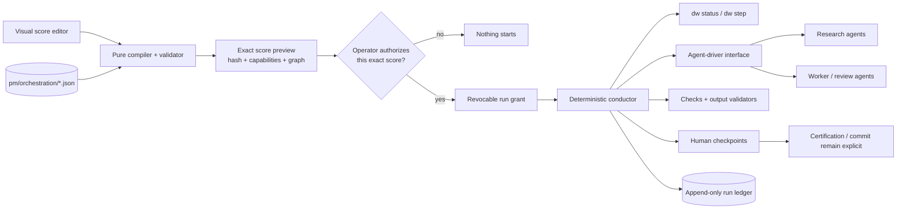
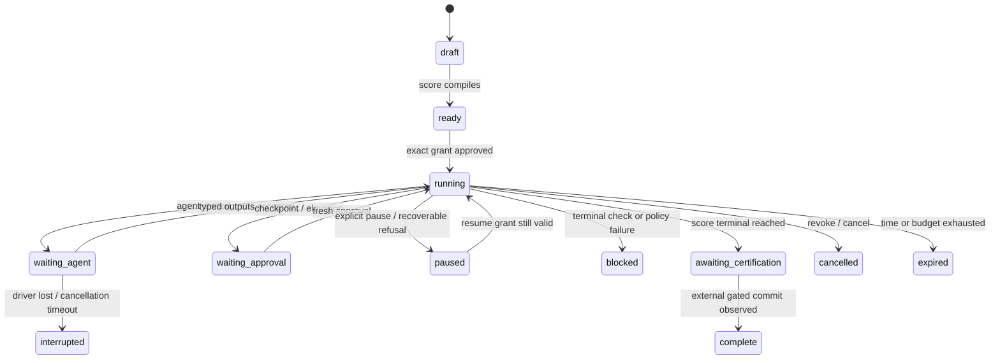

# Visual orchestration contract

**Status:** Phase 24 score contract and compiler delivered; editor and runtime
implementation continue through WLA-24-03 to WLA-24-08.
**Product claim:** Delivery Workbench **can coordinate** a bounded multi-agent
delivery run when an operator has configured an exact orchestration score and
authorized a grant over that score. It does not claim that every repository
or story should be orchestrated.

## Why this layer exists now

Phase 22 supplied one deterministic observation. Phase 23 supplied a
single-use, state-bound action lease with a closed executable table, bounded
receipt, replay claim, and packaged proof. Before those contracts existed, an
orchestrator would have copied recommendations, guessed freshness, and hidden
consent inside a loop. The prerequisites now exist.

The missing capability is not “run the next command forever.” It is a control
plane that can describe and coordinate:

- which agents participate, including parallel research agents;
- what each agent may read, change, and request from its harness;
- which context and prior artifacts each node receives;
- output names, locations, formats, schemas, size limits, and citation rules;
- deterministic checks and their exact argv or built-in predicate;
- dependencies, concurrency limits, budgets, timeouts, and retry ceilings;
- success, failure, repair, escalation, approval, cancellation, and terminal
  routes; and
- where a human must inspect or attest before the run can continue.

That configuration belongs in a rich visual editor and a versioned,
diffable artifact. Runtime authority belongs in a separate, explicit grant.

## The product in one picture



The editor never executes. The compiler never executes. A saved score never
executes. Only an unexpired run grant can let the conductor schedule nodes,
and every scheduled node receives its own claim and receipt.

## Terminology

| Term | Meaning |
|---|---|
| **Score** | The tracked declarative orchestration manifest: graph, roles, inputs, outputs, checks, policies, and limits. |
| **Compilation** | Pure normalization and validation of a score into a deterministic graph plus capability summary. |
| **Grant** | A local, revocable authorization bound to the score hash, repository observation, story, capabilities, budgets, and expiry. |
| **Run** | One projection of ledger events for one grant. A run is local operational state, not roadmap truth. |
| **Node** | One typed unit: agent, check, rail step, approval, or synthesis/collection boundary. |
| **Work packet** | Structured, bounded input handed to an agent driver; never a shell command. |
| **Artifact** | A declared node output with a type, convention, hash, and validation result. |
| **Checkpoint** | A state where the conductor stops until a named human decision is recorded. |
| **Driver** | An adapter between the conductor and an agent harness. The harness owns model execution and sandbox enforcement. |

## Durable score: `delivery-workbench-orchestration@1`

Scores are tracked at `pm/orchestration/<slug>.json`. JSON is deliberate:
the stdlib Python 3.9 core can parse it exactly, the browser can round-trip it
without a second parser, canonical serialization is hashable, and Git still
shows the operator the complete diff. Markdown remains the roadmap source of
truth; the score is executable delivery policy, not another roadmap.

A representative score is below. The shipped ordinary preset is
[`research-build-review.json`](../pmo-roadmap/templates/orchestration/research-build-review.json);
`dw_pmo.orchestration` is the exact schema and semantic owner. Install seeds
that file into `pm/orchestration/` without overwriting an operator's copy.

```json
{
  "kind": "delivery-workbench-orchestration",
  "schema_version": 1,
  "slug": "research-build-review",
  "title": "Research, implement, verify, and hand back",
  "project": "myapp",
  "defaults": {
    "max_concurrency": 3,
    "max_wall_seconds": 7200,
    "max_agent_starts": 8,
    "max_check_starts": 20,
    "default_timeout_seconds": 1200,
    "max_artifact_bytes": 1000000
  },
  "nodes": [
    {
      "id": "research-api",
      "type": "agent",
      "role": "research",
      "profile": "research-readonly",
      "needs": [],
      "capabilities": ["repository-read", "network"],
      "workspace": "read-only",
      "inputs": ["story", "status", "docs/**"],
      "outputs": [{
        "name": "api-findings",
        "format": "markdown",
        "path": "artifacts/api-findings.md",
        "required_sections": ["Findings", "Sources", "Risks"],
        "citations": "required",
        "max_bytes": 30000
      }],
      "timeout_seconds": 1200,
      "on_failure": {"action": "pause"}
    },
    {
      "id": "research-risks",
      "type": "agent",
      "role": "research",
      "profile": "research-readonly",
      "needs": [],
      "capabilities": ["repository-read"],
      "workspace": "read-only",
      "inputs": ["story", "architecture"],
      "outputs": [{
        "name": "risk-register",
        "format": "json",
        "path": "artifacts/risks.json",
        "schema": "schemas/risk-register-v1.json",
        "max_bytes": 20000
      }],
      "timeout_seconds": 900,
      "on_failure": {"action": "retry", "max_attempts": 2}
    },
    {
      "id": "synthesize",
      "type": "agent",
      "role": "synthesis",
      "profile": "reasoning-readonly",
      "needs": ["research-api", "research-risks"],
      "capabilities": ["repository-read"],
      "workspace": "read-only",
      "inputs": [
        {"artifact": "api-findings", "format": "markdown"},
        {"artifact": "risk-register", "format": "json"}
      ],
      "outputs": [{
        "name": "implementation-brief",
        "format": "markdown",
        "path": "artifacts/implementation-brief.md",
        "required_sections": ["Scope", "Decisions", "Acceptance checks"]
      }],
      "on_failure": {"action": "approval", "checkpoint": "research-review"}
    },
    {
      "id": "implement",
      "type": "agent",
      "role": "implementation",
      "profile": "worker-write",
      "needs": ["synthesize"],
      "resource_groups": ["working-tree"],
      "capabilities": ["repository-read", "repository-write"],
      "workspace": "isolated-worktree",
      "inputs": [
        "story",
        {"artifact": "implementation-brief", "format": "markdown"}
      ],
      "outputs": [{
        "name": "implementation-diff",
        "format": "git-diff",
        "path": "workspace",
        "allowed_paths": ["src/**", "tests/**", "docs/**"],
        "max_bytes": 500000
      }],
      "on_failure": {"action": "route", "node": "repair", "max_visits": 1}
    },
    {
      "id": "tests",
      "type": "check",
      "needs": ["implement"],
      "runner": {
        "kind": "command",
        "argv": ["python3", "-m", "pytest", "-q"],
        "cwd": "workspace",
        "timeout_seconds": 1200,
        "output_bytes": 30000,
        "writes": []
      },
      "expect": {"exit_code": 0},
      "on_failure": {"action": "route", "node": "repair", "max_visits": 1}
    },
    {
      "id": "repair",
      "type": "agent",
      "activation": "failure",
      "role": "repair",
      "profile": "worker-write",
      "needs": ["implement"],
      "resource_groups": ["working-tree"],
      "capabilities": ["repository-read", "repository-write"],
      "workspace": "isolated-worktree",
      "inputs": [
        "story",
        {"artifact": "implementation-brief", "format": "markdown"}
      ],
      "outputs": [{
        "name": "repair-diff",
        "format": "git-diff",
        "path": "workspace",
        "allowed_paths": ["src/**", "tests/**", "docs/**"],
        "max_bytes": 500000
      }],
      "on_failure": {"action": "abort"}
    },
    {
      "id": "human-handoff",
      "type": "approval",
      "needs": ["tests"],
      "prompt": "Review the diff, evidence, and contract before certification.",
      "options": ["approve", "reject"],
      "terminal": "awaiting-certification"
    }
  ]
}
```

Schema v1 is closed by level: unknown top-level, default, node, output,
artifact-input, runner, expectation, failure-policy, and layout keys are
diagnostics rather than ignored behavior. The compiler normalizes every
finite default and stamps two hashes:

- `semantic_hash` covers every runtime rule and excludes only top-level
  editor layout;
- `document_hash` covers the normalized score including layout, so a save can
  still be stale-safe and lossless; and
- validation errors carry `pointer`, `code`, `message`, and `remediation`.

The pure CLI surface is `dw orchestration list|show|validate|simulate`.
`simulate` reports deterministic waves, locks, fan-out/fan-in, capability and
profile inventory, output lineage, checkpoints, failure branches, budgets,
and terminal meanings; it explicitly reports `starts_work: false` and
`writes_events: false`.

### Score invariants

- Node ids are unique, stable, and selector-safe.
- `needs` and explicit failure routes resolve to existing nodes.
- The success graph is acyclic. Bounded retries and repair visits are policy,
  never implicit graph cycles.
- Every executable node declares timeout and output bounds, directly or via
  score defaults.
- Parallel eligibility is deterministic; ties resolve by score order then id.
- Required outputs have one producer. Consumers can reference only declared
  artifacts from completed dependencies.
- No prompt, artifact name, path, check, or failure route is synthesized by
  the conductor.
- A score may request capabilities; it cannot grant them. Driver discovery
  and the run grant must both satisfy the request.
- Secrets, API tokens, provider executables, and machine-specific paths never
  belong in the tracked score.

## Node types

| Type | Purpose | Execution owner | Important refusal |
|---|---|---|---|
| `agent` | Research, synthesis, implementation, review, documentation, or repair | Configured agent harness through a driver | Missing profile/capability, undeclared output, or unavailable isolation |
| `check` | Deterministic command or built-in predicate | Local check runner | Shell string, unbounded output/time, escaped cwd, undeclared writes |
| `rail` | One status/step transition named by action id | Existing `dw step` core | Stale lease, action not allowed by score+grant, certification, or commit |
| `approval` | Explicit inspect/choose/attest boundary | Human/operator surface | No approval identity/receipt, expired grant, changed preview |
| `collect` | Validate and expose a set of already-produced artifacts | Pure compiler/validator | Missing, oversized, malformed, or convention-violating artifact |

Agent `role` is descriptive and editor-visible, not hard-coded policy. The
first-class role presets are `research`, `synthesis`, `implementation`,
`review`, `verification`, `documentation`, and `repair`; a score can name a
custom role without minting capabilities.

## Rich visual score editor

The Workbench gets a dedicated orchestration route with three coupled views:

1. **Design:** an SVG/canvas graph with node palette, typed ports, dependency
   and failure edges, grouping, zoom, keyboard navigation, and a property
   inspector. Research-agent fan-out and synthesis fan-in are visible shapes,
   not hidden JSON conventions.
2. **Validate:** the pure compiler's normalized graph, capability inventory,
   output lineage, concurrency projection, unreachable-node and cycle errors,
   unbounded retry/time/cost errors, and a dry scheduling trace.
3. **Run:** the exact score hash and grant, live node states, agent/session
   correlation, checks, output validation, attempts, budgets, checkpoints,
   cancellation, and terminal handoff.

The inspector configures the complete rule surface:

- agent role/profile, prompt template, context selectors, capabilities,
  workspace mode, timeout, and retry ceiling;
- inputs and typed outputs, including path/name conventions, format/schema,
  required headings, citations, allowed paths, and byte bounds;
- command checks as tokenized argv, built-in file/schema/diff/rail checks,
  expected result, timeout, output cap, and declared write behavior;
- success dependencies and explicit failure routes (`retry`, `route`,
  `approval`, `pause`, or `abort`), all bounded;
- score/run budgets, concurrency/resource groups, and approval checkpoints;
  and
- terminal meaning such as `complete`, `blocked`, `cancelled`, or
  `awaiting-certification`.

The graph and JSON views round-trip losslessly. Saving uses the existing
preview→diff→apply discipline through a dedicated contained score mutation;
the browser never owns validation policy. A score with compiler errors cannot
be authorized. Presets are ordinary scores copied into the editor, not magic
runtime branches.

## Authority model

The orchestration layer adds one explicit authority ring; it does not blur
the existing ones.

| Ring | Act | Authority |
|---|---|---|
| 0 | Read score, compile, simulate, inspect status/runs | None; pure reads |
| 1 | Save score | Guarded content preview plus exact fingerprint apply |
| 2 | Start/resume run | Operator grant over score hash, repo/status facts, story, capabilities, budgets, and expiry |
| 3 | Start agent/check/rail node | Active grant + scheduler eligibility + exclusive node claim + driver/check/step refusal checks |
| 4 | Approve checkpoint or capability elevation | Fresh human decision over an exact checkpoint preview |
| 5 | Certify contract and commit | Existing explicit operator act; never inferred from score or run completion |

A tracked score is no more authority than a CI workflow sitting on disk. A
grant is the act boundary. Editing a score invalidates an unstarted grant; an
active run remains bound to its original immutable compiled score and cannot
silently adopt the edit.

## Run grant

`delivery-workbench-run-grant@1` contains at least:

- a random run id plus score slug and canonical score hash;
- repository identity, root, branch, HEAD, selected project, phase/story, and
  initial status token;
- allowed node ids and requested capability summary;
- maximum concurrency, wall time, agent/check starts, attempts, and artifact
  bytes;
- workspace/isolation policy;
- issued/expiry timestamps and revocation generation; and
- the operator's explicit approval receipt.

The grant lives under `.git/pmo-orchestration/runs/<run-id>/grant.json`. It is
local authority, not a portable bearer secret. Revocation, expiry, exhausted
budgets, changed repository identity, unsupported driver capability, or an
ambiguous project/story all stop scheduling before another node starts.

## Run state and deterministic scheduling



The conductor derives the current projection from an append-only ledger. One
reconciliation tick:

1. locks the run and replays/validates its ledger;
2. re-observes repository/status/session/driver facts;
3. handles completed, failed, lost, or cancelled work;
4. validates newly declared artifacts and checks budgets;
5. chooses eligible nodes deterministically;
6. claims each node before dispatch, up to the granted concurrency; and
7. appends dispatch/refusal/checkpoint receipts, then returns.

The long-running conductor is only repeated ticks with a stop signal and
backoff. The tick remains directly callable and idempotent for tests,
recovery, CLI operation, and hosted schedulers. It never follows an unrecorded
decision.

## Agents, research, and isolated workspaces

The core driver protocol is provider-neutral: `discover`, `start`, `poll`,
`interrupt`, and `collect`. A structured work packet carries run/node ids,
role, bounded prompt/context, declared inputs/outputs, workspace identity,
capability request, and deadlines. It carries no provider executable or shell
argv.

Operator-local configuration maps logical profiles such as
`research-readonly` or `worker-write` to installed adapters and credentials.
The adapter reports supported capabilities; a mismatch refuses before an
agent starts. Network access, model choice, filesystem sandboxing, and tool
approval remain enforceable by the harness/adapter, not falsely claimed by
Delivery Workbench.

Read-only research agents can fan out in parallel against one immutable tree
and write only declared run artifacts. Write-capable agents receive isolated
Git worktrees and resource locks. A synthesis node consumes research artifacts
only after their output contracts pass. Concurrent write work never shares a
working directory, and integrating a worktree diff is a separate reviewed
transition—not an implicit side effect of agent completion.

## Checks, outputs, and failure policy

Check nodes are either built-in predicates or exact tokenized argv from the
reviewed score. There is no shell-string mode, interpolation, command emitted
by an agent, unbounded cwd, or inherited secret environment. Command checks
run inside the declared workspace with timeout, output cap, cancellation, and
before/after Git snapshots. Any writes outside declared paths fail the check.

Output validation is deterministic before downstream scheduling:

- existence, kind, path containment, byte bound, and hash;
- JSON schema subset or required Markdown sections;
- citation requirement for research outputs;
- Git diff scope for implementation outputs; and
- one-producer/type-compatible lineage for every artifact reference.

Failure policy is data, not improvised reasoning: bounded retry, route to a
named repair node, request approval, pause, or abort. Required checks and
outputs cannot be silently skipped. A retry gets a new attempt id and receipt;
an old node claim cannot replay.

## Ledger, receipts, and recovery

Runtime state lives under `.git/pmo-orchestration/runs/<run-id>/`:

```text
grant.json                 exact local authority
score.json                 immutable compiled score used by this run
events.jsonl               append-only authoritative run ledger
artifacts/<node>/<name>    bounded declared outputs + metadata
projection.json            disposable derived cache
```

Ledger events carry ids, hashes, state transitions, attempts, timestamps,
budgets, driver/check outcomes, and artifact metadata—not prompts, model
transcripts, source content, credentials, or raw check output. Detailed
streams remain bounded local artifacts and appear only on explicit inspection.

Exclusive run/node claims make dispatch at-most-once. After a crash, restart
replays the ledger and polls claimed driver work; it never assumes an absent
receipt means failure or blindly starts a duplicate. Unknown agent state moves
to `interrupted` or a human recovery checkpoint. Cancellation revokes future
dispatch first, then asks active drivers to interrupt, records every outcome,
and never deletes the audit trail.

## Surfaces and interoperability

One core owns score compilation, grant planning, run projection, tick, and
cancellation. Adapters remain thin:

- CLI: `dw orchestration list|show|validate`, `dw run plan|start|show|tick|pause|resume|cancel`;
- MCP: pure score/run reads plus exact-token run acts, never provider argv;
- HTTP: versioned envelopes for the visual editor and run monitor;
- Workbench: Design, Validate, and Run views over those HTTP models; and
- events/state feed: bounded run summaries for mission-control clients.

Remote or hosted schedulers may call `tick`, but the local runner holding the
grant, repository, driver configuration, and workspaces remains the execution
authority. A Phase 24 implementation does not turn an HTTP score into a
cross-machine bearer capability.

## Threat model and fail checks

| Threat | Required fail check |
|---|---|
| Score edit smuggles new authority into an active run | Run uses immutable compiled score/hash; changed score needs a new grant |
| Model invents commands, outputs, or routes | Only score-declared nodes/argv/artifacts/routes compile; work packets are structured |
| Research agent exfiltrates or writes source | Capability/profile match, read-only workspace, declared artifacts, harness-owned network policy |
| Parallel writers corrupt one tree | Isolated worktrees plus resource locks; no shared writable cwd |
| Retry becomes an infinite loop | Compile-time finite ceilings plus run budgets and visit counters |
| Failed check is waved through | Required checks cannot skip; only explicit failure route or approval receipt advances |
| Crash launches duplicate agent/check | Exclusive claim before dispatch; recovery polls before any retry |
| Stale rail action executes | Fresh `dw step` preview/apply at the rail node boundary |
| Remote caller expands capability | Grant is local/non-portable; adapters accept ids/tokens, never driver or shell argv |
| “Run complete” becomes “safe to commit” | Terminal is `awaiting-certification`; gate certification and commit remain explicit |

## Phase 24 proof standard

The phase is complete only when a wheel-installed fresh consumer can:

1. use the visual editor to configure a score with parallel research agents,
   synthesis, implementation, exact output conventions, deterministic checks,
   a repair/failure route, budgets, and a human terminal checkpoint;
2. round-trip graph ↔ JSON without semantic drift and reject planted cycles,
   unbounded retry, missing output, shell string, escaped path, and unsupported
   capability;
3. authorize the exact compiled hash, run through fixture agent drivers in
   isolated workspaces, and expose every state/receipt identically across CLI,
   MCP, HTTP, and the Workbench;
4. survive restart, refuse a duplicate dispatch, cancel cleanly, and stop on
   expiry/budget/check failure; and
5. hand a real evidence-ready diff back at `awaiting-certification`, with no
   automatic checkbox edit or commit, then pass the existing gated history
   chain after the fixture operator completes those acts.

The deterministic fixture-driver exam is mandatory CI proof. A live supported
agent-harness run is complementary product evidence, not a substitute for the
reproducible contract suite.

## Deliberately deferred from v1

- Arbitrary cyclic graphs; bounded retry/repair policy covers the recoverable
  cases without turning scheduling into an undecidable workflow language.
- Secrets in scores, provider-specific prompt fields, and repository-defined
  driver executables.
- Cross-repository write transactions and automatic merge/conflict resolution.
- Automatic evidence adequacy judgment, contract certification, commit,
  push, release, or deployment.
- A central hosted control plane holding repository authority. The local core
  is designed so one can coordinate it later without moving the consent root.
