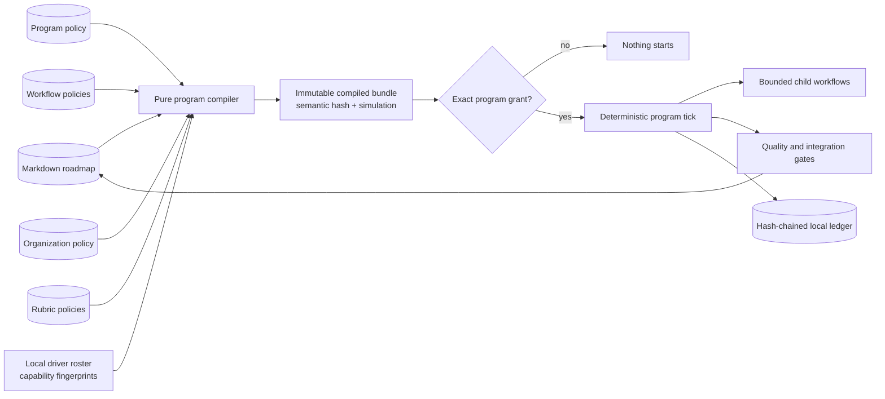
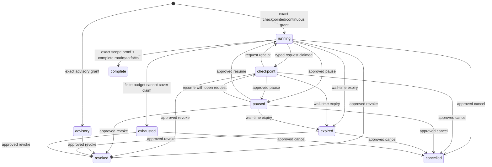

# Optional autonomous delivery programs

**Status:** Phase 26 complete. Planning, workflow, organization,
deliberation, Studio, governed quality-decision, finite program-grant/replay,
restart-safe conduction, exact integration/Git/roadmap delivery, and the
canonical CLI/MCP/HTTP/Workbench control room are pinned by tests and a
fresh-wheel autonomous multi-phase exit exam with a separate dormant
no-program consumer.
**Product claim:** Delivery Workbench **can run** a governed delivery program
across an explicit roadmap scope when tracked policy has compiled and an
operator has issued a separate finite program grant. Delivery Workbench is not
an autonomous runner by default, and installing, updating, opening, or using
the ordinary product starts nothing.

This contract builds on the delivered bounded-run contract in
[orchestration.md](./orchestration.md) and the outward-fact contract in
[signals.md](./signals.md). It does not edit either contract retroactively. A
Phase 24 score still means one bounded run with a terminal handoff; a signal is
still observation rather than authority.

## Capability ladder and default invariant

The product exposes capabilities, not a forced migration:

| Tier | Configuration | Authority | Terminal meaning |
|---|---|---|---|
| **Vanilla** | Roadmap and ordinary Delivery Workbench configuration | Existing deliberate story, evidence, step, gate, and commit acts | The operator or agent chooses each next act |
| **Bounded orchestration** | One `delivery-workbench-orchestration@1` score | One finite run grant | The score reaches its declared terminal handoff |
| **Program advisory** | Program bundle | No dispatch or mutation authority | Explain/simulate the multi-story program |
| **Program checkpointed** | Program bundle | Finite grant plus required named decision ports | Stop at each contracted checkpoint |
| **Program continuous** | Program bundle | Finite grant carrying every required capability | Continue until complete, refused, revoked, expired, or exhausted |

The **default-mode compatibility invariant** is normative:

- no program configuration is healthy ordinary state;
- vanilla `status`, `next`, `step`, evidence, gate, CLI, MCP, HTTP, and
  Workbench behavior remains available without a program store or program
  setup;
- a score, bounded run, shipped template, or existing run grant is never
  auto-wrapped in, imported into, or interpreted as a program;
- install and update create no program instance, grant, ledger, observer,
  process, stream, notification, network call, or changed default route; and
- Program Studio and the program control room are progressively disclosed
  optional workspaces, never the ordinary Workbench front door.

An implementation that violates any line above has changed the base product
and cannot ship as Phase 26.

## Composition and sources of truth



There are four distinct sources. They must never be collapsed:

1. **Roadmap truth** is the existing Markdown tree and Git history.
2. **Tracked policy** describes what a program could do: scope, workflows,
   organization, rubrics, requested capabilities, budgets, and stops.
3. **Local resolution** maps logical agent profiles and provider ports to
   executable drivers, identities, isolation domains, and credentials. Tracked
   policy never contains provider executables or secrets.
4. **Runtime authority** is one immutable, local, finite, revocable grant over
   the complete compiled bundle and observed repository facts.

Opening, listing, compiling, validating, simulating, visually editing, or
saving tracked policy operates only on source 2 and starts no program. A
program grant cannot change source 1 or 2; it can authorize only the exact acts
already requested by the compiled bundle.

## Terminology

| Term | Meaning |
|---|---|
| **Program** | A tracked policy that scopes roadmap work, binds workflow/team/rubric rules, requests finite authority, and defines completion/stops. |
| **Program bundle** | The canonical compiled program plus every resolved workflow, organization, rubric, and layout-independent semantic hash. |
| **Workflow** | A reusable acyclic hierarchical graph with typed, finitely bounded repetition primitives. |
| **Organization** | Logical agents, pools, team slots, separation rules, councils, and stable assignment policy. |
| **Rubric** | Versioned criteria and evidence requirements for an explicitly typed agent judgment. |
| **Role slot** | A duty in one workflow instance, such as implementer, verifier, critic, judge, meta-verifier, or architect. |
| **Principal** | The locally resolved execution identity behind a logical agent. Separation is checked on principal and workspace domain, not display name alone. |
| **Verdict** | A typed, provenance-bound result over one exact subject. Mechanical facts, agent judgments, council judgments, and meta-reviews are distinct types. |
| **Program grant** | Local authority bound to one compiled bundle, roadmap/repository observation, driver roster, mode, capability set, budgets, expiry, and operator. |
| **Program tick** | One replay/reconcile/plan/claim/dispatch-or-record pass. A tick is finite and returns after its declared acts. |
| **Workflow address** | Stable lineage: program/phase/story/workflow/subflow/loop-round/node/role/attempt. |
| **Decision port** | A named typed checkpoint whose allowed responses and effects are declared in policy. |
| **Dissent** | A preserved non-majority or vetoing judgment; never discarded by aggregation. |

## Tracked policy family

Phase 26 introduces new versioned policy kinds rather than extending
`delivery-workbench-orchestration@1` with implicit multi-story behavior:

| Kind | Default path | Owns |
|---|---|---|
| `delivery-workbench-program@1` | `pm/programs/<slug>.json` | roadmap scope, binding and standing-nudge rules, mode ceiling, requested capabilities, budgets, phase gates, and stop policy |
| `delivery-workbench-workflow@1` | `pm/workflows/<slug>.json` | reusable hierarchical graph, parameters, artifacts, typed loops, routes, and terminal meanings |
| `delivery-workbench-organization@1` | `pm/organizations/<slug>.json` | logical agents, pools, teams, role duties, separation, councils, replacement, and escalation |
| `delivery-workbench-rubric@1` | `pm/rubrics/<slug>.json` | agent-judgment criteria, evidence/citation requirements, result aggregation, and freshness |

The kind string and `schema_version: 1` are both required. The `@1` suffix in
this document means that pair, not a filename. References use a stable slug;
the compiler resolves every reference in the same repository, stamps its
semantic hash into the bundle, and rejects missing or ambiguous references.

### Program document

A representative program policy is:

```json
{
  "kind": "delivery-workbench-program",
  "schema_version": 1,
  "slug": "phase-26-and-27",
  "title": "Governed delivery across two phases",
  "scope": {
    "project": "work-log-automation",
    "phases": {"from": 26, "through": 27},
    "stories": "all",
    "selection": "roadmap-frontier-v1",
    "blocked_policy": "stop"
  },
  "organization": "delivery-core",
  "bindings": [
    {
      "id": "phase-26",
      "priority": 10,
      "match": {"phase_from": 26, "phase_through": 26},
      "workflow": "build-verify-integrate",
      "with": {"story-id": {"kind": "context", "name": "story.id"}},
      "team": "story-cell",
      "rubrics": ["story-quality"]
    },
    {
      "id": "fallback",
      "priority": 100,
      "match": {"phase_from": 27, "phase_through": 27},
      "workflow": "build-verify-integrate",
      "with": {"story-id": {"kind": "context", "name": "story.id"}},
      "team": "story-cell",
      "rubrics": ["story-quality"]
    }
  ],
  "phase_gates": [
    {
      "id": "architecture-gate",
      "when": "before-phase-complete",
      "role": "master-architect",
      "rubric": "phase-architecture",
      "on_fail": "block"
    }
  ],
  "nudges": [
    {
      "id": "repair-failed-ci",
      "signal": "ci-failed",
      "binding": "phase-26",
      "target": "story-work/implement",
      "max_per_signal": 1,
      "max_total": 2,
      "expectation": "Revisit the failed CI evidence and repair only the declared story work."
    }
  ],
  "mode_ceiling": "continuous",
  "requested_capabilities": [
    "program:select",
    "agent:dispatch",
    "check:execute",
    "workspace:write",
    "nudge:deliver",
    "verdict:issue",
    "council:decide",
    "obligation:record",
    "obligation:materialize",
    "obligation:disposition",
    "evidence:materialize",
    "integration:apply",
    "contract:generate",
    "certification:verdict",
    "git:commit",
    "git:push",
    "roadmap:story-start",
    "roadmap:story-complete",
    "roadmap:phase-advance"
  ],
  "budgets": {
    "max_phases": 2,
    "max_stories": 12,
    "max_child_runs": 72,
    "max_agent_starts": 96,
    "max_provider_starts": 96,
    "max_model_starts": 96,
    "max_check_starts": 240,
    "max_loop_rounds": 36,
    "max_debate_rounds": 8,
    "max_councils": 8,
    "max_repairs_per_story": 3,
    "max_verdicts": 72,
    "max_obligations": 72,
    "max_obligation_materializations": 24,
    "max_obligation_dispositions": 72,
    "max_integrations": 12,
    "max_commits": 12,
    "max_pushes": 12,
    "max_nudges": 24,
    "max_artifact_bytes": 50000000,
    "max_tokens": 12000000,
    "max_observed_cost_microunits": 750000000,
    "max_wall_seconds": 172800
  },
  "stop_conditions": [
    "scope-complete",
    "checkpoint-required",
    "unresolved-dissent",
    "architect-veto",
    "blocked-frontier",
    "budget-exhausted",
    "grant-expired",
    "grant-revoked"
  ]
}
```

Policy requests capabilities and limits; it grants neither. `mode_ceiling`
states the most autonomous mode the author considered. A grant may choose a
less autonomous mode and smaller limits but never a higher mode, new
capability, wider scope, or larger budget.

Program `nudges` are an optional closed list of at most 20 standing rules.
Each rule has exactly `id`, `signal`, `binding`, `target`,
`max_per_signal`, `max_total`, and optional bounded `expectation`. The signal
is one of `ci-failed`, `changes-requested`, or `merge-conflict`; the Phase 25
`waiting-input-timeout` signal remains local to a bounded child score. The
binding must be exact, and `target` must resolve uniquely to an expanded agent
node outside a structural-loop round template. Bounds are finite positive
integers, `max_per_signal` cannot exceed `max_total`, rule ids are unique, and
the sum of every rule's `max_total` must fit `budgets.max_nudges`.

Standing program rules require both `program:select` and `nudge:deliver`.
Compilation charges their worst-case target reruns against child, agent,
provider, model, artifact, and nudge envelopes; a rule cannot hide starts
outside the grant.

### Workflow document

A workflow has `kind`, `schema_version`, `slug`, `title`, a closed parameter
list, defaults, nodes, terminals, and optional editor `layout`. Its top-level
success dependency graph is acyclic. A node is one of the closed types in the
[hierarchical workflow semantics](#hierarchical-workflow-semantics) section.
Subflow nodes reference another workflow by slug and bind declared parameters;
the compiler expands a stable address while preserving the reference boundary.

A workflow may reuse a complete Phase 24 score only through an explicit
`bounded_run` leaf whose score slug, inputs, expected terminal, capability
ceiling, and child budgets are declared. That leaf creates one child run under
a strict subset grant. It does not turn the score itself into a program and
cannot continue to another story.

### Organization document

An organization contains:

- logical `agents` with stable id, local driver profile selector, allowed duty
  set, program-capability ceiling, workspace-domain requirement, concurrency
  ceiling, and assignment weight;
- ordered `pools` containing agent ids;
- `teams` with named role slots, candidate/fallback pools, exact cardinality,
  required duties, program and driver capability ceilings, workspace mode,
  allowed context channels/expression kinds, readable/writable artifact kinds,
  output/verdict schema, concurrency/resource groups, request/judgment edges,
  and ordered independence rules;
- optional named `diversity` rules that require two roles in one team to use
  different declared provider families;
- `councils` with member role slots, distinct-principal quorum, judge, optional
  meta-verifier, majority/weighted/unanimous/judge aggregation, role weights,
  vetoes, sampling/full-audit policy, and finite round/start/artifact/byte/token/
  wall ceilings; and
- per-role replacement/escalation rules with closed eligible reasons, finite
  replacement counts, exact fallback pools, exhaustion route, and mandatory
  history preservation for judgment roles.

Tracked agents are logical candidates, not credentials. At plan time local
driver discovery resolves each profile to a `principal_fingerprint`, executable
adapter/version, capability fingerprint, supported capabilities, isolation
mode, concurrency ceiling, and availability. The bundle and grant bind that
roster fingerprint. Local `principal` labels may intentionally join multiple
profiles to one execution identity; they contain no credential. Resolution
that cannot prove the requested capability or separation refuses before
assignment.

### Council seats and execution bindings

A council seat and the model process filling it are separate objects. The seat
declares its durable mandate, expertise, perspective and permitted context—for
example security skeptic, product advocate, domain veteran, maintainability
custodian or pragmatic delivery lead. An agent profile declares reusable
background/capability facts. Neither is inferred from a model name, and using
one model for two perspectives does not by itself prove independent judgment.

Tracked policy may leave execution portable, pin an exact execution port, or
select from a closed allowed set with explicit fallback. Local untracked
resolution maps that request to a harness-owned adapter and authentication
binding. The resolved assignment and every contribution/verdict record these
axes independently:

| Axis | Example | Why it remains separate |
|---|---|---|
| council seat | `architecture-conservative` | deliberative mandate and perspective |
| logical agent/profile | `critic-a` / `sonnet-review` | reusable candidate and capability policy |
| harness/adapter | `claude-cli`, `codex-cli`, `pi-cli` | versioned invocation and sandbox behavior |
| inference router/provider | Anthropic direct, OpenAI direct, OpenRouter | routing, availability, cost and trust boundary |
| model vendor/family/id | Anthropic / Claude / Sonnet 5; Moonshot / Kimi / `kimi/k3` | cognitive/model diversity and exact selection |
| authentication domain | opaque local fingerprint | account isolation without storing credentials |
| principal/workspace/session | local execution fingerprints | technical separation of duties |

Provider diversity, router diversity, model-family diversity and principal
independence are different claims. Claude reached directly and Claude reached
through OpenRouter may be router-diverse but not model-family-diverse.
Organizations currently support one diversity kind: a `provider-family` rule
between two roles. The adapter roster declares the family. Delivery Workbench
does not infer it from an executable or model name. Fixture profiles may declare
a family for deterministic tests. An adapter without a declaration cannot
satisfy the rule. A failed exact binding refuses; fallback never substitutes a
harness, provider, or model unless the tracked policy allowed it. Replacement
increments assignment generation and invalidates affected claims, discussion
artifacts and verdicts.

The roster/grant fingerprint includes the requested and resolved adapter
version, harness, provider/router, model vendor/family/id and revision or alias
policy, authentication-domain fingerprint, principal, capabilities, workspace
and concurrency limits. If a harness cannot report a concrete model revision,
the receipt says that only the requested alias was observed; Delivery
Workbench never upgrades an alias claim into a revision pin. Changing any
quality- or authority-relevant execution binding makes the roster/grant stale.

Credentials remain in the selected CLI/provider's own local store. A local
profile may name an opaque authentication binding, but neither tracked policy
nor durable receipts contain tokens. Extensibility uses versioned named driver
adapters with closed configuration, capability discovery and safe argv
rendering—not arbitrary tracked shell commands or caller-supplied flags.

### Rubric document

A rubric contains `kind`, `schema_version`, `slug`, `title`, `subject_type`,
`result_vocabulary`, `freshness`, an ordered closed list of criteria, and an
aggregation rule. Each criterion declares:

- stable id and plain-language question;
- evaluation type: `agent-judgment` or a reference to a named mechanical fact;
- required evidence artifact kinds and minimum citations;
- allowed criterion results: `pass | fail | abstain | inconclusive`;
- whether failure is vetoing; and
- a bounded rationale byte limit.

A rubric never names a model, hidden confidence threshold, executable, or
credential. Changing any question, required evidence, aggregation, freshness,
or veto rule changes the rubric semantic hash and invalidates an unstarted
grant.

`dw rubric list|validate` is the pure configuration surface. No `pm/rubrics/`
directory is a healthy empty library. The wheel carries an
`autonomous-story-quality` example as optional payload but install/update never
copies it into tracked policy. Compilation requires semantic version, exact
subject kind, a result vocabulary, all six freshness bindings (`subject`,
`repository`, `program`, `assignment`, `rubric`, and `ledger`), at least one
criterion, and deterministic `all | any | at_least` result mapping. Layout is
document-hashed but excluded from the rubric semantic hash.

### Closed schemas, hashes, and layout

Every policy kind is closed by object level: unknown top-level, nested, node,
route, loop, role, council, criterion, budget, selector, or capability keys are
compile diagnostics rather than ignored behavior. Numeric bounds are positive
integers unless the field explicitly allows zero to disable a capability.

The compiler produces:

- one `document_hash` for each normalized source including editor layout;
- one `semantic_hash` for each source excluding only non-executable layout;
- one `bundle_hash` covering normalized program semantics, resolved source
  semantic hashes, roadmap-scope rules, compiler version, and local roster
  capability fingerprints; and
- diagnostics containing `source`, JSON `pointer`, `code`, `message`, and
  `remediation`.

Graph and JSON views round-trip both semantics and layout. Layout can move
without changing authority; every executable field changes the bundle hash.
An active program runs its immutable stored bundle and never adopts a tracked
policy edit.

## Roadmap scope and deterministic selection

Program v1 operates in one local Git repository and one roadmap project. Scope
uses exactly one explicit phase list or one inclusive bounded phase range.
Stories are either `all` within those phases or an explicit non-empty story-id
list. Scope cannot be inferred from the current pointer, a model suggestion,
branch name, or untracked file.

`roadmap-frontier-v1` is the only Phase 26 selection policy:

1. Read and validate the complete roadmap snapshot without writing it.
2. Restrict candidates to the exact project, phase, and story scope.
3. Resume an eligible `in-progress` scoped story before selecting new work.
   More than one writable active story is a refusal unless the compiled
   program explicitly owns disjoint read-only activity for the extras.
4. Otherwise choose the lowest numbered incomplete scoped phase, then preserve
   the story-table order within that phase.
5. A story is eligible only when its status is startable, all declared
   dependencies are done, the phase is open, the story is not held or blocked,
   and exactly one binding rule and satisfiable team apply.
6. A held, blocked, failed, vetoed, exhausted, or unresolved-dissent item at
   the advancement frontier stops selection under v1. It is reported; it is
   never silently skipped for easier work.
7. Phase advancement is eligible only when every scoped story in the phase is
   done and every declared phase gate has a fresh green result.
8. Exhausted scope yields `scope-complete` only when all scoped work is done;
   otherwise it yields a specific refusal.

Every story in every scoped phase receives a candidate record, including work
outside the current frontier. Candidate reasons are closed and ordered:
`selected`, `resume-in-progress`, `phase-not-current`, `out-of-scope`,
`phase-paused`, `story-held`, `story-blocked`, `dependency-incomplete`,
`status-not-startable`, `already-done`, `binding-missing`,
`binding-ambiguous`, `team-unsatisfied`, or `frontier-stopped`.

Bindings are evaluated by ascending integer `priority`, then id. Exactly one
best-priority match must exist. Two matching rules at the same best priority
are ambiguous even if they name the same workflow; the compiler refuses so
rule edits cannot change behavior invisibly. Assignment and its complete
derivation are part of a pure plan before any grant exists.

The plan binds repository identity, branch, HEAD, index tree, Git operation,
roadmap file hashes and health, bundle hash, selected phase/story, binding,
workflow version, team, logical agents, resolved principals, required verifier,
optional council/meta-verifier/architect policy, requested acts, and the reason
for every excluded candidate. Repeating at one observation time is
byte-equivalent and creates no state.

Grant planning freezes the deterministic union of every seat and checkpoint
port reachable by every binding in the granted scope, not only the first
selected story. A later story or phase therefore cannot introduce a principal,
provider/model/auth binding, or decision port that was absent from the
operator-reviewed start plan.

### Delivered pure planning surface (WLA-26-02)

`dw program list|validate|simulate|plan` now implements this read boundary.
`list` treats an absent `pm/programs/` directory as a healthy empty inventory.
`validate` closes program keys, references, scope, budgets, bindings, minimum
organization/team shape, and ambiguous equal-priority matches. `simulate`
returns every candidate reason plus the selected workflow/team/role derivation.
`plan` additionally binds repository root/branch/HEAD/index/operation, roadmap
health and file snapshot, policy/reference hashes, local driver-roster
capabilities, stable role assignments, verifier separation, and phase-gate
policy.

All four documents explicitly stamp `starts_work: false`; the planning forms
also stamp `writes_policy: false`, `writes_roadmap: false`,
`writes_run_state: false`, and `creates_grant: false`. Repeated plans at one
observation are canonical-byte identical. No command creates
`.git/pmo-programs`, and none accepts a mode, capability, assignment, or route
override from the caller. WLA-26-03 supplies the workflow bundle/envelope
pinned by each program binding, and WLA-26-04 supplies the compiled
organization, packet policy, principal-level separation proof, council/resource
plan, and finite replacement lineage consumed by the same pure program plan.

## Hierarchical workflow semantics

### Closed node types

| Type | Meaning | Required finite boundary |
|---|---|---|
| `agent` | One structured work packet to a declared role slot | timeout, output schema/bytes, attempt ceiling, capability ceiling |
| `check` | Phase 24 exact command or built-in mechanical check | argv/predicate, timeout, output cap, declared writes |
| `collect` | Pure fan-in and artifact validation | declared producers, schema and byte bounds |
| `bounded_run` | One immutable Phase 24 score as a child | child grant subset, expected terminal, run/start/wall budgets |
| `subflow` | One referenced workflow with bound parameters | acyclic reference graph and child budget envelope |
| `loop` | Repeat one acyclic subflow under a typed predicate | `max_rounds`, global budget, success predicate, exhaustion route |
| `debate` | Typed propose→critique→rebut→judge rounds | participants, `max_rounds`, quorum/tie/dissent rules, exhaustion route |
| `verdict` | Request one agent, council, or meta verdict | exact subject, role, rubric, freshness, allowed result routes |
| `gate` | Combine named mechanical facts and typed verdicts | closed expression, missing/dissent policy, pass/fail routes |
| `checkpoint` | Publish one typed human decision port | prompt id, closed options, expiry, each option's route |
| `rail` | One existing evidence/contract/integration/Git/roadmap act | exact action id, capability, preview/fingerprint/apply receipt |

Fan-out is multiple nodes becoming eligible from the same completed boundary.
Fan-in is a `collect` or `gate` whose complete `needs` set must finish. Stable
score order then id breaks scheduling ties; role/resource locks constrain
parallelism. No browser, agent, or runtime callback invents an edge.

### Bounded loops and subflows

General graph cycles and recursive subflow references are invalid. Repetition
exists only through `loop` and `debate` nodes. A loop declares:

- an acyclic body workflow and exact input/output bindings;
- `max_rounds` and any narrower per-story/per-program ceiling;
- one closed `until` predicate over named check results, verdict results,
  artifact validity, or a typed decision—not model prose;
- which artifacts carry into the next round and which are immutable;
- a success continuation; and
- an exhaustion action: `block | escalate | checkpoint | abort`.

Retry, repair, review, audit, and verifier-of-verifier cycles are named loop
templates over those same semantics. A repair round receives the failed facts
and verdict hashes, never hidden reviewer conversation. A fresh verification
round evaluates the post-repair subject; an older green verdict cannot cover a
new diff.

A debate is not free-form group chat. Each round emits ordered, byte- and
token-bounded `proposal`, `critique`, `rebuttal`, and `judgment` artifacts from
declared role slots. Quorum counts eligible non-abstaining principals, the
judge applies an exact rubric, dissent is preserved, and the separately
declared advance, repair, dissent, quorum-loss, tie, and exhaustion route is
followed. A council may recommend; it gains no integration or roadmap authority
from reaching consensus.

### Complete route simulation

Compilation explores every finite branch symbolically. Simulation reports:

- expanded workflow addresses and reference lineage;
- deterministic eligibility waves, resource locks, and team assignments;
- green, red, abstain, inconclusive, dissent, checkpoint, exhaustion,
  replacement, escalation, revocation, and expiry routes;
- per-route and worst-case phase/story/round/start/check/artifact/time envelopes;
- every required capability and the node/rail that consumes it; and
- terminal meanings and any route that cannot reach one.

The compiler rejects an unbounded route, unreachable required node, route to an
unknown node, unhandled verdict, impossible quorum, unsatisfied role,
non-decreasing loop budget, recursive subflow, ambiguous binding, or workflow
whose worst case exceeds program policy. “The model will stop” is never a
finite proof.

### Delivered workflow compiler surface (WLA-26-03)

`dw workflow list|validate|simulate` now owns the reusable workflow registry
under `pm/workflows/*.json`. An absent registry is a healthy empty inventory;
all commands are pure and create no policy, run state, grant, process, or work.
Validation resolves every subflow and explicit `bounded_run` score, while
simulation emits namespaced hierarchy, symbolic and concrete bounded-round
addresses, fan-out/fan-in waves, every outcome route, per-node/per-route and
whole-workflow envelopes, terminal meanings, source provenance, and the exact
capability consumers.

Parameters use the closed types `string | integer | boolean | string-list` and
may declare required/default/enum/numeric/byte bounds. A binding is always one
typed data expression, never interpolation:

```json
{"kind":"literal","value":"WLA-26-03"}
{"kind":"parameter","name":"story-id"}
{"kind":"context","name":"story.id"}
{"kind":"artifact","name":"research.findings"}
```

Only node inputs may consume artifact expressions. Program and subflow
parameters accept literals plus type-compatible declared context/parent
parameters; they cannot bind artifacts or arbitrary context names. No syntax
substitutes into a node, id, route, argv, path, capability, bound, provider, or
workflow reference. The compiler normalizes bound values separately and hashes
them into the workflow instance bundle.

Every route is exactly `{"kind":"node|terminal|action","target":"..."}`.
Node routes are forward-only and target `activation: "route"` nodes; general
dependency and route cycles refuse. `action` targets are closed to
`block | escalate | checkpoint | abort`. Verdict nodes route every declared
`pass | fail | abstain | inconclusive` result. Gates route pass, fail, missing,
and dissent. Checkpoint options are a closed id/label/route set. Success sinks
and every declared terminal must have a real route, so “fall off the graph” is
not a terminal meaning.

`subflow` pins `workflow`, semantic `version`, typed `with` bindings, and a
capability ceiling. A child capability outside that ceiling is
`capability-smuggling`. `loop` adds a named purpose, explicit `max_rounds`,
typed `until`, exact carried artifacts, success route, and exhaustion route;
its body is a separate acyclic subflow. `debate` declares distinct speaker and
judge roles, round ceiling, quorum, artifact byte/token/time bounds,
tie/dissent policy, and advance/repair/dissent/quorum-loss/exhaustion routes.
Missing bounds, reference recursion,
backward routes, impossible quorum, and a finite envelope above compiler or
program ceilings refuse before a plan exists.

The conservative worst-case envelope has the closed counters `node_visits`,
`agent_starts`, `check_starts`, `child_runs`, `loop_rounds`, `debate_rounds`,
`rail_acts`, `wall_seconds`, and `artifact_bytes`. Program compilation pins one
workflow bundle per binding and rejects missing requested capabilities or any
single workflow envelope already larger than the program budget. Layout is
carried by `document_hash`; it is excluded from source semantic and instance
bundle hashes.

Three wheel-shipped examples live under
`pmo-roadmap/templates/workflows/`: `docs-only`, `research-build-verify`, and
`architect-debate-delivery`. The second embeds the unchanged Phase 24
`research-build-review` score only through an explicit finite `bounded_run`;
the third pins nested subflows, a bounded propose→critique→rebut→judge debate,
and a finite audit loop. Install/update intentionally does not copy these into
`pm/workflows`: templates become project policy only after an explicit user
copy/save action, preserving the healthy no-workflow and no-program defaults.

## Organization, assignment, and separation of duties

Team assignment happens during pure planning, before implementation dispatch.
For each role slot the compiler filters the declared pool by duty,
capabilities, availability, workspace isolation, and separation constraints,
then ranks candidates with `rendezvous-sha256-v1` over:

```text
bundle_hash | story_id | workflow_address | role_slot | agent_id
```

Highest hash wins; agent id breaks an impossible hash tie. Assignment is stable
for the same observation and not chosen by an implementer or model. The plan
records filtered candidates and a reason for every exclusion.

Every autonomously completable story requires, at minimum:

- one implementer principal with a writable isolated workspace;
- one verifier principal different from the implementer principal and from the
  implementer's workspace domain;
- verifier assignment fixed before implementation dispatch;
- a verifier capability set that cannot write the implementation subject; and
- a fresh verifier verdict over the exact integrated candidate diff and
  required mechanical receipts.

Logical ids alone do not prove independence. If two agent ids resolve to the
same principal, credential, session, or writable workspace domain, the plan
refuses `separation-violation`. The implementer cannot select, replace, prompt,
or alter the verifier/rubric. Context needed to judge is declared; private
implementer chain-of-thought is neither required nor supplied.

Meta-verifiers, judges, and master architects obey policy-declared separation.
A meta-verifier must be independent of the implementer and the verdict author
it audits. A council cannot satisfy quorum with duplicate principals. A phase
architect veto is blocking when the phase gate says so.

Replacement is not silent reassignment. It requires a declared unavailable,
lost, conflicted, or refused state; consumes a replacement budget; appends the
old/new assignment and reason; increments assignment generation; invalidates
outstanding work for the old principal; and requires fresh outputs/verdicts
where subject or independence could have changed. Exhaustion follows the
declared escalation route.

### Delivered pure organization surface (WLA-26-04)

`dw organization list|validate|simulate` now owns the tracked
`pm/organizations/*.json` registry. An absent directory is a healthy empty
inventory. Validation closes every agent, pool, role, visibility, schema,
cardinality, independence, council, resource, and finite replacement field;
it also proves that tracked required pools can satisfy implementer/verifier
separation before consulting local providers. Simulation exposes the logical
assignment witness and resource-compatible concurrency waves while stamping
that no work, policy, state, or grant is created.

During `dw program plan`, the same compiler intersects workflow role lanes with
program authority, role and logical-agent ceilings, and the operator-local
driver roster. The assignment receipt records each role-slot address, selected
logical agent/profile, non-secret principal and adapter-capability fingerprints,
packet visibility, effective child ceiling, candidates/exclusions, session
binding key, council quorum, resource conflicts, and exact separation facts.
Local unavailability uses only declared fallback pools. Pure replacement plans
preserve prior lineage and dissent, keep the capability ceiling unchanged,
invalidate outstanding work/verdicts, and route exhaustion explicitly.

The wheel ships one optional `autonomous-story-cell` organization example but
install/update never creates `pm/organizations/`. Adopting or saving that file
is an explicit policy act, just like adopting a workflow or program.

## Bounded deliberation protocol

### Councils are deliberative; panels are independent composition

A **council** is a governed group of assigned seats that sees a shared matter,
exchanges declared artifacts through bounded discussion, and comes together on
a decision. Its members may have different expertise, perspectives, harnesses,
providers and models. A **review panel** contains independent reviewers who do
not deliberate with one another; their separately issued verdicts are combined
by quorum/threshold/veto policy. A **debate corner** is one possible council
protocol. These terms are not interchangeable in schema, UI or audit output.

Council policy declares the question/charter, seats and perspectives, evidence
packet, discussion protocol, decision rule, dissent treatment and consequence
policy before dispatch. Provider/model diversity can strengthen a council but
does not replace distinct-principal, workspace and session checks. A model may
play a declared adversarial perspective without counting as a second
independent principal.

Decision authority is explicit and closed:

- `rule` means majority, weighted threshold or unanimity computes the terminal
  outcome. No agent is the ultimate decider; a chair may synthesize the record
  but cannot override the computed result. If the charter separately declares
  a judge-only tie route, that conditional route names its preassigned
  `decider_seat`; it does not turn non-tied rule outcomes into agent decisions.
- `judge` names one `decider_seat` in the compiled council. That seat is
  resolved and assigned before discussion, and its agent may select only from
  the outcomes mechanically allowed by the charter, quorum, veto, evidence and
  budget facts. It must emit cited rationale and obligations.
- `checkpoint` routes the decision to a separately authorized human/external
  principal through a typed request. An agent cannot impersonate that port.

A judge is identified by the stable hierarchical seat address
`program/phase/story/workflow/council/role/slot`, assignment generation and
assignment hash—not by display name or model label. Its decision receipt also
binds logical agent/profile, principal, adapter/harness, provider/router,
model, authentication domain, workspace and session. A judge cannot elect
itself, change its profile/model during deliberation, or delegate the final
choice. Declared replacement creates a new generation, preserves the old
judge/artifacts/dissent and invalidates any incomplete terminal decision.
Meta-verifier and architect review are separate downstream gates; neither is a
hidden rewrite of who decided the council matter.

### Delivered council execution core (WLA-26-05)

`compile_deliberation_plan` now intersects one compiled workflow debate with
one already-resolved organization assignment and council. Its immutable proof
enumerates every round/stage/role-slot address and the maximum rounds, speakers,
agent starts, artifacts, output bytes, tokens, and wall time; binds the exact
rubric, subject, evidence receipts, principals, assignment generations,
quorum, aggregation, tie/dissent rules, audit mode, architect boundary, and
every possible route; and refuses a workflow/council mismatch, insufficient
principals, writable judge/auditor, missing visibility, or any maximum above
the narrower council ceiling. `simulate_deliberation` renders that same proof
without state or work. Workflow and organization simulation also expose the
underlying token/routes and council decision/audit/budget policy.

The authority-neutral transition core is
`start_deliberation` → `claim_next_deliberation` →
`record_deliberation_submission`, with `replay_deliberation` as the truth
projection. It appends exact hash-chained `protocol_started`, `speaker_claimed`,
`artifact_recorded`, `member_replaced`, and `budget_exhausted` events to a
caller-owned event list. A claim is deterministic over protocol, complete
round/stage/role-slot address, assignment generation, and bound principal.
Restart returns the unresolved claim; an exact repeated receipt is idempotent;
a different receipt conflicts. The module starts no driver, writes no run
store, creates no grant, and mutates no repository or roadmap. The delivered
WLA-26-09 conductor places these exact transitions behind program-ledger
claims without inventing new council semantics.

Only closed artifact receipts are durable. Proposal, critique, and rebuttal
records carry content hash/reference, bounded byte/token counts, and citations;
the rebuttal also carries one `advance | repair | abstain` vote. The judgment
records every distinct-principal vote receipt, weight/count, abstention,
duplicate-principal exclusion, veto, quorum fact, allowed result, concise judge
rationale, dissent, and resulting route. Artifact/prompt bodies, transport
transcripts, and private reasoning are neither accepted nor required state.
Replacement keeps old/new generations, invalidated claim, earlier verdict
lineage, and dissent.

The WLA-26-07 refinement makes outcome authority machine-readable rather than
leaving it implicit in the judgment stage. The compiled plan exposes the
primary and tie authority. Each completed `delivery-workbench-decision@1`
records the actual `rule | judge | checkpoint` source. A clear rule result has
`decider_seat: null` even though the assigned chair records the terminal
artifact; judge mode and judge tie-breaking bind the exact preassigned seat,
assignment generation, adapter/harness, router/provider, model binding,
auth-domain fingerprint, principal, workspace and session. The projection now
calls intermediate artifacts `round_judgments` and exposes one distinct
`council_decision`, preventing independent aggregation or a chair from being
mistaken for the ultimate decider.

Council aggregation is closed to `majority | weighted | unanimous | judge`.
The judge can choose only a computed allowed result; a tie can invoke the
declared judge, dissent, or checkpoint policy; redeliberation consumes one
precompiled round and becomes exhaustion at the ceiling. Preserved minority
dissent remains visible even when the declared majority/weight result may
advance. Quorum loss, veto, repair, checkpoint, and exhaustion can never fall
through to a green route.

An enabled sampling or full meta-audit claim contains the exact rubric,
evidence receipts, original vote/judgment lineage, and deterministic audited
receipt set. The independent read-only meta-verifier emits only `uphold |
overturn | escalate`; its receipt retains the original council verdict and
cannot write implementation or relabel judgment as mechanical fact. An
optional story/phase master-architect claim similarly sees only declared
cross-boundary artifacts and emits `approve | repair | escalate | veto`. Its
packet explicitly denies implementation, integration, commit, push, and
roadmap authority; `approve` merely retains the already-governed route.

### Decisions and carried obligations

Every terminal council result emits an immutable
`delivery-workbench-decision@1`, not only a vote label. It binds the charter,
subject, participants and their resolved execution provenance, source
artifacts/verdicts, chosen result, concise rationale/citations, alternatives,
accepted risks, dissent, and an explicit `obligations` array. The array is
required even when empty so absence is an auditable assertion rather than a
forgotten field.

Each obligation has a stable id and source-decision hash plus a closed kind
(`backlog`, `technical-debt`, `risk`, `research`, or `follow-up`), statement,
severity/priority, blocking flag, accountable role, target story/phase or
trigger, citations, acceptance condition and initial state. The immutable
decision is never edited; hash-chained ledger events move an obligation through
`open | in-progress | completed | superseded | waived | escalated`, retaining
actor, authority, reason and replacement lineage.

Blocking obligations prevent the decision's green route. Non-blocking
obligations enter the program's durable planning frontier and remain visible
across ticks, stories, phases, replacement and restart until explicitly
disposed. They cannot disappear merely because the council ended or a phase
advanced. Materializing an obligation as a roadmap story is a separate
previewed, deduplicated `roadmap:write` act under the program grant; without
that authority it remains a ledgered obligation rather than causing an ad-hoc
Markdown edit. Waiver likewise requires named authority and never erases the
original debt, risk or dissent.

## Verdict taxonomy and quality gates

### Mechanical facts are not agent judgments

| Type | Issuer | May claim | May not claim |
|---|---|---|---|
| `mechanical-fact` | Trusted local check/rail adapter | exact argv/predicate, exit/result, hashes, bounded output reference, observed facts | design quality, intent fidelity, subjective confidence |
| `agent-verdict` | One assigned independent principal | rubric criterion judgments over cited evidence | that prose is a test receipt or that uncited work happened |
| `panel-verdict` | Deterministic composition of non-deliberating member verdicts | quorum/threshold result, member hashes and dissent | a discussion occurred or judgment became mechanical truth |
| `council-verdict` | One council round's governed judgment artifact | policy-computed allowed result, discussion-artifact lineage, rationale and dissent | act as an independent-panel aggregate or silently become a decision by itself |
| `council-decision` | One immutable terminal `delivery-workbench-decision@1` derived from the replayed council | actual rule/judge/checkpoint authority, resolved participants, source receipts, rationale, dissent and obligations | hide the decider source, omit consequences, or claim mechanical truth |
| `meta-verdict` | Assigned independent auditor | validity/procedure/freshness of underlying verdicts; uphold, overturn, or escalate | rewrite history, erase dissent, or convert judgment into fact |

Quality verdicts use logical schema `delivery-workbench-verdict@1` (`kind` plus
`schema_version: 1`); council decisions use the separate immutable decision
schema above. Verdicts bind:

- program/run, phase, story, workflow address, assignment generation, and
  issuer principal/role;
- subject kind plus subject hash: diff/tree, artifact set, phase snapshot, or
  underlying verdict set;
- rubric slug and semantic hash;
- ordered criterion results with evidence/citation references and bounded
  rationales;
- one rubric-derived overall result, including the policy's exact
  `pass | fail | repair | needs-repair | abstain | inconclusive | escalate` mapping
  (meta and architect rubrics may map green/red to `uphold | overturn` or
  `approve | veto`);
- dissent/veto records and source-verdict hashes when applicable;
- issued time, freshness facts, ledger head, and idempotency key.

Only the check/rail adapter can create `mechanical-fact`. An agent mentioning a
passing test produces an assertion until a matching mechanical receipt exists.
Only the assigned principal can create its verdict, and the conductor validates
the subject/rubric/assignment/freshness before recording it.

The mechanical predicate vocabulary is closed: check receipt, artifact/schema/
citation conformance, diff scope, roadmap/contract health, signal state,
history condition, and exact verification command. A fact binds trusted adapter
kind, capability/fingerprint, receipt hash, bounded observation reference,
subject, exact argv/exit where applicable, issue time, payload hash, and fact
hash. It contains no agent rationale. A mechanical criterion is computed from
that matching current fact; the verdict author cannot select a conflicting
result or replace it with prose.

Verdict issuance projects one preassigned read-only organization member into a
hash-bound packet. Every program-agent packet also carries the same bounded,
hash-bound repository-knowledge section as a standalone bounded run: verified
locations, whole-symbol snippets, mapped tests, relevant lessons, labeled
unverified hints, and named byte-budget exclusions. Hint-free stories remain
explicitly empty; stale map or grounding fails packet assembly rather than
silently degrading. Knowledge remains advisory and grants no authority.
Principal, workspace domain, and session binding must all be
independent from the implementer (and a meta-verifier from every audited
author). Criterion evidence and citations are references with hashes—not
embedded third-party bodies or private reasoning. The overall result is
recomputed from the rubric; a driver receipt attests the exact payload.

Panel composition de-duplicates principals, applies declared quorum,
threshold/unanimity and veto roles deterministically, and retains every source
verdict plus dissent. A council round judgment binds the completed deliberation
protocol; its separate decision binds actual authority and the obligation
record. Independent votes alone cannot counterfeit either. Random meta-audit is
deterministic sampling from the gate hash and source-verdict hashes; full audit
binds the entire selected set.
An overturn never rewrites the original. A newer verdict may explicitly
supersede an older verdict in the same role/rubric/story lineage, but the
quality proof keeps both hashes and marks the older record inactive rather than
deleting it.

A quality `gate` is a closed expression over named facts and verdicts using
`all`, `any`, `at_least`, and explicit veto rules. Missing, stale, abstaining,
inconclusive, quorum-lost, meta-overturned, or unresolved dissent inputs take
their declared red/escalation route; they never default to pass. Every surface
renders facts and judgments with different labels and provenance.

Pure gate evaluation returns `delivery-workbench-quality-proof@1` with exactly
`pass | fail | pending | refused`, the declared route, contributing and rejected
inputs, freshness reasons, dissent, complete supersession history, remediation,
and an evidence-materialization preview. Repair is a named route with a finite
round ceiling and explicit exhaustion route. It accepts a council requirement
only from a replay-derived, fully freshness-bound council decision; a panel
verdict cannot satisfy that slot. The proof sets every work, state, repository,
roadmap, evidence, and grant effect to false; green selects no act and conveys
no authority by itself.

## Autonomy modes and capability lattice

Modes constrain when the same conductor must stop; they do not mint authority:

| Mode | Dispatch/mutation | Mandatory stop |
|---|---|---|
| `advisory` | none | after pure plan/simulation |
| `checkpointed` | only capabilities in its grant | every named decision port plus any refusal/limit |
| `continuous` | only capabilities in its grant | policy stop, refusal, terminal, revocation, expiry, or limit |

Changing mode requires a new grant. A live grant is immutable. Continuous mode
means no human act is required *inside the granted envelope*; it does not mean
unlimited time, authority, retries, cost, scope, or recovery.

The Phase 26 capability vocabulary is closed:

| Capability | Exact act |
|---|---|
| `program:select` | reserve one deterministic scoped selection, assignment, or typed checkpoint request |
| `agent:dispatch` | claim and start/poll one declared agent or child-run node |
| `check:execute` | claim and execute one declared bounded mechanical check |
| `workspace:write` | let an assigned child write only its isolated declared paths |
| `verdict:issue` | issue one declared rubric-bound agent/panel/meta/architect verdict or evaluate its gate |
| `council:decide` | conduct one declared bounded council/debate act and issue only its predeclared decision route |
| `obligation:record` | append the explicit typed obligations carried by one decision |
| `obligation:materialize` | materialize one separately authorized obligation on the exact roadmap rail |
| `obligation:disposition` | complete, supersede, escalate, or explicitly waive one exact durable obligation |
| `nudge:deliver` | use a score/program-declared Phase 25 standing rule within budget |
| `notification:send` | publish a content-safe declared notification |
| `evidence:materialize` | write one exact captured evidence artifact through the evidence rail |
| `integration:apply` | apply one previewed candidate diff to the integration lane |
| `contract:generate` | generate a contract over the exact staged tree |
| `certification:objective` | record only fully machine-derived certification claims defined as objective by canon |
| `certification:verdict` | record an accountable rubric-backed certification judgment from the assigned authority |
| `git:commit` | create one exact gated commit with expected tree/message/trailers |
| `git:push` | push that exact commit as a clean fast-forward to one named remote/ref |
| `roadmap:story-start` | apply one previewed start transition for the selected story |
| `roadmap:story-complete` | apply one previewed done transition after all completion gates |
| `roadmap:phase-advance` | advance the pointer after every scoped story and phase gate is green |

Capabilities are independent bits with prerequisites, not implication shortcuts.
For example, `git:push` requires a recorded exact commit but does not grant
`git:commit`; `roadmap:story-complete` requires evidence and certification but
does not grant either; `agent:dispatch` never grants write, verdict,
integration, certification, Git, or roadmap acts. Program, role, child-run,
story, repository, and remaining-budget ceilings are intersected for every
claim. The narrowest ceiling wins.

No Phase 26 grant can contain `git:merge`, release creation, deployment,
publication, arbitrary shell, arbitrary network destinations, raw credential
access, policy/rubric edits, authority minting, conflict resolution, or
cross-repository writes. Those are permanent exclusions for this phase.

Certification remains an explicit act. A mechanical green suite never checks a
judgment box. `certification:objective` is legal only for a canonically defined
claim whose complete truth is machine-derived. `certification:verdict` requires
the specifically assigned authority, exact rubric and citations, fresh subject,
visible judgment provenance, and any required quorum/meta-review. Neither can
be inferred from program completion.

An ordinary workflow or council judgment uses `verdict:issue`; it does not
silently acquire certification authority. `certification:verdict` is reserved
for the separate certification rail and must be granted independently.

## Program plan and grant

`delivery-workbench-program-plan@1` remains the pure selector/assignment view.
`delivery-workbench-program-start-plan@1` is the separate reviewed consent
preview over that plan. In addition to the complete assignment it carries:

- repository physical identity, branch, HEAD, index tree, worktree cleanliness,
  Git operation, worktree fingerprint, and—when push or a program standing
  nudge is requested—one exact remote/ref, URL fingerprint, and head (plus the
  fast-forward observation required for push);
- roadmap snapshot/hash, selected project, complete scope, current frontier,
  and all candidate reasons;
- source document hashes, bundle hash, roster and assignment fingerprints,
  assignments, separation proof, route simulation, and worst-case envelope;
- every assigned seat's stable address and generation plus its resolved
  harness/adapter, router/provider, model vendor/family/id/revision-or-alias,
  auth domain, principal, workspace, session, and capability fingerprints;
- every council's rule/judge/checkpoint authority and, for judge mode, its
  already assigned `decider_seat` (rule mode records `null`, not a fake agent);
- requested mode, capabilities, per-scope budgets, expiry, stop conditions,
  permanent exclusions, and accountable operator; and
- `starts_work: false`, `writes_policy: false`, `writes_roadmap: false`, and an
  exact single-use `start_token` over the whole preview.

`delivery-workbench-program-grant@1` is issued only when start re-plans current
facts under an exclusive lock and exactly matches the submitted plan/token. It
contains one unpredictable program-run id, immutable policy/bundle hashes,
repository/roadmap/roster facts, chosen mode, exact capability set, every
finite budget, issued/expiry times, revocation generation, operator
identity/decision, and permanent exclusions. The grant therefore identifies a
judge by durable seat plus exact assignment/execution generation; changing a
provider, model alias resolution, adapter, auth domain, principal, workspace,
or capability fingerprint cannot silently preserve that authority.

The grant lives under `.git/pmo-programs/runs/<program-run-id>/grant.json`. It
is local authority, not a portable bearer secret. A caller supplies ids and
exact tokens, never a replacement policy, prompt, capability, command,
assignment, rubric, budget, or route at action time.

Start refuses on stale token, changed source/bundle/roster/roadmap/repository,
dirty or ambiguous integration state, unsupported capability, impossible
separation, invalid route, missing finite bound, expired plan, or scope that
cannot progress. Pause stops new claims. Resume requires current facts still
inside the grant. Revoke increments generation before stopping future claims;
cancel additionally requests bounded interruption of active children. A wider
scope, larger budget, different mode, changed policy, or changed authority
always requires a new grant—not mutation in place.

When standing program nudges exist, start also requires an exact resolving
remote-tracking ref in either `refs/remotes/<remote>/<branch>` or
`<remote>/<branch>` form. This freezes the Phase 25 signal-channel branch.
The conductor never performs a network observation pass; it consumes only the
already-observed, hash-verified local channel for that exact remote and branch.

The WLA-26-08 authority core reserves every act through an exclusive,
idempotent `delivery-workbench-program-claim-preview@1`, appends only
hash-chained `delivery-workbench-program-event@1` records, and derives the
disposable `delivery-workbench-program-projection@1` by replay. Apply-time code
recomputes scope, capability, typed checkpoint port, child intersection,
budget, roster/policy/repository/roadmap freshness, control transition, and
completion facts; preview hashes are integrity bindings, never treated as
secret bearer authority. WLA-26-09's conductor consumes these reservations—it
does not acquire a second authority system.

## Budgets, ceilings, and exhaustion

All continuous grants have finite positive limits for phases, stories, child
runs, agent, provider and model starts, check starts, total loop rounds, debate
rounds, councils, repairs per story, verdicts, obligations and their
materialization/disposition, integrations, commits, pushes, nudges, artifact
bytes, tokens, observed cost and wall time. A capability absent from the grant
has an effective budget of zero. Cost is explicitly `observed-only`; no
unavailable provider bill is presented as a mechanical fact.

Each workflow/loop/role may declare a narrower local ceiling. Before a claim,
the conductor checks the minimum of policy, grant, scope, role, node, loop,
story, phase, and remaining global limits. Budget is reserved atomically with
the claim and reconciled from its receipt; a crash cannot spend the same unit
twice. Worst-case compilation includes every retry, repair, debate, replacement,
standing-nudge target rerun, and failure branch rather than only the green
path.

Exhaustion is a typed result, not an invitation to improvise. It follows the
compiled `block`, `escalate`, `checkpoint`, or `abort` route and prevents all
uncovered claims. Adding budget requires a new grant over a fresh plan.

## Program state, ledger, and recovery

The WLA-26-08 replayed `delivery-workbench-program-projection@1` uses this
authority state machine:



`advisory` can only be inspected or revoked. `complete`, `expired`, `exhausted`,
`revoked`, and `cancelled` permit no future claims; bounded active-claim
receipts may still be reconciled without reviving authority. Scope completion
now requires an exact claim-bound proof, no blocking obligation, a fresh grant,
and the pure roadmap planner independently reporting the entire granted scope
complete. Operational labels such as waiting for
a child, repairing, or blocked are conductor views over claims/routes, not new
authority states. A corrupt, forked, truncated, reordered, or invalid ledger
produces no projection at all—it does not become a usable `corrupt` state.

The WLA-26-08 authority directory is deliberately small:

```text
.git/pmo-programs/runs/<program-run-id>/
  grant.json                 immutable local authority
  plan.json                  immutable reviewed start plan
  ledger.jsonl               authoritative hash-chained events
  conductor/                 subordinate immutable receipts/artifacts/child grants
    driver-sessions/         non-authoritative reconciliation journal
  delivery/                  immutable delivery/obligation intents and receipts
```

Child grants are mechanically derived documents and projections are replayed,
not trusted caches. The delivered conductor and WLA-26-10 delivery adapter use
bounded subordinate `conductor/` and `delivery/` storage; neither may replace
the three authoritative files or smuggle authority into them.

Every current `delivery-workbench-program-event@1` carries exact run id,
sequence, timestamp, previous/event hash, grant generation, one closed event
name, and exact typed detail. The event names are
`program_started`, `claim_reserved`, `claim_completed`, `program_paused`,
`program_resumed`, `program_revoked`, `program_cancelled`, and
`program_exhausted`, plus the conductor-owned `claim_dispatched`,
`program_obligation_recorded`, `program_obligation_disposed`, and
`program_scope_completed`. A reservation records deterministic claim id,
idempotency/request hash, category, exact typed subject (including phase/story
when applicable), capability, decision, reason, resource estimate, consumed
budget, optional child-grant hash, and optional typed request port.

Claim categories close over selection/assignment, child and agent work,
checks, council/debate/loop rounds, verdict/gate/repair, all three obligation
acts, evidence/integration/contract/certification, commit/push, story/phase transitions,
outward facts, nudges/notifications, and checkpoint requests. Conductor
and WLA-26-10 delivery receipts both originate in these reservations. Neither
can invent an unclaimed event family as a shortcut.

Before any external or mutation act, the conductor atomically appends an
exclusive claim with an idempotency key over run/generation/phase/story/
workflow-address/round/node/role/attempt/action kind. Recovery replays, polls or
reconciles that exact claim, and records one terminal receipt before another
attempt. It never treats a missing receipt as proof an act did not happen.

Driver, check, evidence, integration, Git, and roadmap rails each expose an
operation-specific idempotency/reconciliation seam. An uncertain destructive
act blocks rather than repeats. A corrupt, forked, truncated, reordered, or
hash-invalid ledger refuses replay and all further claims. No projection cache
is authoritative; creating, deleting, or changing one cannot change meaning.

### Delivered restart-safe conductor (WLA-26-09)

`derive_program_frontier` is the read-only next-act derivation;
`tick_program` is the only scheduling primitive; and `supervise_program` does
nothing except repeat that tick inside explicit tick/time ceilings. One tick
takes the run-local conductor lock, replays the grant and ledger, verifies every
ledger-bound immutable conductor receipt, reconciles an active external
operation, rebuilds the current program/workflow/team assignment, reserves one
exact act, dispatches or records it, and returns a content-safe projection.
It does not mutate Git or roadmap rails.

The delivered slice conducts selection and assignment, isolated implementer
work, deterministic fan-out/fan-in collection, registered built-in checks,
mechanical facts, mandatory independent rubric verification, and one or more
finite claimed repair/reverification rounds as budgets allow. Addresses retain
`program/phase/story/workflow/subflow/loop/round/council/seat/node/role/attempt`;
child grants are strict intersections and are embedded verbatim in work
packets. A compact workflow that omits an explicit verdict node still receives
its policy-required preassigned verifier, with a read-only packet and a
principal/workspace/session separation proof.

Declared debate nodes now compose the existing pure deliberation core through
the same tick. The first claimed debate round freezes the exact finite protocol
plan in its immutable receipt. Subsequent replay reconstructs
`start_deliberation` → `claim_next_deliberation` →
`record_deliberation_submission` from ledger-bound conductor receipts; there
is no second mutable council ledger. Every proposal, critique, rebuttal,
judgment and meta-audit retains
`program/phase/story/workflow/node/council/round/stage/seat/role/attempt`
lineage and receives its own agent claim and strict child grant.

Raw seat submissions do not themselves mint an outcome. A separate
`council` claim issues the validated immutable decision, and a separate
`verdict` claim issues a required meta-audit result. Rule mode records no agent
decider; judge or judge-only tie mode binds the one preassigned seat and its
exact execution identity; checkpoint ties open only the workflow-declared
`program-decision-checkpoint` request. Each decision obligation is then
ingested through its own exact `obligation-record` claim and the authoritative
program ledger before an advance route is eligible. Non-blocking obligations
remain durable; the pure council core refuses an advance decision carrying an
open blocking obligation.

Structural `loop` nodes now execute through that same frontier and sole
authority ledger. Replay derives the current round only from contiguous,
hash-verified `loop-round` receipts; child nodes retain
`.../loop/<id>/round/<n>/subflow/...` lineage, including nested loop segments.
The predicate reads only its compiled named check result, governed verdict,
typed decision, or validated artifact. Its separately claimed immutable round
receipt carries the scalar observation, producing action and receipt hash,
exact valid carried-artifact hashes, the finite maximum, and the compiled
success, next-round, or exhaustion route. A red predicate source is therefore
a loop observation rather than permission for the child node's unrelated
failure route to take over. Exhaustion stops or routes exactly as policy
declares, missing source work stops distinctly, and a crash after the receipt
replays the same completed claim instead of consuming another loop-round
budget unit.

Configured `before-phase-complete` architecture gates now activate only when
the selected story is the last unfinished story in that scoped phase. Program
planning projects each gate into the selected team requirements, so the
declared master-architect seat is policy-required, read-only, phase-visible,
able to read the boundary artifact, and limited to the exact
`agent:dispatch`/`verdict:issue` intersection. A gate cannot leave an optional
architect seat present but inert, and a program cannot configure the gate
without requesting both capabilities.

The conductor first reserves a `gate` claim and freezes one bounded Markdown
phase snapshot containing only the exact policy, roadmap/repository,
assignment, receipt, evidence-hash, and open-obligation lineage. The
preassigned architect receives that immutable snapshot as bounded packet
content and emits raw criterion results under an ordinary agent claim. A
separate verdict claim issues one validated `architect-verdict` with the
architect seat's exact provider/model/auth execution identity; a final
separate gate claim evaluates it through the pure quality-gate core. Approval
retains the integration checkpoint. Veto stops as `architect-veto`; a declared
checkpoint opens only the grant's `phase-boundary` port; abort remains a
distinct stop. None of these acts integrates, commits, or changes the roadmap.

Agent dispatch has two distinct durable facts. `claim_reserved` authorizes the
exact attempt; `claim_dispatched` binds its deterministic operation id, packet
hash, child grant, profile, adapter/version, provider/model/auth execution
identity, and idempotency key *before* the external start. A missing mutable
session after that event is `external-operation-uncertain`, never permission to
start again. Fixture reconciliation proves both the “not found, safe to start
the same key” and “found, poll/collect without restart” paths. Immutable
`delivery-workbench-program-conductor-receipt@1` and artifact receipts are
hash-verified on every replay; deletion or editing stops the conductor because
the completed ledger claim still binds the missing exact hash.

The registered Pi adapter is `pi-exec`. Its configuration pins
`pi-cli@<semver>`, resolves provider/model through the local driver profile,
uses non-session print mode with a closed no-shell tool set, passes credentials
only through a scrubbed harness-owned environment, and refuses version skew.
Codex, Claude, Pi, and the deterministic fixture remain named adapters; tracked
program policy cannot supply executable flags, credentials, or arbitrary
command checks.

Before selecting new work, the conductor now composes the Phase 25 local signal
projection without observing the network. For a currently matching declared
SCM fact it records a separately claimed content-safe `outward-fact` receipt
containing only rule/hash, signal kind, signal event hash/sequence, and channel
hash. It then claims at most one bounded nudge only after that rule's exact
target agent has already run. The nudge receipt binds the fact receipt, target
lineage, next attempt, expectation, idle receptivity, and both finite rule
ceilings; its target packet and receipt bind the nudge receipt. Newer green or
resolved signal facts stop a stale failure from matching.

A nudge reruns only its declared agent and work made causally stale by that new
receipt: dependent DAG nodes, independent verification, and a later
architecture boundary are re-evaluated with new attempts. It never activates
undeclared work early. If replay would need to reopen a completed council or
structural-loop governance outcome, the conductor stops distinctly as
`nudge-governance-replay-required` rather than silently rewriting history.
Crashes after the outward or nudge receipt recover the same claim and target;
per-signal, per-rule, program, child, start, model/provider, and artifact
ceilings remain authoritative.

After WLA-26-10's separately claimed integration, evidence, certification,
Git, and roadmap facts make the selected story complete, the next tick
re-plans and selects the next exact scoped story, binding, workflow, and phase.
Non-blocking obligations stay in the replayed frontier across that transition;
any open blocking obligation stops as `blocking-obligation-open`. When the
pure planner reports `scope-complete`, a separately claimed immutable scope
proof binds the complete frontier and one `program_scope_completed` event
enters terminal `complete`; a crash after the proof records neither a second
proof nor a second terminal event. The conductor itself still never performs
the WLA-26-10 rails.

## Integration and exact roadmap advancement

Implementation occurs in isolated child workspaces. Only one story owns the
Phase 26 integration lane at a time. `integration:apply` requires a pure plan
binding base tree, candidate diff hash, allowed paths, expected resulting tree,
story, workflow/assignment generation, green gate hashes, and repository
fingerprint. Apply rechecks all facts under the integration lock. Dirty,
divergent, overlapping, out-of-scope, symlink-escaping, stale, or conflicting
diffs refuse with no partial apply; there is no automatic conflict resolution.

Evidence materialization, contract generation, certification, commit, push,
story transition, and phase transition are separate claims and receipts. A
green verifier verdict grants none of them. A continuous program completes a
story only when all of the following are fresh for the exact integrated tree:

1. required mechanical checks passed;
2. the preassigned independent verifier issued a green rubric verdict;
3. required council/meta-verifier/architect gates passed and dissent policy is
   satisfied;
4. evidence was materially captured and paired through the existing rail;
5. the applicable certification act was separately granted and recorded;
6. exact integration, gated commit, and any required push succeeded under their
   own capabilities; and
7. the guarded roadmap mutation re-previews and atomically moves only that
   story to done.

Story-start and story-complete acts continue to use the existing roadmap
preview/fingerprint/apply core and validation. Phase advancement additionally
requires every scoped phase story done, a clean healthy roadmap, a fresh phase
architect gate when declared, no unresolved dissent/veto, expected Git/remote
facts, and `roadmap:phase-advance`. Partial phase transition is impossible.

Commit and push are exact rather than arbitrary Git shells. Commit binds the
staged tree, message template, story trailer, certified contract digest, and
expected parent. Push binds one remote/ref, exact commit, and observed
fast-forward lease. Merge, release, deploy, and publication remain impossible.

WLA-26-10 implements that boundary as
`delivery-workbench-program-delivery-preview@1`. The preview is pure and
content-addressed. It binds the immutable program/grant/ledger and conductor
receipt set; exact story, phase, workflow lineage, mechanical checks, governed
verdicts, and proof hash; candidate artifact id/hash/bytes/allowed paths; base
commit/tree/index and simulated result tree; roadmap snapshot; final staged
tree and paths; contract contents/digest/certification map; fixed commit
subject/trailers; and, when `git:push` was granted, the remote, tracking ref,
URL fingerprint, observed head, fast-forward observation, and destination ref.
Every effect flag in the preview is false. A single-use `delivery_token`
hashes the complete preview.

Starting that preview stores
`delivery-workbench-program-delivery-plan@1` below the program run. It grants
nothing: each action still reserves its own existing program-ledger claim.
The exact action vocabulary and dependency order are:

| Action | Claim category | Capability | Durable effect |
|---|---|---|---|
| `integration` | `integration` | `integration:apply` | apply the one artifact patch with `git apply --index`, no 3-way fallback |
| `evidence` | `evidence` | `evidence:materialize` | apply and stage one canonical paired evidence plan |
| `story-complete` | `story-complete` | `roadmap:story-complete` | stage the exact guarded done transition |
| `phase-advance` (when crossing phases) | `phase-advance` | `roadmap:phase-advance` | atomically close the complete phase, write its summary, move the current pointer, and open the next phase |
| `story-start` (when work remains) | `story-start` | `roadmap:story-start` | stage the next planner-selected story as in progress |
| `contract` | `contract` | `contract:generate` | generate the contract over the final staged tree |
| `certification-objective` | `certification-objective` | `certification:objective` | check only canonically mechanical assertions |
| `certification-verdict` | `certification-verdict` | `certification:verdict` | check only the fresh rubric-backed governed assertions |
| `commit` | `commit` | `git:commit` | run the real gate, create one exact commit, archive the contract, and range-verify it |
| `push` (when granted) | `push` | `git:push` | observe and perform one no-force fast-forward update, then rebind the tracking fact |

Roadmap mutations precede contract generation because the existing gate must
see the evidence, done flip, optional phase transition, and next-story start
in the same staged tree it certifies. This ordering does not merge authority:
every row above still has its own claim and
`delivery-workbench-program-delivery-receipt@1`. The receipt binds delivery
plan/action, claim/request/subject, capability, story/phase, and a content-safe
result identity. A completed receipt is valid only when the program ledger
names its exact hash.

The canonical contract assertion map is closed. `Evidence, not vibes.`,
`Master docs updated.`, `Tests ran.`, `Story → evidence pairing.`, and
`One PR per story.` require objective proof, including at least one fresh green
mechanical check. `Greenfield discipline (if applicable).` and `No bypasses.`
require the separately granted governed-verdict authority and its exact
independent verifier lineage. A custom rule set whose titles cannot be fully
partitioned refuses. The contract archive embeds
`delivery-workbench-program-attestation@1` provenance, names the program,
grant, proof, diff, mechanical and governed receipts, and states
`human_attestation: false`.

Recovery is effect-aware. Before each effect, immutable intent is durable and
the program claim is reserved. On restart, an all-old state applies once; an
all-new exact state records or completes the existing receipt; mixed or
unknown evidence, roadmap, index, contract, commit, archive, or remote state
refuses rather than guessing. Commit reconciliation requires the exact parent,
tree, message, trailers, contract archive, clean index/worktree, gate result,
and one-commit range verification. Push reconciliation first observes the
named remote ref: already-at-commit succeeds idempotently, the exact old lease
may fast-forward, and every other head is `remote-diverged`. There is no force
route.

Open blocking obligations make the delivery preview non-applicable.
Non-blocking obligations remain only in the program ledger unless
`obligation:materialize` is separately claimed. The pure materialization
preview uses `plan_story_create` plus guarded apply, carries stable program,
decision, obligation, and obligation-hash markers, and detects an existing
exact marker as a no-op; an id reused by a different decision refuses.
`obligation:disposition` separately records `completed`, `superseded`,
`escalated`, or `waived` while retaining the original obligation and history.
A waiver additionally requires the grant's accountable operator and exact
grant authority string; self-asserted waiver authority refuses.

These rails still expose no general command runner. Patch application, closed
mechanical checks, gate, commit, range verification, remote observation/push,
and canonical roadmap mutations are fixed adapters. The autonomous contract
path must already be ignored, and candidate policy edits, symlinks, gitlinks,
overlapping paths, hook failures, stale proof, budget/capability loss,
revocation, dirty state, and remote divergence all stop closed.

## Outward facts, nudges, and decision ports

Programs consume Phase 25 signal facts by hash and derived status; they do not
copy raw forge content or turn observation into authority. A program can wait
on a declared signal predicate, issue a content-safe notification, or deliver
a bounded nudge only when program policy, child score policy, grant capability,
standing rule, activity receptivity, and all budgets agree.

A nudge changes when an already declared role/node runs, never which work,
agent, check, rubric, or capability exists. `blocked` and `unknown` principals
still refuse input. Program recovery links existing signal/nudge/request
receipts instead of republishing or redelivering them.

Program-level standing rules are deliberately narrower than Phase 25 score
rules: they accept only SCM failure/review/conflict signals, bind one exact
program binding and expanded agent target, require an exact grant-time
remote-tracking ref, and can wake only an idle target that already has a
completed attempt. Signal observation remains an authority-free operator or
adapter act outside the conductor. No raw forge prose, URL, log, review body,
credential, or notification payload enters the program ledger or a nudge work
packet.

Decision ports name exact allowed responses and effects. A checkpoint response
binds program/run, request id, generation, ledger head, subject hashes, chosen
closed option, accountable identity, and expiry. It may choose a declared route
but cannot add policy, authority, budget, prompt text, command, or assignment.
Continuous policies may omit human ports; checkpointed policies must stop at
the ones they declare.

Operator notifications are derived from verified program projections, never
accepted as authority. The closed program taxonomy covers required
intervention, verifier/council disagreement, decider loss, provider loss,
architect veto, new/blocking/overdue obligations, budget exhaustion,
integration refusal, and program completion. A notification carries a typed
request summary and tells a responder to obtain a fresh matching
`dw program preview`; it never carries an act token. Phone or other transport
delivery can move that document, but only an exact local `program request` act
over the still-outstanding request changes the ledger.

## Surfaces and progressive disclosure

One core compiler/planner/projection owns semantics. Delivered adapters are:

- CLI policy reads: `dw organization list|validate|simulate`,
  `dw workflow list|validate|simulate`, and
  `dw program list|validate|simulate|plan`;
- CLI: `dw program list|show|validate|simulate|plan|start|tick|supervise|pause|
  resume|revoke|cancel|request|tail|stream`;
- MCP/HTTP: byte-equivalent reads plus exact-token, closed-parameter acts;
- Workbench Program Studio: task-shaped Plan or Team & review, Try the flow,
  Check, Technical details, and Permission details views over the shared
  compiler;
  and
- Workbench control room: roadmap frontier, active organization, workflow
  lineage, rounds, verdicts/dissent, gates, authority, budgets, events, and
  exact stop/refusal explanation.

The program namespace is additive. With no organization, workflow, or program
files, each list command returns a healthy empty inventory and ordinary
status/MCP/HTTP/Workbench models stay behavior-compatible. Opening the
Workbench does not create policy directories, start SSE, poll providers, send
notifications, or show blocking setup. Program Studio is entered deliberately.

The delivered control-room routes are `#/programs` and
`#/programs/<program-run-id>`. Inventory separates tracked policies from local
runs. A run view explains the current phase/story/binding selection, workflow
and team choice, every implementer/verifier/deliberator/decider/meta-verifier/
architect seat and its content-safe harness/provider/model/auth/principal
fingerprints, active nested node/loop/round, sessions, artifact lineage,
mechanical and governed verdicts, preserved dissent, councils, gates,
obligations, deliveries/integrations, phase progress, budget consumption,
capabilities/exclusions, outstanding requests, exact next/refusal, and the
verified ledger timeline. Stream content opens only from an explicit session
control. The browser starts SSE only while an exact run route is open, closes
it on route exit, and never turns replay into ticking or supervision.

Planning and lifecycle controls are preview-first. Start requires explicit
approval of the exact finite plan. Tick performs one visible conductor or
delivery-lane act. Supervise requires a separately previewed token and finite
tick/time ceilings, returns every constituent tick, and stops on checkpoint,
no progress, refusal, budget, duration, or terminal state. Pause, resume,
revoke, cancel, and typed request responses accept only ids, bounded reasons,
closed decisions, and a fresh exact token.

The delivered authoring route is `#/program-studio`, with family documents at
`#/program-studio/<program|workflow|organization>/<name>`. Program and workflow
documents now lead with the
`delivery-workbench-delivery-plan-authoring@1` application view. It orders
authoring around delivery scope, work flow, quality and review, decision
points, repair and escalation, stop conditions, and finite limits, and it
provides one readable summary before save. The exact graph and JSON editors
remain under **Technical details** rather than becoming a second saved format.
Organization documents instead lead with
`delivery-workbench-team-review@1`. Its shared design/live sections answer who
does each responsibility, who reviews independently, who decides contested
matters, where exhausted replacement escalates, and who audits review or
architecture. Policy feasibility stays distinct from runtime-proven
principal/workspace/session separation; provider/model observations never
stand in for identity proof. Exact roles, packet rules, decision thresholds,
provenance, and source JSON remain under **Technical details**.
`GET /api/program-studio` returns a healthy neutral empty inventory, while the
family/name read and
`POST /api/program-studio/preview|apply` expose the exact compiler, graph,
simulation, authority, diff, and stale-fingerprint models. The graph embeds the
lossless config and proves semantic/document/layout hash identity on every
round trip. Targeted task edits operate on that same source object, so unedited
advanced fields remain intact; an unknown field is preserved and the existing
validator refuses save instead of silently dropping it. Apply is
direct-contained to one selected tracked JSON policy and
returns explicit false facts for grant, run, agent, check, observer,
notification, integration, roadmap, and background-polling effects.

### Live progress and exact inspection

The bounded Run view and program control room both attach
`delivery-workbench-live-progress@1`. This pure application view answers the
same seven operator questions: delivery scope, doing and reviewing ownership,
passed work, blockers, decision ownership, remaining permission/cost, and one
next step. Progress uses the declared work/story denominator; activity or
event volume is never presented as completed work.

The projection receives already replayed and validated facts. For a bounded
run, its executable next step is exactly the first
`schedule_decision(...).scheduled` item, an existing active claim, an
outstanding request, or the canonical terminal/stop fact. For a program, it is
exactly the public first `derive_program_frontier(...).next_actions` item, an
existing reconciliation claim, an outstanding request, or the canonical
terminal/stop fact. The builder reports `selects_next_work: false`,
`decides_recovery: false`, and `grants_authority: false`; browser renderers do
not contain a fallback scheduler.

Mechanical checks, agent judgment, dissent, repair, and final governed
decisions remain separate sections. Readable activity groups related work and
outcomes, while **Technical details** retains exact node/action identities,
assigned provenance, controls, streams, budgets, ordered hash-linked events,
and the full audit timeline.

Every application read replays the authoritative history first. An unresolved
claim renders as active or recovering rather than as lost or restarted.
Program delivery frontiers are included only after their replay has validated
one outcome per action; identical retry is idempotent and conflicting duplicate
receipts refuse. If browser SSE disconnects, Workbench retains the last
verified view, labels it stale, and offers an explicit refresh that replays the
history again. A disconnected snapshot never claims that completed work
vanished or that active work ran twice.

### Bounded action application view

Both control rooms also attach
`delivery-workbench-bounded-actions@1`. It receives the canonical controls,
requests, blockers, permission limits, progress facts, failures, and receipts
that the core has already derived. The view may explain and group those facts,
but reports false for selecting an action or next work, starting work, writing
an event, granting authority, changing retry policy, and sending a
notification.

The default Workbench action center puts permission and consumption before
state-changing controls. It names allowed effects, exact scope, ceilings,
expiry and stops, measured use, and permanent exclusions. Each measure keeps
limit, estimate, actual, and remaining values separate; zero is never rendered
as unbounded, and a missing value is unknown rather than zero. Decision and
blocker items name affected work, cause, resolver, exact valid choices, the
result of each choice, and what happens if the person leaves it pending.

Continue, saved repair, pause, resume, permanent revoke, cancel, reject, and
unavailable retry or permission elevation remain materially different
actions. Consequences appear before the existing exact act preview, and the
resulting readable receipt links back to exact history. A refusal names what
happened, what stayed unchanged, whether an effect may already exist, the safe
next step, and exact evidence. An inconclusive transport failure requires
ledger reload, never a blind retry.

Notification and Telegram presentation may carry one exact closed response
but cannot create authority. Local principal, request identity, response-set,
fresh-token, ledger, and generation checks remain the only decisive boundary.

The Authority and Organization inspectors also project an execution contract:
portable logical profiles, exact or closed-fallback execution ports, council
seat mandates and perspectives, rule-versus-judge/checkpoint authority,
independence and observed provider/model/principal diversity, obligation
policy, and locally resolved availability plus opaque fingerprints. Local
resolution is observational and content-safe; credentials remain in the
harness-owned store, and Studio accepts no executable or arbitrary command.

Graph/config round trips are lossless. Saving uses guarded
preview→fingerprint→apply and starts nothing. Simulation is pure. Authority is
a separate preview/confirm surface and never a Save button side effect. Browser
routes accept ids, bounded reasons, closed decisions, and exact tokens—not
program documents at runtime or generic prompts/commands.

Reads and SSE streams carry no mutation token. SSE is bounded cursor replay of
the authoritative ledger, not a scheduler or polling authority. Remote clients
may operate the local runner through exact adapters; the local repository,
grant, ledger, drivers, and locks remain the trust root.

## Storage, privacy, and content boundaries

Tracked policy may contain reviewed prompts/instructions and artifact schemas,
but never credentials, API tokens, private keys, provider executables,
machine-specific secret paths, or raw third-party bodies. Local driver
configuration owns authentication and sandbox enforcement.

The program ledger stores identifiers, hashes, bounded reasons, typed results,
criterion outcomes, citation references, capability/budget consumption, and
receipts. It does not store chain-of-thought, full model transcripts, source
file contents, raw CI logs, review bodies, environment dumps, credentials, or
notification transport payloads. Declared artifacts have byte/type/retention
bounds and explicit inspection; public projections contain metadata only.

Untrusted model/forge/artifact text is data. It cannot become a route,
capability, argv, role assignment, rubric edit, decision option, or reason to
skip a check. Content-safe refusals expose a closed code and local correlation
without echoing planted secrets.

## Refusal taxonomy

Program operations return a versioned refusal with `code`, bounded `message`,
`program`, `state`, `workflow_address`, `ledger_head`, `retryable`, and
`remediation`; untrusted content is excluded. The closed Phase 26 codes are:

| Code | Meaning |
|---|---|
| `program-not-found` | An explicit program act named no existing compiled policy; ordinary no-program use is not an error |
| `program-invalid` | Closed-schema, reference, hash, selector, or route compilation failed |
| `program-stale` | Tracked policy or bundle changed after preview |
| `roadmap-stale` | Roadmap snapshot, phase/story state, dependencies, or health changed |
| `repository-stale` | HEAD/index/worktree/operation/remote facts changed or are ambiguous |
| `grant-required` | The requested act is not a pure read and no exact active grant exists |
| `grant-expired` | Wall expiry passed |
| `grant-revoked` | Revocation generation forbids new claims |
| `mode-denied` | Act would cross the advisory/checkpointed/continuous mode boundary |
| `capability-denied` | Exact capability is absent from policy, grant, role, or child ceiling |
| `budget-exhausted` | A required finite counter has no remaining unit |
| `scope-violation` | Project/phase/story/repository falls outside exact scope |
| `frontier-blocked` | Earlier held/blocked/failed/vetoed/dissenting work prevents advancement |
| `dependency-incomplete` | Required roadmap/workflow dependency is not green |
| `binding-missing` | No workflow/team/rubric binding matches |
| `binding-ambiguous` | Equal best-priority bindings match |
| `workflow-unbounded` | A route lacks a compile-time finite proof |
| `workflow-recursive` | Workflow/subflow reference recursion was found |
| `role-unavailable` | No resolved candidate satisfies the role |
| `separation-violation` | Principal/workspace/duty independence cannot be proven |
| `provider-diversity-unsatisfied` | A named role pair has no assignment with two declared, different provider families |
| `quorum-lost` | Declared distinct-principal quorum cannot be reached |
| `dissent-unresolved` | Policy requires resolution of preserved dissent |
| `verdict-stale` | Subject/rubric/assignment/ledger facts changed after verdict |
| `verdict-insufficient` | Missing criterion, citation, gate, meta-review, or allowed result |
| `architect-veto` | A blocking phase architect verdict is red |
| `checkpoint-required` | A named human decision port must resolve before progress |
| `claim-conflict` | An exclusive idempotency claim already owns the act |
| `ledger-corrupt` | Chain is invalid, forked, truncated, or inconsistent |
| `integration-conflict` | Candidate cannot apply exactly to the integration base |
| `remote-diverged` | Exact push is no longer a clean fast-forward |
| `content-refused` | Untrusted/secret/oversized/unsupported content crossed a boundary |
| `permanent-exclusion` | Merge/release/deploy/publish/arbitrary authority was requested |

Retryable is derived from code and compiled policy, never caller-provided.
Refusals append at most one deduplicated receipt when a grant/ledger exists;
pure pre-grant validation writes nothing.

## Threat model and exact fail checks

| Threat | Exact fail check | Required response |
|---|---|---|
| Default-mode creep makes programs mandatory | Fresh no-program install has no program files/state/process/observer/network/UI detour and ordinary golden models match | Release/phase exit refuses |
| Install, save, or open becomes ambient authority | No grant exists and process/state/network side-effect counters remain zero | Nothing starts; report pure result |
| A bounded score silently becomes a program | Program compiler accepts only explicit program kind and references scores only through `bounded_run` | `program-not-found` or `program-invalid` |
| Policy edit changes a live program | Runtime uses immutable bundle/grant hashes | `program-stale`; new grant required |
| Agent/model chooses work or authority | Selection/bindings/capabilities derive only from closed compiled policy | `scope-violation`, `binding-*`, or `capability-denied` |
| Hard work is skipped for easier work | `roadmap-frontier-v1` stops at held/blocked/failed/vetoed/dissenting frontier | `frontier-blocked` with all candidate reasons |
| Implementer verifies itself | Principal/workspace separation proof precedes dispatch and verdict recording | `separation-violation` |
| Two logical council members are one principal | Quorum de-duplicates bound principal fingerprints | `quorum-lost` |
| Prompt or rubric mutates after work | Subject binds rubric semantic hash and immutable bundle | `program-stale` or `verdict-stale` |
| Agent prose counterfeits a test fact | Only check/rail adapter may issue `mechanical-fact` | `verdict-insufficient` or `content-refused` |
| Council hides dissent | Aggregation requires every member hash and preserved dissent/veto fields | `dissent-unresolved`; render dissent |
| Debate/retry/repair loops forever | Closed loop primitive, positive max rounds, decreasing budgets, worst-case compile proof | `workflow-unbounded` or `budget-exhausted` |
| Stale green verdict covers repaired code | Verdict subject includes exact diff/tree and assignment/rubric generation | `verdict-stale`; re-verify |
| Meta-verifier launders a bad verdict | Meta type can uphold/overturn/escalate only and remains judgment | `verdict-insufficient`; type stays visible |
| Child run elevates capability | Child ceiling is strict intersection of program/role/story/node/remaining grant | `capability-denied` before claim |
| Crash duplicates an expensive/destructive act | Exclusive deterministic claim, operation receipt, reconcile-before-retry | `claim-conflict` or block uncertain act |
| Corrupt projection/ledger changes truth | Projection disposable; complete hash-chain replay required | Rebuild projection or `ledger-corrupt`; no dispatch |
| Integration overwrites concurrent work | Exact base/diff/result plan under single integration lock | `integration-conflict`; no partial apply |
| Push overwrites remote history | Exact expected commit/ref plus fast-forward lease | `remote-diverged`; no force push |
| Raw forge/model content injects routes or secrets | Closed schemas/decision options, content classification, byte limits, metadata-only ledger | `content-refused`; do not echo content |
| UI/config/runtime interpret policy differently | One compiler/model; byte-equivalent adapters and graph↔JSON golden round trips | Validation/parity failure blocks save/start |
| Grant becomes perpetual or expands in place | Every counter and expiry finite; immutable mode/scope/capabilities/budgets | `grant-expired`/`budget-exhausted`; new grant required |
| Program crosses repository or release boundary | Repository id fixed; excluded capabilities absent from vocabulary | `scope-violation` or `permanent-exclusion` |

## Phase 26 proof standard

Contract completion (WLA-26-01) requires this document, cross-links, structural
tests for the default invariant, policy family, separation, verdict taxonomy,
capabilities, refusals, and threat table, plus docs/canon/roadmap validation and
a human read-through of one complete route.

Phase completion is proven by two distinct wheel-installed exams:

1. **No-program regression:** install with no program config; exercise ordinary
   roadmap/status/next/step/evidence/gate/Workbench and one optional bounded
   score/run; prove compatible models and zero program store/process/observer/
   notification/network/default-route/setup effects.
2. **Autonomous program:** compile config and visual round-trip, preview one
   exact continuous grant, then cross multiple phases/stories with specialist
   implementation, preassigned independent verification, one failed-verifier
   repair, one bounded debate with dissent, meta-verification, master-architect
   phase gate, evidence/integration/certification/commit/push/roadmap acts,
   planted crashes, exact replay, and the complete refusal matrix—without a
   human act after the grant.

The deterministic fixture organization is the mandatory oracle. Any
authenticated live-agent specimen is separately labeled and optional. Merge,
release, deployment, publication, hosted authority, phone interaction, and
cross-repository programs are not Phase 26 exit requirements.

The delivered autonomous exam runs three stories across two phases after one
continuous grant. It includes one independent fail→repair→pass route, a
propose/critique/rebuttal council with preserved dissent and carried
non-blocking debt, a full verifier-of-verifier audit, phase architect gates,
evidence/integration/certification/commit/push, planted conductor and delivery
crashes, exact ledger/SSE replay, and the contracted compiler/runtime/
authority refusal matrix. Its Claude/Sonnet-like and
pi/OpenRouter/Kimi-like seats are deterministic injected fixtures behind the
shipped adapter contracts, not claims about live model behavior. The optional
authenticated live specimen is recorded as not run.

## Settled decisions and deferred boundaries

Settled here:

- Phase 24's schema remains one bounded score; Phase 26 uses separate program,
  workflow, organization, and rubric kinds.
- Vanilla, bounded orchestration, and program profiles are independent opt-in
  capabilities.
- Multi-phase work selection is deterministic policy, never model ranking.
- General cycles are forbidden; typed bounded loop/debate primitives provide
  advanced iteration.
- Every autonomously completed story has a preassigned independent verifier.
- Mechanical facts and governed judgments are permanently different types.
- Agent/council/meta/architect judgments may govern advancement only through an
  exact rubric, evidence, dissent policy, grant, and fresh subject.
- Continuous mode may advance stories and phases with no further human act only
  inside one finite revocable grant containing each separate delivery act.

Deferred beyond Phase 26: cross-repository portfolios, a hosted/cross-machine
authority root, general plugin execution inside the conductor, automatic merge
or conflict resolution, release/deploy/publication capabilities, and changing
the existing vanilla or bounded-run defaults.
