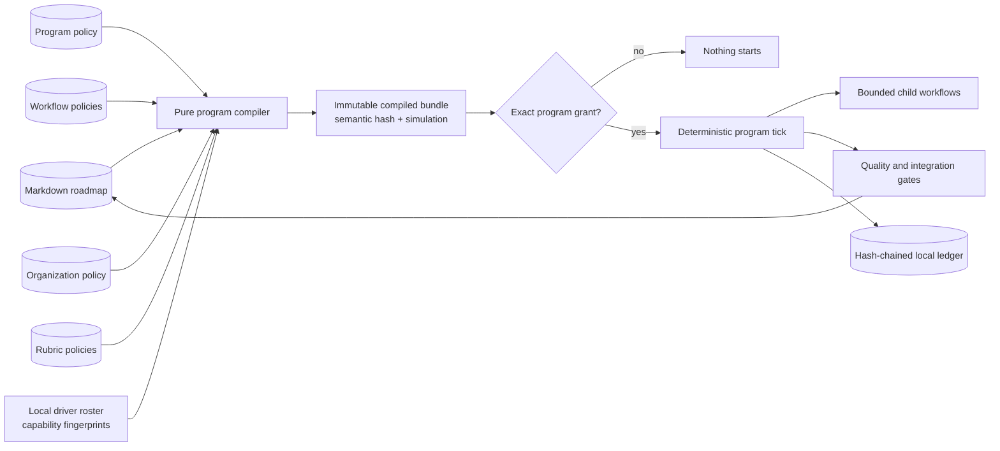
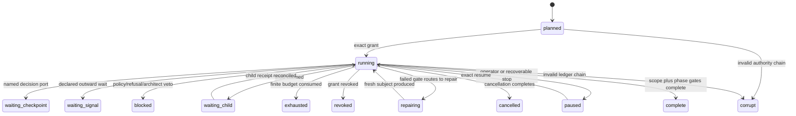

# Optional autonomous delivery programs

**Status:** Phase 26 contract. Runtime implementation begins only after this
trust and semantics document is pinned by tests.
**Product claim:** Delivery Workbench **can run** a governed delivery program
across an explicit roadmap scope when tracked policy has compiled and an
operator has issued a separate finite program grant. Delivery Workbench is not
an autonomous runner by default, and installing, updating, opening, or using
the ordinary product starts nothing.

This contract builds on the delivered bounded-run contract in
[orchestration.md](./orchestration.md) and the outward-fact contract in
[signals.md](./signals.md). It does not edit either contract retroactively. A
Phase 24 score still means one bounded run with a terminal handoff; a signal is
still observation rather than authority.

## Capability ladder and default invariant

The product exposes capabilities, not a forced migration:

| Tier | Configuration | Authority | Terminal meaning |
|---|---|---|---|
| **Vanilla** | Roadmap and ordinary Delivery Workbench configuration | Existing deliberate story, evidence, step, gate, and commit acts | The operator or agent chooses each next act |
| **Bounded orchestration** | One `delivery-workbench-orchestration@1` score | One finite run grant | The score reaches its declared terminal handoff |
| **Program advisory** | Program bundle | No dispatch or mutation authority | Explain/simulate the multi-story program |
| **Program checkpointed** | Program bundle | Finite grant plus required named decision ports | Stop at each contracted checkpoint |
| **Program continuous** | Program bundle | Finite grant carrying every required capability | Continue until complete, refused, revoked, expired, or exhausted |

The **default-mode compatibility invariant** is normative:

- no program configuration is healthy ordinary state;
- vanilla `status`, `next`, `step`, evidence, gate, CLI, MCP, HTTP, and
  Workbench behavior remains available without a program store or program
  setup;
- a score, bounded run, shipped template, or existing run grant is never
  auto-wrapped in, imported into, or interpreted as a program;
- install and update create no program instance, grant, ledger, observer,
  process, stream, notification, network call, or changed default route; and
- Program Studio and the program control room are progressively disclosed
  optional workspaces, never the ordinary Workbench front door.

An implementation that violates any line above has changed the base product
and cannot ship as Phase 26.

## Composition and sources of truth



There are four distinct sources. They must never be collapsed:

1. **Roadmap truth** is the existing Markdown tree and Git history.
2. **Tracked policy** describes what a program could do: scope, workflows,
   organization, rubrics, requested capabilities, budgets, and stops.
3. **Local resolution** maps logical agent profiles and provider ports to
   executable drivers, identities, isolation domains, and credentials. Tracked
   policy never contains provider executables or secrets.
4. **Runtime authority** is one immutable, local, finite, revocable grant over
   the complete compiled bundle and observed repository facts.

Opening, listing, compiling, validating, simulating, visually editing, or
saving tracked policy operates only on source 2 and starts no program. A
program grant cannot change source 1 or 2; it can authorize only the exact acts
already requested by the compiled bundle.

## Terminology

| Term | Meaning |
|---|---|
| **Program** | A tracked policy that scopes roadmap work, binds workflow/team/rubric rules, requests finite authority, and defines completion/stops. |
| **Program bundle** | The canonical compiled program plus every resolved workflow, organization, rubric, and layout-independent semantic hash. |
| **Workflow** | A reusable acyclic hierarchical graph with typed, finitely bounded repetition primitives. |
| **Organization** | Logical agents, pools, team slots, separation rules, councils, and stable assignment policy. |
| **Rubric** | Versioned criteria and evidence requirements for an explicitly typed agent judgment. |
| **Role slot** | A duty in one workflow instance, such as implementer, verifier, critic, judge, meta-verifier, or architect. |
| **Principal** | The locally resolved execution identity behind a logical agent. Separation is checked on principal and workspace domain, not display name alone. |
| **Verdict** | A typed, provenance-bound result over one exact subject. Mechanical facts, agent judgments, council judgments, and meta-reviews are distinct types. |
| **Program grant** | Local authority bound to one compiled bundle, roadmap/repository observation, driver roster, mode, capability set, budgets, expiry, and operator. |
| **Program tick** | One replay/reconcile/plan/claim/dispatch-or-record pass. A tick is finite and returns after its declared acts. |
| **Workflow address** | Stable lineage: program/phase/story/workflow/subflow/loop-round/node/role/attempt. |
| **Decision port** | A named typed checkpoint whose allowed responses and effects are declared in policy. |
| **Dissent** | A preserved non-majority or vetoing judgment; never discarded by aggregation. |

## Tracked policy family

Phase 26 introduces new versioned policy kinds rather than extending
`delivery-workbench-orchestration@1` with implicit multi-story behavior:

| Kind | Default path | Owns |
|---|---|---|
| `delivery-workbench-program@1` | `pm/programs/<slug>.json` | roadmap scope, binding rules, mode ceiling, requested capabilities, budgets, phase gates, and stop policy |
| `delivery-workbench-workflow@1` | `pm/workflows/<slug>.json` | reusable hierarchical graph, parameters, artifacts, typed loops, routes, and terminal meanings |
| `delivery-workbench-organization@1` | `pm/organizations/<slug>.json` | logical agents, pools, teams, role duties, separation, councils, replacement, and escalation |
| `delivery-workbench-rubric@1` | `pm/rubrics/<slug>.json` | agent-judgment criteria, evidence/citation requirements, result aggregation, and freshness |

The kind string and `schema_version: 1` are both required. The `@1` suffix in
this document means that pair, not a filename. References use a stable slug;
the compiler resolves every reference in the same repository, stamps its
semantic hash into the bundle, and rejects missing or ambiguous references.

### Program document

A representative program policy is:

```json
{
  "kind": "delivery-workbench-program",
  "schema_version": 1,
  "slug": "phase-26-and-27",
  "title": "Governed delivery across two phases",
  "scope": {
    "project": "work-log-automation",
    "phases": {"from": 26, "through": 27},
    "stories": "all",
    "selection": "roadmap-frontier-v1",
    "blocked_policy": "stop"
  },
  "organization": "delivery-core",
  "bindings": [
    {
      "id": "phase-26",
      "priority": 10,
      "match": {"phase_from": 26, "phase_through": 26},
      "workflow": "build-verify-integrate",
      "team": "story-cell",
      "rubrics": ["story-quality"]
    },
    {
      "id": "fallback",
      "priority": 100,
      "match": {"phase_from": 27, "phase_through": 27},
      "workflow": "build-verify-integrate",
      "team": "story-cell",
      "rubrics": ["story-quality"]
    }
  ],
  "phase_gates": [
    {
      "id": "architecture-gate",
      "when": "before-phase-complete",
      "role": "master-architect",
      "rubric": "phase-architecture",
      "on_fail": "block"
    }
  ],
  "mode_ceiling": "continuous",
  "requested_capabilities": [
    "agent:dispatch",
    "check:execute",
    "workspace:write",
    "evidence:materialize",
    "integration:apply",
    "contract:generate",
    "certification:verdict",
    "git:commit",
    "git:push",
    "roadmap:story-start",
    "roadmap:story-complete",
    "roadmap:phase-advance"
  ],
  "budgets": {
    "max_phases": 2,
    "max_stories": 12,
    "max_child_runs": 72,
    "max_agent_starts": 96,
    "max_check_starts": 240,
    "max_loop_rounds": 36,
    "max_debate_rounds": 8,
    "max_repairs_per_story": 3,
    "max_verdicts": 72,
    "max_integrations": 12,
    "max_commits": 12,
    "max_pushes": 12,
    "max_nudges": 24,
    "max_artifact_bytes": 50000000,
    "max_wall_seconds": 172800
  },
  "stop_conditions": [
    "scope-complete",
    "checkpoint-required",
    "unresolved-dissent",
    "architect-veto",
    "blocked-frontier",
    "budget-exhausted",
    "grant-expired",
    "grant-revoked"
  ]
}
```

Policy requests capabilities and limits; it grants neither. `mode_ceiling`
states the most autonomous mode the author considered. A grant may choose a
less autonomous mode and smaller limits but never a higher mode, new
capability, wider scope, or larger budget.

### Workflow document

A workflow has `kind`, `schema_version`, `slug`, `title`, a closed parameter
list, defaults, nodes, terminals, and optional editor `layout`. Its top-level
success dependency graph is acyclic. A node is one of the closed types in the
[hierarchical workflow semantics](#hierarchical-workflow-semantics) section.
Subflow nodes reference another workflow by slug and bind declared parameters;
the compiler expands a stable address while preserving the reference boundary.

A workflow may reuse a complete Phase 24 score only through an explicit
`bounded_run` leaf whose score slug, inputs, expected terminal, capability
ceiling, and child budgets are declared. That leaf creates one child run under
a strict subset grant. It does not turn the score itself into a program and
cannot continue to another story.

### Organization document

An organization contains:

- logical `agents` with stable id, local driver profile selector, allowed duty
  set, capability ceiling, workspace-domain requirement, and assignment weight;
- ordered `pools` containing agent ids;
- `teams` with named role slots, candidate pool, cardinality, required duties,
  and independence rules;
- `councils` with speaker slots, protocol, quorum, judge/tie policy, dissent
  handling, and optional meta-verifier; and
- replacement/escalation rules with finite replacement counts.

Tracked agents are logical candidates, not credentials. At plan time local
driver discovery resolves each profile to a `principal_fingerprint`, executable
version, supported capabilities, isolation mode, and availability. The bundle
and grant bind that roster fingerprint. Resolution that cannot prove the
requested capability or separation refuses before assignment.

### Rubric document

A rubric contains `kind`, `schema_version`, `slug`, `title`, `subject_type`,
`result_vocabulary`, `freshness`, an ordered closed list of criteria, and an
aggregation rule. Each criterion declares:

- stable id and plain-language question;
- evaluation type: `agent-judgment` or a reference to a named mechanical fact;
- required evidence artifact kinds and minimum citations;
- allowed criterion results: `pass | fail | abstain | inconclusive`;
- whether failure is vetoing; and
- a bounded rationale byte limit.

A rubric never names a model, hidden confidence threshold, executable, or
credential. Changing any question, required evidence, aggregation, freshness,
or veto rule changes the rubric semantic hash and invalidates an unstarted
grant.

### Closed schemas, hashes, and layout

Every policy kind is closed by object level: unknown top-level, nested, node,
route, loop, role, council, criterion, budget, selector, or capability keys are
compile diagnostics rather than ignored behavior. Numeric bounds are positive
integers unless the field explicitly allows zero to disable a capability.

The compiler produces:

- one `document_hash` for each normalized source including editor layout;
- one `semantic_hash` for each source excluding only non-executable layout;
- one `bundle_hash` covering normalized program semantics, resolved source
  semantic hashes, roadmap-scope rules, compiler version, and local roster
  capability fingerprints; and
- diagnostics containing `source`, JSON `pointer`, `code`, `message`, and
  `remediation`.

Graph and JSON views round-trip both semantics and layout. Layout can move
without changing authority; every executable field changes the bundle hash.
An active program runs its immutable stored bundle and never adopts a tracked
policy edit.

## Roadmap scope and deterministic selection

Program v1 operates in one local Git repository and one roadmap project. Scope
uses exactly one explicit phase list or one inclusive bounded phase range.
Stories are either `all` within those phases or an explicit non-empty story-id
list. Scope cannot be inferred from the current pointer, a model suggestion,
branch name, or untracked file.

`roadmap-frontier-v1` is the only Phase 26 selection policy:

1. Read and validate the complete roadmap snapshot without writing it.
2. Restrict candidates to the exact project, phase, and story scope.
3. Resume an eligible `in-progress` scoped story before selecting new work.
   More than one writable active story is a refusal unless the compiled
   program explicitly owns disjoint read-only activity for the extras.
4. Otherwise choose the lowest numbered incomplete scoped phase, then preserve
   the story-table order within that phase.
5. A story is eligible only when its status is startable, all declared
   dependencies are done, the phase is open, the story is not held or blocked,
   and exactly one binding rule and satisfiable team apply.
6. A held, blocked, failed, vetoed, exhausted, or unresolved-dissent item at
   the advancement frontier stops selection under v1. It is reported; it is
   never silently skipped for easier work.
7. Phase advancement is eligible only when every scoped story in the phase is
   done and every declared phase gate has a fresh green result.
8. Exhausted scope yields `scope-complete` only when all scoped work is done;
   otherwise it yields a specific refusal.

Every story in every scoped phase receives a candidate record, including work
outside the current frontier. Candidate reasons are closed and ordered:
`selected`, `resume-in-progress`, `phase-not-current`, `out-of-scope`,
`phase-paused`, `story-held`, `story-blocked`, `dependency-incomplete`,
`status-not-startable`, `already-done`, `binding-missing`,
`binding-ambiguous`, `team-unsatisfied`, or `frontier-stopped`.

Bindings are evaluated by ascending integer `priority`, then id. Exactly one
best-priority match must exist. Two matching rules at the same best priority
are ambiguous even if they name the same workflow; the compiler refuses so
rule edits cannot change behavior invisibly. Assignment and its complete
derivation are part of a pure plan before any grant exists.

The plan binds repository identity, branch, HEAD, index tree, Git operation,
roadmap file hashes and health, bundle hash, selected phase/story, binding,
workflow version, team, logical agents, resolved principals, required verifier,
optional council/meta-verifier/architect policy, requested acts, and the reason
for every excluded candidate. Repeating at one observation time is
byte-equivalent and creates no state.

### Delivered pure planning surface (WLA-26-02)

`dw program list|validate|simulate|plan` now implements this read boundary.
`list` treats an absent `pm/programs/` directory as a healthy empty inventory.
`validate` closes program keys, references, scope, budgets, bindings, minimum
organization/team shape, and ambiguous equal-priority matches. `simulate`
returns every candidate reason plus the selected workflow/team/role derivation.
`plan` additionally binds repository root/branch/HEAD/index/operation, roadmap
health and file snapshot, policy/reference hashes, local driver-roster
capabilities, stable role assignments, verifier separation, and phase-gate
policy.

All four documents explicitly stamp `starts_work: false`; the planning forms
also stamp `writes_policy: false`, `writes_roadmap: false`,
`writes_run_state: false`, and `creates_grant: false`. Repeated plans at one
observation are canonical-byte identical. No command creates
`.git/pmo-programs`, and none accepts a mode, capability, assignment, or route
override from the caller. Full hierarchical workflow compilation and the
expanded organization/replacement model remain WLA-26-03 and WLA-26-04,
respectively.

## Hierarchical workflow semantics

### Closed node types

| Type | Meaning | Required finite boundary |
|---|---|---|
| `agent` | One structured work packet to a declared role slot | timeout, output schema/bytes, attempt ceiling, capability ceiling |
| `check` | Phase 24 exact command or built-in mechanical check | argv/predicate, timeout, output cap, declared writes |
| `collect` | Pure fan-in and artifact validation | declared producers, schema and byte bounds |
| `bounded_run` | One immutable Phase 24 score as a child | child grant subset, expected terminal, run/start/wall budgets |
| `subflow` | One referenced workflow with bound parameters | acyclic reference graph and child budget envelope |
| `loop` | Repeat one acyclic subflow under a typed predicate | `max_rounds`, global budget, success predicate, exhaustion route |
| `debate` | Typed propose→critique→rebut→judge rounds | participants, `max_rounds`, quorum/tie/dissent rules, exhaustion route |
| `verdict` | Request one agent, council, or meta verdict | exact subject, role, rubric, freshness, allowed result routes |
| `gate` | Combine named mechanical facts and typed verdicts | closed expression, missing/dissent policy, pass/fail routes |
| `checkpoint` | Publish one typed human decision port | prompt id, closed options, expiry, each option's route |
| `rail` | One existing evidence/contract/integration/Git/roadmap act | exact action id, capability, preview/fingerprint/apply receipt |

Fan-out is multiple nodes becoming eligible from the same completed boundary.
Fan-in is a `collect` or `gate` whose complete `needs` set must finish. Stable
score order then id breaks scheduling ties; role/resource locks constrain
parallelism. No browser, agent, or runtime callback invents an edge.

### Bounded loops and subflows

General graph cycles and recursive subflow references are invalid. Repetition
exists only through `loop` and `debate` nodes. A loop declares:

- an acyclic body workflow and exact input/output bindings;
- `max_rounds` and any narrower per-story/per-program ceiling;
- one closed `until` predicate over named check results, verdict results,
  artifact validity, or a typed decision—not model prose;
- which artifacts carry into the next round and which are immutable;
- a success continuation; and
- an exhaustion action: `block | escalate | checkpoint | abort`.

Retry, repair, review, audit, and verifier-of-verifier cycles are named loop
templates over those same semantics. A repair round receives the failed facts
and verdict hashes, never hidden reviewer conversation. A fresh verification
round evaluates the post-repair subject; an older green verdict cannot cover a
new diff.

A debate is not free-form group chat. Each round emits ordered, bounded
`proposal`, `critique`, `rebuttal`, and `judgment` artifacts from declared role
slots. Quorum counts eligible non-abstaining principals, the judge applies an
exact rubric, dissent is preserved, and the configured tie/exhaustion route is
followed. A council may recommend; it gains no integration or roadmap authority
from reaching consensus.

### Complete route simulation

Compilation explores every finite branch symbolically. Simulation reports:

- expanded workflow addresses and reference lineage;
- deterministic eligibility waves, resource locks, and team assignments;
- green, red, abstain, inconclusive, dissent, checkpoint, exhaustion,
  replacement, escalation, revocation, and expiry routes;
- per-route and worst-case phase/story/round/start/check/artifact/time envelopes;
- every required capability and the node/rail that consumes it; and
- terminal meanings and any route that cannot reach one.

The compiler rejects an unbounded route, unreachable required node, route to an
unknown node, unhandled verdict, impossible quorum, unsatisfied role,
non-decreasing loop budget, recursive subflow, ambiguous binding, or workflow
whose worst case exceeds program policy. “The model will stop” is never a
finite proof.

## Organization, assignment, and separation of duties

Team assignment happens during pure planning, before implementation dispatch.
For each role slot the compiler filters the declared pool by duty,
capabilities, availability, workspace isolation, and separation constraints,
then ranks candidates with `rendezvous-sha256-v1` over:

```text
bundle_hash | story_id | workflow_address | role_slot | agent_id
```

Highest hash wins; agent id breaks an impossible hash tie. Assignment is stable
for the same observation and not chosen by an implementer or model. The plan
records filtered candidates and a reason for every exclusion.

Every autonomously completable story requires, at minimum:

- one implementer principal with a writable isolated workspace;
- one verifier principal different from the implementer principal and from the
  implementer's workspace domain;
- verifier assignment fixed before implementation dispatch;
- a verifier capability set that cannot write the implementation subject; and
- a fresh verifier verdict over the exact integrated candidate diff and
  required mechanical receipts.

Logical ids alone do not prove independence. If two agent ids resolve to the
same principal, credential, session, or writable workspace domain, the plan
refuses `separation-violation`. The implementer cannot select, replace, prompt,
or alter the verifier/rubric. Context needed to judge is declared; private
implementer chain-of-thought is neither required nor supplied.

Meta-verifiers, judges, and master architects obey policy-declared separation.
A meta-verifier must be independent of the implementer and the verdict author
it audits. A council cannot satisfy quorum with duplicate principals. A phase
architect veto is blocking when the phase gate says so.

Replacement is not silent reassignment. It requires a declared unavailable,
lost, conflicted, or refused state; consumes a replacement budget; appends the
old/new assignment and reason; increments assignment generation; invalidates
outstanding work for the old principal; and requires fresh outputs/verdicts
where subject or independence could have changed. Exhaustion follows the
declared escalation route.

## Verdict taxonomy and quality gates

### Mechanical facts are not agent judgments

| Type | Issuer | May claim | May not claim |
|---|---|---|---|
| `mechanical-fact` | Trusted local check/rail adapter | exact argv/predicate, exit/result, hashes, bounded output reference, observed facts | design quality, intent fidelity, subjective confidence |
| `agent-verdict` | One assigned independent principal | rubric criterion judgments over cited evidence | that prose is a test receipt or that uncited work happened |
| `council-verdict` | Deterministic aggregation of member verdicts | quorum result, judge result, member hashes, dissent | unanimity when dissent exists or mechanical truth |
| `meta-verdict` | Assigned independent auditor | validity/procedure/freshness of underlying verdicts; uphold, overturn, or escalate | rewrite history, erase dissent, or convert judgment into fact |

All verdicts use `delivery-workbench-verdict@1` and bind:

- program/run, phase, story, workflow address, assignment generation, and
  issuer principal/role;
- subject kind plus subject hash: diff/tree, artifact set, phase snapshot, or
  underlying verdict set;
- rubric slug and semantic hash;
- ordered criterion results with evidence/citation references and bounded
  rationales;
- overall `pass | fail | abstain | inconclusive`;
- dissent/veto records and source-verdict hashes when applicable;
- issued time, freshness facts, ledger head, and idempotency key.

Only the check/rail adapter can create `mechanical-fact`. An agent mentioning a
passing test produces an assertion until a matching mechanical receipt exists.
Only the assigned principal can create its verdict, and the conductor validates
the subject/rubric/assignment/freshness before recording it.

A quality `gate` is a closed expression over named facts and verdicts using
`all`, `any`, `at_least`, and explicit veto rules. Missing, stale, abstaining,
inconclusive, quorum-lost, meta-overturned, or unresolved dissent inputs take
their declared red/escalation route; they never default to pass. Every surface
renders facts and judgments with different labels and provenance.

## Autonomy modes and capability lattice

Modes constrain when the same conductor must stop; they do not mint authority:

| Mode | Dispatch/mutation | Mandatory stop |
|---|---|---|
| `advisory` | none | after pure plan/simulation |
| `checkpointed` | only capabilities in its grant | every named decision port plus any refusal/limit |
| `continuous` | only capabilities in its grant | policy stop, refusal, terminal, revocation, expiry, or limit |

Changing mode requires a new grant. A live grant is immutable. Continuous mode
means no human act is required *inside the granted envelope*; it does not mean
unlimited time, authority, retries, cost, scope, or recovery.

The Phase 26 capability vocabulary is closed:

| Capability | Exact act |
|---|---|
| `agent:dispatch` | claim and start/poll one declared agent or child-run node |
| `check:execute` | claim and execute one declared bounded mechanical check |
| `workspace:write` | let an assigned child write only its isolated declared paths |
| `nudge:deliver` | use a score/program-declared Phase 25 standing rule within budget |
| `notification:send` | publish a content-safe declared notification |
| `evidence:materialize` | write one exact captured evidence artifact through the evidence rail |
| `integration:apply` | apply one previewed candidate diff to the integration lane |
| `contract:generate` | generate a contract over the exact staged tree |
| `certification:objective` | record only fully machine-derived certification claims defined as objective by canon |
| `certification:verdict` | record an accountable rubric-backed certification judgment from the assigned authority |
| `git:commit` | create one exact gated commit with expected tree/message/trailers |
| `git:push` | push that exact commit as a clean fast-forward to one named remote/ref |
| `roadmap:story-start` | apply one previewed start transition for the selected story |
| `roadmap:story-complete` | apply one previewed done transition after all completion gates |
| `roadmap:phase-advance` | advance the pointer after every scoped story and phase gate is green |

Capabilities are independent bits with prerequisites, not implication shortcuts.
For example, `git:push` requires a recorded exact commit but does not grant
`git:commit`; `roadmap:story-complete` requires evidence and certification but
does not grant either; `agent:dispatch` never grants write, verdict,
integration, certification, Git, or roadmap acts. Program, role, child-run,
story, repository, and remaining-budget ceilings are intersected for every
claim. The narrowest ceiling wins.

No Phase 26 grant can contain `git:merge`, release creation, deployment,
publication, arbitrary shell, arbitrary network destinations, raw credential
access, policy/rubric edits, authority minting, conflict resolution, or
cross-repository writes. Those are permanent exclusions for this phase.

Certification remains an explicit act. A mechanical green suite never checks a
judgment box. `certification:objective` is legal only for a canonically defined
claim whose complete truth is machine-derived. `certification:verdict` requires
the specifically assigned authority, exact rubric and citations, fresh subject,
visible judgment provenance, and any required quorum/meta-review. Neither can
be inferred from program completion.

## Program plan and grant

`delivery-workbench-program-plan@1` is a pure reviewed preview. In addition to
the complete assignment plan it carries:

- repository physical identity, branch, HEAD, index tree, worktree cleanliness,
  Git operation, remote/ref and fast-forward observation;
- roadmap snapshot/hash, selected project, complete scope, current frontier,
  and all candidate reasons;
- source document hashes, compiler version, bundle hash, roster fingerprint,
  assignments, separation proof, route simulation, and worst-case envelope;
- requested mode, capabilities, per-scope budgets, expiry, stop conditions,
  permanent exclusions, and accountable operator; and
- `starts_work: false`, `writes_policy: false`, `writes_roadmap: false`, and an
  exact single-use `start_token` over the whole preview.

`delivery-workbench-program-grant@1` is issued only when start re-plans current
facts and byte-matches the submitted plan/token. It contains one unpredictable
program-run id, immutable plan/bundle, repository/roadmap/roster facts, chosen
mode, exact capability set, every finite budget, issued/expiry times,
revocation generation, operator identity/decision, and permanent exclusions.

The grant lives under `.git/pmo-programs/runs/<program-run-id>/grant.json`. It
is local authority, not a portable bearer secret. A caller supplies ids and
exact tokens, never a replacement policy, prompt, capability, command,
assignment, rubric, budget, or route at action time.

Start refuses on stale token, changed source/bundle/roster/roadmap/repository,
dirty or ambiguous integration state, unsupported capability, impossible
separation, invalid route, missing finite bound, expired plan, or scope that
cannot progress. Pause stops new claims. Resume requires current facts still
inside the grant. Revoke increments generation before stopping future claims;
cancel additionally requests bounded interruption of active children. A wider
scope, larger budget, different mode, changed policy, or changed authority
always requires a new grant—not mutation in place.

## Budgets, ceilings, and exhaustion

All continuous grants have finite positive limits for phases, stories, child
runs, agent starts, check starts, total loop rounds, debate rounds, repairs per
story, verdicts, integrations, commits, pushes, nudges, artifact bytes, and wall
time. A capability absent from the grant has an effective budget of zero.

Each workflow/loop/role may declare a narrower local ceiling. Before a claim,
the conductor checks the minimum of policy, grant, scope, role, node, loop,
story, phase, and remaining global limits. Budget is reserved atomically with
the claim and reconciled from its receipt; a crash cannot spend the same unit
twice. Worst-case compilation includes every retry, repair, debate, replacement,
and failure branch rather than only the green path.

Exhaustion is a typed result, not an invitation to improvise. It follows the
compiled `block`, `escalate`, `checkpoint`, or `abort` route and prevents all
uncovered claims. Adding budget requires a new grant over a fresh plan.

## Program state, ledger, and recovery

The replayed `delivery-workbench-program-run@1` projection uses these states:



`blocked`, `exhausted`, `revoked`, `cancelled`, `complete`, and `corrupt` are
terminal for that grant generation. A repair or checkpoint is nonterminal only
when the compiled route and remaining grant explicitly cover it.

The runtime directory is:

```text
.git/pmo-programs/runs/<program-run-id>/
  grant.json                 immutable local authority
  plan.json                  immutable reviewed start plan
  bundle.json                immutable compiled policy bundle
  ledger.jsonl               authoritative hash-chained events
  children/<address>.json    child run/session identities and receipts
  artifacts/                 declared bounded artifact metadata/content
  integration/               exact diff/apply/commit/push receipts
  projection.json            disposable replay cache
```

Every `delivery-workbench-program-event@1` carries run id, sequence, event id,
timestamp, previous hash, event hash, grant generation, workflow address,
phase/story when applicable, action/idempotency key, typed detail, consumed
budget, and resulting state. The closed event families are:

- lifecycle: `program_started`, `program_paused`, `program_resumed`,
  `program_revoked`, `program_cancelled`, `program_exhausted`,
  `program_completed`, `program_refused`;
- selection/organization: `phase_selected`, `story_selected`, `team_assigned`,
  `assignment_replaced`, `workflow_instantiated`;
- work/quality: `action_claimed`, `child_started`, `child_reconciled`,
  `artifact_recorded`, `mechanical_fact_recorded`, `verdict_recorded`,
  `dissent_recorded`, `loop_advanced`, `debate_round_recorded`,
  `gate_evaluated`, `repair_routed`;
- decisions/signals: `checkpoint_requested`, `checkpoint_decided`,
  `signal_linked`, `nudge_linked`, `notification_linked`; and
- delivery: `evidence_materialized`, `integration_applied`,
  `contract_generated`, `certification_recorded`, `commit_recorded`,
  `push_recorded`, `story_transitioned`, `phase_transitioned`.

Before any external or mutation act, the conductor atomically appends an
exclusive claim with an idempotency key over run/generation/phase/story/
workflow-address/round/node/role/attempt/action kind. Recovery replays, polls or
reconciles that exact claim, and records one terminal receipt before another
attempt. It never treats a missing receipt as proof an act did not happen.

Driver, check, evidence, integration, Git, and roadmap rails each expose an
operation-specific idempotency/reconciliation seam. An uncertain destructive
act blocks rather than repeats. A corrupt, forked, truncated, reordered, or
hash-invalid ledger yields `corrupt` and no further claim. Deleting
`projection.json` changes no meaning.

## Integration and exact roadmap advancement

Implementation occurs in isolated child workspaces. Only one story owns the
Phase 26 integration lane at a time. `integration:apply` requires a pure plan
binding base tree, candidate diff hash, allowed paths, expected resulting tree,
story, workflow/assignment generation, green gate hashes, and repository
fingerprint. Apply rechecks all facts under the integration lock. Dirty,
divergent, overlapping, out-of-scope, symlink-escaping, stale, or conflicting
diffs refuse with no partial apply; there is no automatic conflict resolution.

Evidence materialization, contract generation, certification, commit, push,
story transition, and phase transition are separate claims and receipts. A
green verifier verdict grants none of them. A continuous program completes a
story only when all of the following are fresh for the exact integrated tree:

1. required mechanical checks passed;
2. the preassigned independent verifier issued a green rubric verdict;
3. required council/meta-verifier/architect gates passed and dissent policy is
   satisfied;
4. evidence was materially captured and paired through the existing rail;
5. the applicable certification act was separately granted and recorded;
6. exact integration, gated commit, and any required push succeeded under their
   own capabilities; and
7. the guarded roadmap mutation re-previews and atomically moves only that
   story to done.

Story-start and story-complete acts continue to use the existing roadmap
preview/fingerprint/apply core and validation. Phase advancement additionally
requires every scoped phase story done, a clean healthy roadmap, a fresh phase
architect gate when declared, no unresolved dissent/veto, expected Git/remote
facts, and `roadmap:phase-advance`. Partial phase transition is impossible.

Commit and push are exact rather than arbitrary Git shells. Commit binds the
staged tree, message template, story trailer, certified contract digest, and
expected parent. Push binds one remote/ref, exact commit, and observed
fast-forward lease. Merge, release, deploy, and publication remain impossible.

## Outward facts, nudges, and decision ports

Programs consume Phase 25 signal facts by hash and derived status; they do not
copy raw forge content or turn observation into authority. A program can wait
on a declared signal predicate, issue a content-safe notification, or deliver
a bounded nudge only when program policy, child score policy, grant capability,
standing rule, activity receptivity, and all budgets agree.

A nudge changes when an already declared role/node runs, never which work,
agent, check, rubric, or capability exists. `blocked` and `unknown` principals
still refuse input. Program recovery links existing signal/nudge/request
receipts instead of republishing or redelivering them.

Decision ports name exact allowed responses and effects. A checkpoint response
binds program/run, request id, generation, ledger head, subject hashes, chosen
closed option, accountable identity, and expiry. It may choose a declared route
but cannot add policy, authority, budget, prompt text, command, or assignment.
Continuous policies may omit human ports; checkpointed policies must stop at
the ones they declare.

## Surfaces and progressive disclosure

One core compiler/planner/projection owns semantics. Intended adapters are:

- CLI: `dw program list|show|validate|simulate|plan|start|tick|supervise|pause|
  resume|revoke|cancel|tail`;
- MCP/HTTP: byte-equivalent reads plus exact-token, closed-parameter acts;
- Workbench Program Studio: Design, Organization, Rubrics, Simulate, Validate,
  JSON, and Authority views over the shared compiler; and
- Workbench control room: roadmap frontier, active organization, workflow
  lineage, rounds, verdicts/dissent, gates, authority, budgets, events, and
  exact stop/refusal explanation.

The program namespace is additive. With no program files, `program list`
returns a healthy empty inventory and ordinary status/MCP/HTTP/Workbench models
stay behavior-compatible. Opening the Workbench does not create a program
directory, start SSE, poll providers, send notifications, or show blocking
setup. Program Studio is entered deliberately.

Graph/config round trips are lossless. Saving uses guarded
preview→fingerprint→apply and starts nothing. Simulation is pure. Authority is
a separate preview/confirm surface and never a Save button side effect. Browser
routes accept ids, bounded reasons, closed decisions, and exact tokens—not
program documents at runtime or generic prompts/commands.

Reads and SSE streams carry no mutation token. SSE is bounded cursor replay of
the authoritative ledger, not a scheduler or polling authority. Remote clients
may operate the local runner through exact adapters; the local repository,
grant, ledger, drivers, and locks remain the trust root.

## Storage, privacy, and content boundaries

Tracked policy may contain reviewed prompts/instructions and artifact schemas,
but never credentials, API tokens, private keys, provider executables,
machine-specific secret paths, or raw third-party bodies. Local driver
configuration owns authentication and sandbox enforcement.

The program ledger stores identifiers, hashes, bounded reasons, typed results,
criterion outcomes, citation references, capability/budget consumption, and
receipts. It does not store chain-of-thought, full model transcripts, source
file contents, raw CI logs, review bodies, environment dumps, credentials, or
notification transport payloads. Declared artifacts have byte/type/retention
bounds and explicit inspection; public projections contain metadata only.

Untrusted model/forge/artifact text is data. It cannot become a route,
capability, argv, role assignment, rubric edit, decision option, or reason to
skip a check. Content-safe refusals expose a closed code and local correlation
without echoing planted secrets.

## Refusal taxonomy

Program operations return a versioned refusal with `code`, bounded `message`,
`program`, `state`, `workflow_address`, `ledger_head`, `retryable`, and
`remediation`; untrusted content is excluded. The closed Phase 26 codes are:

| Code | Meaning |
|---|---|
| `program-not-found` | An explicit program act named no existing compiled policy; ordinary no-program use is not an error |
| `program-invalid` | Closed-schema, reference, hash, selector, or route compilation failed |
| `program-stale` | Tracked policy or bundle changed after preview |
| `roadmap-stale` | Roadmap snapshot, phase/story state, dependencies, or health changed |
| `repository-stale` | HEAD/index/worktree/operation/remote facts changed or are ambiguous |
| `grant-required` | The requested act is not a pure read and no exact active grant exists |
| `grant-expired` | Wall expiry passed |
| `grant-revoked` | Revocation generation forbids new claims |
| `mode-denied` | Act would cross the advisory/checkpointed/continuous mode boundary |
| `capability-denied` | Exact capability is absent from policy, grant, role, or child ceiling |
| `budget-exhausted` | A required finite counter has no remaining unit |
| `scope-violation` | Project/phase/story/repository falls outside exact scope |
| `frontier-blocked` | Earlier held/blocked/failed/vetoed/dissenting work prevents advancement |
| `dependency-incomplete` | Required roadmap/workflow dependency is not green |
| `binding-missing` | No workflow/team/rubric binding matches |
| `binding-ambiguous` | Equal best-priority bindings match |
| `workflow-unbounded` | A route lacks a compile-time finite proof |
| `workflow-recursive` | Workflow/subflow reference recursion was found |
| `role-unavailable` | No resolved candidate satisfies the role |
| `separation-violation` | Principal/workspace/duty independence cannot be proven |
| `quorum-lost` | Declared distinct-principal quorum cannot be reached |
| `dissent-unresolved` | Policy requires resolution of preserved dissent |
| `verdict-stale` | Subject/rubric/assignment/ledger facts changed after verdict |
| `verdict-insufficient` | Missing criterion, citation, gate, meta-review, or allowed result |
| `architect-veto` | A blocking phase architect verdict is red |
| `checkpoint-required` | A named human decision port must resolve before progress |
| `claim-conflict` | An exclusive idempotency claim already owns the act |
| `ledger-corrupt` | Chain is invalid, forked, truncated, or inconsistent |
| `integration-conflict` | Candidate cannot apply exactly to the integration base |
| `remote-diverged` | Exact push is no longer a clean fast-forward |
| `content-refused` | Untrusted/secret/oversized/unsupported content crossed a boundary |
| `permanent-exclusion` | Merge/release/deploy/publish/arbitrary authority was requested |

Retryable is derived from code and compiled policy, never caller-provided.
Refusals append at most one deduplicated receipt when a grant/ledger exists;
pure pre-grant validation writes nothing.

## Threat model and exact fail checks

| Threat | Exact fail check | Required response |
|---|---|---|
| Default-mode creep makes programs mandatory | Fresh no-program install has no program files/state/process/observer/network/UI detour and ordinary golden models match | Release/phase exit refuses |
| Install, save, or open becomes ambient authority | No grant exists and process/state/network side-effect counters remain zero | Nothing starts; report pure result |
| A bounded score silently becomes a program | Program compiler accepts only explicit program kind and references scores only through `bounded_run` | `program-not-found` or `program-invalid` |
| Policy edit changes a live program | Runtime uses immutable bundle/grant hashes | `program-stale`; new grant required |
| Agent/model chooses work or authority | Selection/bindings/capabilities derive only from closed compiled policy | `scope-violation`, `binding-*`, or `capability-denied` |
| Hard work is skipped for easier work | `roadmap-frontier-v1` stops at held/blocked/failed/vetoed/dissenting frontier | `frontier-blocked` with all candidate reasons |
| Implementer verifies itself | Principal/workspace separation proof precedes dispatch and verdict recording | `separation-violation` |
| Two logical council members are one principal | Quorum de-duplicates bound principal fingerprints | `quorum-lost` |
| Prompt or rubric mutates after work | Subject binds rubric semantic hash and immutable bundle | `program-stale` or `verdict-stale` |
| Agent prose counterfeits a test fact | Only check/rail adapter may issue `mechanical-fact` | `verdict-insufficient` or `content-refused` |
| Council hides dissent | Aggregation requires every member hash and preserved dissent/veto fields | `dissent-unresolved`; render dissent |
| Debate/retry/repair loops forever | Closed loop primitive, positive max rounds, decreasing budgets, worst-case compile proof | `workflow-unbounded` or `budget-exhausted` |
| Stale green verdict covers repaired code | Verdict subject includes exact diff/tree and assignment/rubric generation | `verdict-stale`; re-verify |
| Meta-verifier launders a bad verdict | Meta type can uphold/overturn/escalate only and remains judgment | `verdict-insufficient`; type stays visible |
| Child run elevates capability | Child ceiling is strict intersection of program/role/story/node/remaining grant | `capability-denied` before claim |
| Crash duplicates an expensive/destructive act | Exclusive deterministic claim, operation receipt, reconcile-before-retry | `claim-conflict` or block uncertain act |
| Corrupt projection/ledger changes truth | Projection disposable; complete hash-chain replay required | Rebuild projection or `ledger-corrupt`; no dispatch |
| Integration overwrites concurrent work | Exact base/diff/result plan under single integration lock | `integration-conflict`; no partial apply |
| Push overwrites remote history | Exact expected commit/ref plus fast-forward lease | `remote-diverged`; no force push |
| Raw forge/model content injects routes or secrets | Closed schemas/decision options, content classification, byte limits, metadata-only ledger | `content-refused`; do not echo content |
| UI/config/runtime interpret policy differently | One compiler/model; byte-equivalent adapters and graph↔JSON golden round trips | Validation/parity failure blocks save/start |
| Grant becomes perpetual or expands in place | Every counter and expiry finite; immutable mode/scope/capabilities/budgets | `grant-expired`/`budget-exhausted`; new grant required |
| Program crosses repository or release boundary | Repository id fixed; excluded capabilities absent from vocabulary | `scope-violation` or `permanent-exclusion` |

## Phase 26 proof standard

Contract completion (WLA-26-01) requires this document, cross-links, structural
tests for the default invariant, policy family, separation, verdict taxonomy,
capabilities, refusals, and threat table, plus docs/canon/roadmap validation and
a human read-through of one complete route.

Phase completion additionally requires two distinct wheel-installed exams:

1. **No-program regression:** install with no program config; exercise ordinary
   roadmap/status/next/step/evidence/gate/Workbench and one optional bounded
   score/run; prove compatible models and zero program store/process/observer/
   notification/network/default-route/setup effects.
2. **Autonomous program:** compile config and visual round-trip, preview one
   exact continuous grant, then cross multiple phases/stories with specialist
   implementation, preassigned independent verification, one failed-verifier
   repair, one bounded debate with dissent, meta-verification, master-architect
   phase gate, evidence/integration/certification/commit/push/roadmap acts,
   planted crashes, exact replay, and the complete refusal matrix—without a
   human act after the grant.

The deterministic fixture organization is the mandatory oracle. Any
authenticated live-agent specimen is separately labeled and optional. Merge,
release, deployment, publication, hosted authority, phone interaction, and
cross-repository programs are not Phase 26 exit requirements.

## Settled decisions and deferred boundaries

Settled here:

- Phase 24's schema remains one bounded score; Phase 26 uses separate program,
  workflow, organization, and rubric kinds.
- Vanilla, bounded orchestration, and program profiles are independent opt-in
  capabilities.
- Multi-phase work selection is deterministic policy, never model ranking.
- General cycles are forbidden; typed bounded loop/debate primitives provide
  advanced iteration.
- Every autonomously completed story has a preassigned independent verifier.
- Mechanical facts and governed judgments are permanently different types.
- Agent/council/meta/architect judgments may govern advancement only through an
  exact rubric, evidence, dissent policy, grant, and fresh subject.
- Continuous mode may advance stories and phases with no further human act only
  inside one finite revocable grant containing each separate delivery act.

Deferred beyond Phase 26: cross-repository portfolios, a hosted/cross-machine
authority root, general plugin execution inside the conductor, automatic merge
or conflict resolution, release/deploy/publication capabilities, and changing
the existing vanilla or bounded-run defaults.
