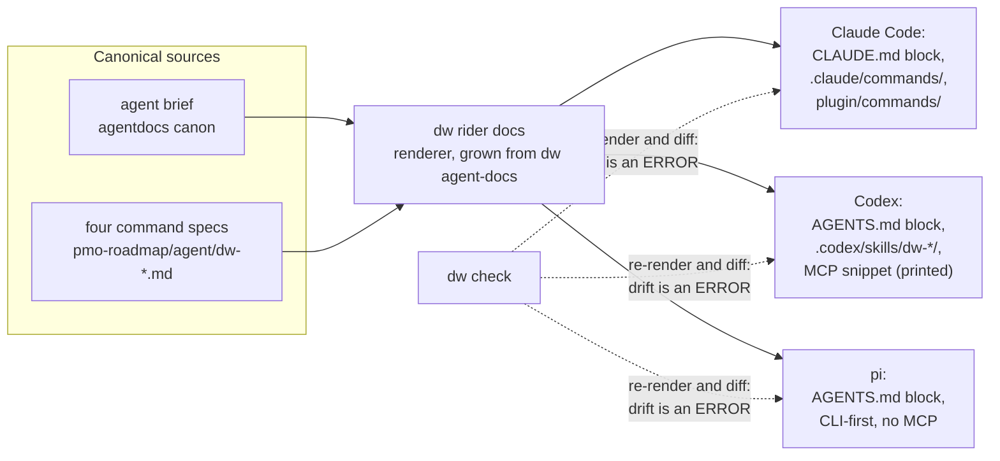

# Riders: the symbiosis contract

**Scope:** the design contract for Phase 12 (WLA-12-01). One canonical
agent brief, rendered per surface; one HoldSpeak integration, ridden
through seams that already exist. Stories WLA-12-02 through WLA-12-07
implement against this document — when reality disagrees with it, the
story updates this document in the same commit, and the correction is
part of the story's evidence.

**How to read the claims.** Every capability claim below carries one
of three marks:

- **verified-live** — the command was run against the installed tool
  on this machine, on the date and version recorded here.
- **cited** — read in the tool's own docs or source, with the file
  path (and version) pinned.
- **unverified** — we could not check it, and the reason is stated.
  Nothing downstream may depend on an unverified claim.

Verification date for everything below: 2026-07-03.

## The four surfaces

| Surface | Version verified against | Context file | Commands / skills | Plugin / extension | MCP | Hooks |
|---|---|---|---|---|---|---|
| Claude Code | 2.1.200 | `CLAUDE.md` (managed block) | `.claude/commands/*.md` | `plugin/` (marketplace plugin) | stdio via `.mcp.json` | yes (not used by DW) |
| Codex CLI | codex-cli 0.142.4 | `AGENTS.md` (native spec) | `.codex/skills/<name>/SKILL.md` | `codex plugin` marketplace | `[mcp_servers]` in `~/.codex/config.toml` | `hooks.json`, trust-gated |
| pi | 0.70.6 | `AGENTS.md` or `CLAUDE.md` | `.pi/prompts/*.md` templates | `.pi/extensions/*.ts` | **none, by design** | none (extensions instead) |
| HoldSpeak | 0.3.1 (pinned; see below) | `.hs/` directory | n/a (voice surface) | `~/.holdspeak/plugin_packs/*.py` | n/a | agent hook (watches Claude/Codex) |

### Claude Code — 2.1.200

Everything in this row is **verified-live** by this repository itself;
the rails run under Claude Code today.

- Context file: the `CLAUDE.md` managed block, stamped and refreshed
  by `dw agent-docs` (canon in
  `pmo-roadmap/lib/dw_pmo/agentdocs.py`), staleness checked by
  `dw doctor`.
- Commands: four slash commands in `.claude/commands/`, currently
  byte-identical hand-synced twins of `plugin/commands/` — the
  duplication WLA-12-04 exists to collapse.
- Plugin: `plugin/` with `.claude-plugin/plugin.json`, the four
  commands, and one skill.
- MCP: `.mcp.json` wires the `delivery-workbench` server over stdio
  to `.githooks/dw-mcp` (contract in [mcp.md](./mcp.md)).

### Codex CLI — codex-cli 0.142.4

- `AGENTS.md`: **verified-live.** The 0.142.4 binary embeds the
  AGENTS.md spec in its base instructions (scope is the directory
  tree rooted at the containing folder; nearer files win). The rider
  writes the same managed block `dw agent-docs` already produces for
  `AGENTS.md`.
- Custom prompts: **verified-live, negative.** The folklore answer
  (`~/.codex/prompts/*.md` becomes `/name`) is stale for the
  non-interactive path: with `~/.codex/prompts/ridertest.md` in
  place, `codex exec '/ridertest'` passed the string through
  literally — the model never saw the prompt file. A custom-prompt
  view still exists in the TUI (**unverified** interactively — it
  needs a human at a TTY; no automated capture was possible), but
  the rider must not depend on it.
- Skills: **verified-live.** The discoverable unit in 0.142.4 is the
  skill — `SKILL.md` directories under `$CODEX_HOME/skills`
  (built-ins ship under `.system/`) and repo-level
  `.codex/skills/<name>/SKILL.md`. A fixture skill planted in a repo
  was discovered and honored by `codex exec` with no flags. This is
  the surface WLA-12-05 renders the four commands onto, and it
  amends that story's "custom prompts" wording.
- MCP: **verified-live.** `codex mcp add|list|get|remove|login`
  manages `[mcp_servers]` entries in `~/.codex/config.toml` (a live
  entry exists on this machine). The rider prints the snippet; it
  never writes into the user's home config silently.
- Hooks: **verified-live.** The `hooks` feature flag reports
  stable/enabled in `codex features`; hooks are configured in a
  `hooks.json` with named lifecycle events (`session_start`,
  `user_prompt_submit`, `pre_tool_use`, `post_tool_use`,
  `pre_compact`, `post_compact`, `subagent_start`, `subagent_stop`,
  `permission_request`), and hook sources are trust-gated.
  HoldSpeak's Codex watcher installs through this surface
  (`holdspeak agent-hook templates --agent codex`); the Codex rider
  must coexist with it (WLA-12-05 proves both function together).

### pi — 0.70.6

pi is installed from npm (`@mariozechner/pi-coding-agent`); claims
are **verified-live** against `pi --help` and **cited** to the docs
shipped inside the installed package
(`…/pi-coding-agent/docs/*.md`).

- Context files: pi loads `AGENTS.md` or `CLAUDE.md` from
  `~/.pi/agent/AGENTS.md` (global), then parent directories walking
  up, then the current directory (`docs/usage.md`, "Context Files").
  `--no-context-files` disables. Because pi reads the same
  `AGENTS.md` the Codex rider writes, the shared-file case is real:
  the rendered block must read correctly under both (WLA-12-06
  records the answer).
- Extensions: `~/.pi/agent/extensions/` (global) and
  `.pi/extensions/*.ts` (project-local) are auto-discovered;
  `pi install npm:…|git:…|./path` installs packages (`-l` scopes to
  the project's `.pi/settings.json`).
- Skills and prompt templates: `~/.pi/agent/skills/` and
  `.pi/skills/`; prompt templates in `.pi/prompts/*.md`.
- MCP: **none, intentionally** — cited to the installed
  `docs/usage.md`: pi "intentionally does not include built-in MCP,
  sub-agents, permission popups, plan mode, to-dos, or background
  bash"; such workflows are extensions or external tools. This is
  why pi is the honest "any harness can run the rails" proof: the
  pi rider is CLI-first — plain `dw` invocations and exit codes,
  no MCP, no slash commands.

### HoldSpeak — pinned to 0.3.1

**The pin.** We integrate against the released `holdspeak==0.3.1`
(the only published artifact). The desk on this machine runs `main`
at `v0.3.1-575-g f6fda7f` — 575 commits past the tag with an open
`[Unreleased]` changelog, and HoldSpeak's own changelog warns the
0.x surface can move. Consequence: the pack MANIFEST (WLA-12-02)
declares the range it was proven against, and a surface shift is a
documented compatibility note, not a silent break. All source
citations below are to the local tree at that commit.

- Pack discovery: **cited** (`holdspeak/plugin_pack_loader.py`).
  Every non-underscore `.py` file in `~/.holdspeak/plugin_packs/`
  (env override `HOLDSPEAK_USER_PLUGIN_PACKS_DIR`) is imported; it
  must export a `MANIFEST` (`PluginManifest`) and a zero-arg
  `create_plugin()` factory; `validate_manifest` re-validates, and
  discovery errors are captured, never crash the host. The
  directory is the trust boundary — pack code runs in-process with
  the user's permissions. No first-party pack ships today
  (`ALL_PACKS` is empty): ours will be the first real one, which is
  exactly the worked-example value.
- Plugin kinds and capabilities: **cited**
  (`holdspeak/plugin_sdk.py`). Kinds: `synthesizer`, `validator`,
  `artifact_generator`, `signals`, `detector`, `actuator`. Plugin
  `required_capabilities` admit exactly two values: `llm` and
  `actuator`.
- **Correction to phase folklore:** `shell:exec` is *not* a plugin
  capability. It is a **connector** permission
  (`holdspeak/connector_sdk.py`; `run_subprocess → shell:exec` in
  `connector_runtime.py`, enforced by the `PermissionGate` in
  `plugins/gated_connector.py`). The actuator story therefore has
  two precisely-named halves: an actuator *plugin*
  (`required_capabilities: ["actuator"]`) that only ever proposes,
  and a gated *connector* whose manifest declares `shell:exec` with
  `allowed_argv_prefixes` and performs the only egress. Story and
  phase text that says "a `shell:exec` manifest" means the
  connector manifest.
- The `delivery` intent: **cited** (`holdspeak/plugins/router.py`).
  A supported intent with the built-in chain
  `action_owner_enforcer → milestone_planner → dependency_mapper`;
  detection keywords include "roadmap", "milestone", "deadline".
- **Caveat the synthesizer story must design around:** a pack
  manifest's `profiles`/`intents` hints are declarative only today —
  live routing of pack plugins into intent chains is deferred
  HoldSpeak work (HS-35-03). A registered pack plugin executes by
  id, but does not automatically join the `delivery` chain.
  WLA-12-02 must prove its firing path against the real host, not
  assume routing.
- Actuator lifecycle: **cited** (`holdspeak/plugins/actuators.py`,
  `db/actuators.py`, `plugins/actuator_executor.py`). Proposals
  carry `target, action, preview, payload` (payload is the source
  of truth for execution parity); the state machine is
  `proposed → approved|rejected`, `approved → executed|failed`,
  `failed → approved` (retry), with an audit row per transition.
  The executor enforces, in order: status gate, policy gate (master
  `allow_actuators` flag off by default, plus a per-project
  `allowed_actuator_ids` allow-list), payload-hash parity (sha256
  of canonical JSON — what executes is exactly what was previewed),
  and egress only through an injected connector. HoldSpeak's stated
  invariant: no external side effect without an explicit, audited,
  per-action human approval.
- `.hs/` project context: **cited**
  (`holdspeak/agent_context/hs_context.py`, `models.py`). Canonical
  files: `instructions.md`, `context.md`, `memory.md`,
  `workflows.md`, `issues.md`, `terms.md`, `targets.md`; 64 KB
  total cap with per-file caps and secret redaction; repo root
  detected by walking up for `.hs`/`.git`/`.holdspeak` markers.
  HoldSpeak never auto-writes `.hs/`. Terminology, because three
  nearby things share a name: `.hs/` (repo-local context DW may
  write), *project briefings* (the per-project meeting-context
  timeline behind `GET /api/projects/{id}/briefings`), and the
  *activity pre-briefing* are distinct; WLA-12-07 uses the first
  two, by these names.
- Agent hook: **cited** (`docs/AGENT_HOOK_INSTALL.md`). Installed
  per agent via `holdspeak agent-hook templates --agent
  claude|codex`; reports cwd, session, transcript path, and latest
  assistant question; requires `holdspeak` on a stable PATH.
- The shipped bar: **cited** (`docs/PLUGIN_AUTHORING.md`, "The
  'shipped' bar"). A plugin is done only with all five: a real
  `run()` against configured intel, a persisted artifact fetched by
  the history view, a registered renderer (readable at `/history`),
  chain membership, and unit coverage (success, failure, capability
  gate) with routing/pipeline tests updated in lockstep. Stories
  02 and 03 clear this bar, not just our own gate.
- Projects API: **cited** (`docs/API_SURFACE.md`,
  `web/routes/projects.py`). CRUD on `/api/projects`, plus
  `/summary`, `/action-items`, `/artifacts`, `/briefings`,
  `/meetings` per project. Renderers register in two dict
  registries in `holdspeak/plugins/synthesis.py` (plugin id →
  artifact type, artifact type → render function) — data-only, no
  dispatch edits.

## One brief, four renderings

The architecture that stops stories 02–07 from shipping four
integrations instead of one contract:



- **Canonical sources.** The brief canon lives where it already
  lives (`agentdocs.py`'s canonical block) and the four command
  specs in `pmo-roadmap/agent/dw-*.md`. WLA-12-04 refactors both
  into per-surface-renderable form; it does not invent a new
  document format first and a renderer second.
- **Per-surface variation is data, not forks.** MCP is mentioned
  only on surfaces that have MCP (Claude, Codex). Slash commands
  only where they exist (Claude). pi gets plain `dw` invocations
  with exit-code meanings. The variation lives in the renderer,
  never in hand edits to rendered files.
- **Decision (resolves the deferred question): rendered copies are
  committed, not build products.** The gate's whole philosophy is
  that pushed history is self-verifying; a fresh clone must work in
  every harness without running a generator first. So the rendered
  files stay in the tree, the renderer regenerates them, and drift
  is *caught* rather than prevented by a build step.
- **The drift rule WLA-12-04 implements:** `dw check` re-renders
  every rendered copy from canon in memory and diffs. Any
  difference is an `ERROR <rendered-file>: drifted from <canonical
  source> — run dw rider docs`, exit 1, same as any other lint
  offense. `dw doctor` keeps its softer staleness warning for
  unmanaged clones.

**Shipped (WLA-12-04).** The seam above is live: command-spec canon
is embedded in `dw_pmo/riderdocs.py` with `pmo-roadmap/agent/*.md`
as the source-tree override (the same fallback pattern as the
brief's template override — this is what lets a consumer repo with
only a vendored `dw_pmo` render and drift-check), `dw rider docs
[--check]` regenerates, and the drift rule runs in both `dw check`
surfaces (CLI and MCP). The AGENTS.md brief variant exists behind
the same managed markers (compatibility with every block already in
the wild): Claude-only paragraphs removed, MCP wiring generalized,
and an explicit "the CLI is the complete surface" line for agents
without MCP. AGENTS.md itself is created by the rider installers
(05/06), not by this repo's regeneration. The first canon-driven
regeneration was byte-identical on every target.

## The HoldSpeak seams we ride — and what we leave alone

Three seams, all existing:

1. **Roadmap-alignment synthesizer** (WLA-12-02): a pack plugin
   (`kind: synthesizer`, `execution_mode: deferred`,
   `required_capabilities: ["llm"]`) in
   `integrations/holdspeak/delivery_workbench_pack.py`, reading
   roadmap state via `dw context --compact` and emitting a typed
   `roadmap_alignment` artifact. Read-only. Note: this plugin does
   not exist anywhere yet — phase prose that mentions it describes
   the design target, not shipped HoldSpeak code.
2. **Story actuator behind a gated connector** (WLA-12-03): an
   actuator plugin proposing exactly two actions — `dw story
   status …` and `dw story create …` — and a connector manifest
   declaring `shell:exec` whose `allowed_argv_prefixes` admit only
   those two argv forms. Empty allow-list and actuators-off are the
   defaults; both must be deliberately switched on. This stacks two
   consent systems: HoldSpeak's propose → approve → execute above,
   and the dw gate below — an approved-but-dishonest story flip is
   still refused by the rails.
3. **Desk presence** (WLA-12-07): roadmap state (current phase,
   next story, last alignment artifact) surfaced through `.hs/`
   and/or the projects-API briefing — HoldSpeak's existing,
   documented read paths.

What we do not touch: HoldSpeak core and its meeting pipeline; no
new egress path on their side; no writes to HoldSpeak-owned state
outside the seams above; no new Desk object types. And on our side,
canon that predates this phase: certification is never a tool call —
contract boxes are flipped by a human, on every surface, always.

## Proof obligations, story by story

The **full story loop** means: `dw next` → flip in-progress → do the
work → `dw evidence capture` of the real verification → flip done →
`dw contract new` → certify by hand → gated `git commit` that
passes. Every typing-surface story below must run that loop
end-to-end in a fixture repo under the real tool — not a transcript
of what the tool would probably do.

- **WLA-12-02** — the pack passes `validate_manifest` and runs
  through the real HoldSpeak host against a transcript fixture,
  producing a rendered `roadmap_alignment` artifact that names at
  least one real story ID; the no-roadmap case returns the failure
  shape (confidence 0.0, nothing invented); the firing path is
  proven despite declarative-only chain hints; the pack clears
  HoldSpeak's shipped bar (all five items).
- **WLA-12-03** — with both defaults untouched, nothing executes;
  an approved in-progress flip executes and the fixture shows it;
  the crown case: an approved `done` flip on an evidence-less story
  executes and is **refused by the dw gate**, banner captured
  verbatim in evidence; an out-of-allow-list proposal is refused by
  the connector before egress.
- **WLA-12-04** — one canonical source generates every rendered
  copy; regenerating over the current tree yields no semantic diff;
  hand-editing any rendered copy makes `dw check` fail with the
  drift ERROR naming the file and its source, test-proven.
- **WLA-12-05** — `dw rider install codex` wires a fixture repo
  idempotently: AGENTS.md managed block, the four commands as
  `.codex/skills/` skills (per this matrix — not `~/.codex/prompts`),
  MCP snippet printed, never silently written; the full story loop
  runs under the real Codex CLI; coexistence with HoldSpeak's Codex
  hook verified.
- **WLA-12-06** — `dw rider install pi` wires a fixture repo
  idempotently; the rendered output is mechanically checked to
  contain no MCP or Claude-isms; the full story loop runs under
  real pi; `docs/riders.md` gains the pi how-to plus the "any other
  harness" section the pi proof makes honest.
- **WLA-12-07** — a real Desk shows phase, next story, and last
  alignment for a HoldSpeak project; `dw doctor` reports per-rider
  status and a deliberately broken rider flips to a finding;
  v1.9.0 is live on PyPI, the tap, and GitHub Releases; the journal
  has an index and one entry per story, linked from the README.

## The HoldSpeak pack: install and operate

Shipped by WLA-12-02. The pack is one file in this repo,
`integrations/holdspeak/delivery_workbench_pack.py`, installed by
copying (the copy step is deliberately a documented `cp`, not
machinery — `dw doctor` learns to check the installation in
WLA-12-07):

```sh
mkdir -p ~/.holdspeak/plugin_packs
cp integrations/holdspeak/delivery_workbench_pack.py ~/.holdspeak/plugin_packs/
```

HoldSpeak's context does not carry a repo path, so the operator
maps meeting projects to rails repos once, in
`~/.holdspeak/delivery_workbench.json`:

```json
{"projects": {"delivery-workbench": "/path/to/repo"},
 "default": "/path/to/repo"}
```

Grounding is enforced in code, not trusted from the model: an
alignment naming a story ID that is not on the roadmap is demoted
to a drift flag naming the invented ID, and the next-actionable
story always comes from `dw context`, never from the LLM.

Findings verified while shipping the pack (each amended this doc
the day it was found):

- **holdspeak is not on PyPI.** It installs editable from its repo;
  CI pins the public `v0.3.1` git tag with `--no-deps`, which is
  test-proven sufficient — the plugin surface (`plugin_sdk`,
  `plugins.host`, `plugin_pack_loader`, `plugins.synthesis`) is
  stdlib-only with lazy intel imports, and those five modules are
  byte-identical between `v0.3.1` and current main.
- **Packs cannot register renderers or artifact types** on 0.3.1:
  the registries in `plugins/synthesis.py` are private dicts with
  no public API, and core edits are out of scope. Consequence: the
  pack's artifact lands as `plugin_output` with the default body,
  which inserts the plugin's `summary` — so the pack writes its
  full alignment (grounded items, drift, next story) as a rich
  markdown summary. The 0.3.1 body composer whitespace-collapses
  it; keep summaries scannable despite the collapse. A public
  renderer-registration seam is a candidate upstream contribution,
  not a workaround on our side.
- **The typed payload lives in the plugin-run output**
  (`roadmap_alignment` key: aligned items, drift, next story,
  grounded IDs), which is what downstream consumers — the actuator
  (WLA-12-03) and mission control (Phase 13) — read; the artifact
  is the human-facing rendering.

### The story actuator (WLA-12-03)

The write half, `delivery_workbench_actuator_pack.py`, installed
beside the synthesizer pack (one plugin per pack file is the 0.3.1
loader contract — a delta from the phase's "same file" wording).
The trust chain, end to end:

1. The LLM (or an explicit `context["dw_action"]` — the
   deterministic desk/relay seam Phase 13 builds on) produces
   **fields only**: project, story ID, target status, or a title.
2. Code validates every field against the live roadmap before a
   proposal exists — an invented story ID or illegal status dies as
   a `ValueError`, never as a proposal.
3. The proposal stores domain fields; **argv is built by the
   connector from the stored payload at egress time**, never by the
   model, and the payload hash guarantees what executes is what was
   approved.
4. The connector's `WriteConnectorManifest` (`shell:exec`) admits
   exactly two argv prefixes — the repo's own `.githooks/dw`
   (installed `dw --root` as fallback; recorded decision) plus
   `story status` / `story create` — anything else raises
   `ConnectorOperationRefused` before egress.
5. HoldSpeak's executor enforces its own stack on top: approval
   state, `allow_actuators` master switch (off by default), the
   actuator allow-list (empty by default), payload parity.
6. And the dw gate keeps final say: the captured crown proof shows
   an approved done-flip on an evidence-less story coming back
   `failed` with `dw: refusing to mark story done without
   evidence` verbatim, fixture untouched, audit trail
   `proposed -> approved -> failed`. That refusal is the feature.

Pending, owed honestly: the desk's "Pending actions" execution
wiring for pack actuators (vs built-ins) is unverified — the E2E
proof scripts HoldSpeak's own host/db/executor path, which is what
their tests do too. Lands with the live-desk demo.

## The Codex rider: install and operate

Shipped by WLA-12-05, on the WLA-12-04 seam. In a rails repo:

```sh
.githooks/dw rider install codex
```

wires three things, idempotently: the AGENTS.md managed block
(agents variant of the brief), the four commands as repo-level
Codex skills (`.codex/skills/dw-*/SKILL.md` — the surface the
matrix verified; Codex discovers them with no flags), and the MCP
registration snippet for `~/.codex/config.toml`, printed for the
operator and never silently written into their home config. All
rendered Codex surfaces live under the same `dw check` drift rule
as every other copy.

Verified operational notes (codex-cli 0.142.4):

- **`workspace-write` keeps `.git` read-only.** A non-interactive
  loop (`codex exec`) cannot stage or commit under it — use
  `-s danger-full-access` for automation; interactive users approve
  the commit instead. The flip side is a real security property:
  under the default sandbox the model cannot tamper with the gate
  hooks. (When we hit this live, Codex itself declined to certify
  the contract after staging failed — "flipping the contract boxes
  would not be honest" — the rails' bar, upheld by another vendor's
  model.)
- **Hooks are trust-gated.** HoldSpeak's Codex hook template works
  on 0.142.4 as shipped, but codex refuses untrusted hook sources
  by default: trust once interactively, or pass
  `--dangerously-bypass-hook-trust` in automation you have already
  vetted. With the hook trusted, one captured run shows the hook
  reporting the session and the dw gate stamping the commit —
  coexistence proven, not assumed.
- The full story loop (next → in-progress → work → evidence → done
  → human-in-the-loop certification → gated commit) ran under real
  Codex in a fixture repo; the commit carries the standard trailers
  and `dw verify` re-derives it from history alone.

## The pi rider — and any other harness

Shipped by WLA-12-06. In a rails repo:

```sh
.githooks/dw rider install pi
```

wires the shared AGENTS.md managed block and the four commands as
project prompt templates in `.pi/prompts/` (type `/dw-next` in pi's
editor). The templates are the canon verbatim — pi's format is
byte-identical to the command-spec format — and they are
mechanically checked to contain no MCP or Claude references, both
at install time and in CI. All pi-rendered surfaces live under the
`dw check` drift rule.

**The shared-file answer** (the matrix's open question, now
recorded): there is exactly one `AGENTS.md` filename, so one block
serves every AGENTS.md-reading harness — Codex, pi, and whatever
arrives next. That is why the agents variant is CLI-first with MCP
as a single clearly-optional aside. Installing the Codex rider and
then the pi rider leaves AGENTS.md untouched on the second
install; test-proven.

**Any other harness.** The pi proof is the reference: the full
story loop ran under an agent with *nothing but a context file and
shell access* — no MCP, no slash commands, no plugin system. So
for a harness this document has never heard of, the recipe is
three lines:

1. Point the agent at the managed block in `AGENTS.md` (or
   `CLAUDE.md`) — or paste the block into whatever context file
   the harness reads; `dw agent-docs` writes it.
2. Ensure the agent can run shell commands in the repo. The four
   workflows are plain `dw` invocations with meaningful exit codes
   (`dw next` exits 0/2/1 for found/none/error; `dw check` and
   `dw gate` exit non-zero on issues; the commit gate refuses on
   its own).
3. Keep certification human-in-the-loop: whoever works the story
   verifies the contract rules and flips the boxes — no tool does
   it for them, on any surface, ever.

Everything else — MCP, skills, slash commands, packs — is
per-surface sugar over that core.

## Amendments this matrix forces

Recorded here so the risk table's stop signal ("a rider story finds
its 12-01 assumption false") has already fired where it needed to:

1. WLA-12-05 renders commands as **Codex skills**, not custom
   prompts — the prompt surface did not survive live verification
   on 0.142.4's non-interactive path.
2. WLA-12-02/03 language "a `shell:exec` manifest" means the
   **connector** manifest; plugins cannot declare `shell:exec`.
3. WLA-12-02 must prove its **firing path** explicitly; pack
   routing hints do not route yet (HS-35-03).
