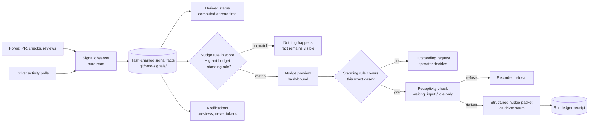

# Outward signals and bounded nudges contract

**Status:** Phase 25 contract. Delivered so far: the authority-free
observer (WLA-25-02: `dw signals`, MCP `dw_signals`, `GET /api/signals`),
driver activity states with the receptivity table (WLA-25-03), the
bounded nudge engine (WLA-25-04: score `nudges` rules, grant standing
rules + `max_nudges` budget, `nudge_delivered`/`nudge_refused` ledger
events, the awaiting-certification wake, and driver-seam session
delivery), the live stream (WLA-25-05: SSE `GET
/api/runs/<run>/events` and `GET /api/signals/events` with exact
cursor replay, `dw run tail`, and the live Run view), and durable
operator notifications (WLA-25-06: derived facts with receipted ack,
`dw notifications` across CLI/MCP/HTTP, the Run view card, the
Telegram push pass, and the `/decision` typed response), and
the second real driver (WLA-25-07: `ClaudeCodeExecDriver` over
non-interactive `claude -p`, least-privilege tool allowlists, version-
pinned discovery, honest `active`/`exited`/`unknown` activity), and durable
typed request ports (WLA-25-08: ledger-derived correlation, restart/resume
republish, exact response/refusal, expiry, and inspect-only lineage).
**Product claim:** Delivery Workbench **can observe** facts from outside a
run — CI verdicts, review state, mergeability, agent activity — and, under an
explicit grant, **can nudge** the right agent back to work. It does not claim
that observation should run everywhere, and a recorded fact is never, by
itself, authority to act.

## Why this layer exists now

Phase 24 delivered the inward loop: a granted run schedules its own agents,
runs its own checks, routes its own repairs, and stops at
`awaiting-certification`. The boundary of that authority is the repository
observation the grant pinned. Everything after the operator integrates and
pushes — a failing workflow, a reviewer requesting changes, a merge conflict
forming under an open pull request — is invisible, and the operator becomes
the message bus carrying forge facts back to agents by hand.

Two comparative studies (2026-07-18) shaped this layer.
AgentWrapper/agent-orchestrator demonstrates the observation shapes that
work — conditional polling, semantic diffing, durable facts with status
derived at read time, feedback routed to the agent that owns the work — and
also demonstrates the failure mode this contract exists to prevent: all of
that living inside a daemon whose authority is implicit.
microsoft/agent-framework-go contributes the human-in-the-loop discipline:
typed request/response ports for pending decisions, outstanding requests
that survive checkpoint and resume, and standing approval rules scoped by
exact match.

The owner direction on record: auto-nudging is supported. The boundary is
not "never inject" but "never inject without a grant, a budget, and a
receipt." Observation is authority-free the way `dw status` is; nudging is
authority the way `dw run` is.

## The loop in one picture

The observer never acts. A signal fact never acts. Only a grant whose score
declared the nudge rule, whose budgets have room, and whose standing rules
cover the exact case can turn a fact into a delivered nudge — and every
delivery is one ledger receipt.

## Terminology

| Term | Meaning |
|---|---|
| **Signal** | One durable, hash-chained fact observed from outside run authority: an SCM fact or a driver activity fact. |
| **Signal chain** | The append-only `signals.jsonl` for one observed branch; corrupt, forked, or truncated chains fail closed. |
| **Derived status** | A display state (`ci-failed`, `changes-requested`, `merge-conflict`, …) computed at read time from signal facts by a fixed precedence. Never stored. |
| **Activity state** | What a driver last honestly reported about a session: `active`, `idle`, `waiting_input`, `blocked`, `exited`, or `unknown`. |
| **Receptivity** | The pure function deciding whether a session may receive a nudge right now: deliver, defer, or refuse. |
| **Nudge** | A structured, hash-bound packet delivered to one agent session because one signal matched one score-declared rule under one grant. Never a shell command, never free-form prose. |
| **Nudge rule** | A score-declared binding from one signal kind to one declared route target, with a bounded content template and finite ceilings. |
| **Standing nudge rule** | A grant-held authorization to deliver matching nudges without a fresh per-delivery approval. Exact-match scoped, narrow by default, revoked with the grant. |
| **Notification** | A durable operator-facing fact derived from ledger or signal events, with unread/acknowledged state. Carries previews and references, never tokens or apply commands. |
| **Request port** | A typed pending-decision seam: declared request and response schemas, a correlation id, runtime validation, and republish-on-resume semantics. |
| **Outstanding request** | A pending human decision persisted in run state; it survives pause, crash, and resume, and expires into a recorded refusal with the grant. |

## Durable signal model: `delivery-workbench-signal@1`

Signal facts live outside the operator tree and outside the repository,
under `.git/pmo-signals/<remote>/<branch>/`:

- `signals.jsonl` — the append-only, hash-chained fact log. Authoritative.
- `projection.json` — a disposable read cache. Deleting it changes nothing.

Fact kinds:

| Kind | Carries |
|---|---|
| `pr` | PR identity, state, draft flag, head/base, URL. |
| `pr-check` | Check name, status, conclusion, URL. |
| `pr-review-thread` | Thread counts, resolution state, reviewer identities, URLs. |
| `pr-mergeability` | Mergeable verdict and reason. |
| `session-activity` | A driver-reported activity transition for a run node attempt. |
| `observe-refusal` | A content-free record of degraded forge access (rate limit, missing auth). |

Model invariants:

- **Observation is pure.** No observe path mutates the forge, the operator
  tree, any run, or any agent. Every observe result stamps
  `starts_work: false`. A long-lived watcher is only the bounded observe
  pass repeated; there is no resident observer daemon.
- **Semantic dedup.** A sweep appends a fact only when the semantic content
  changed; unchanged forge responses write nothing. Conditional requests
  (ETags) are used where the forge offers them.
- **References, not bodies.** CI log text, review comment bodies, and any
  third-party prose are never persisted in durable facts — names, states,
  counts, identities, and URLs only.
- **Degradation is recorded.** A rate-limited or unauthenticated forge
  produces an `observe-refusal` fact, never a crash and never a
  stale-silent success.
- **Provider neutrality.** SCM access is a port; GitHub is the first
  adapter and a deterministic fixture provider is the test oracle.
  Credentials come from the operator environment and are never stored in
  facts, configuration, or scores.

## Derived status precedence

Display status is computed at read time from signal facts, highest
precedence first; nothing below the first match applies:

1. `merged` — the PR merged.
2. `closed-unmerged` — the PR closed without merging.
3. `ci-failed` — any required check concluded failure.
4. `merge-conflict` — the forge reports the PR unmergeable.
5. `changes-requested` — an unresolved review requests changes.
6. `ci-pending` — required checks are still running.
7. `approved` — reviews approve and checks pass.
8. `mergeable` — checks pass, no blocking review state.
9. `pr-open` — an open PR with no stronger fact.
10. `unobserved` — no signal chain for the branch.

Deleting every projection cache and re-deriving from chains alone must
reproduce identical answers on every surface.

## Activity states and receptivity

Drivers extend their poll contract with one vocabulary. An adapter reports
only what its harness actually exposes and must report `unknown` otherwise;
inventing states is a conformance failure.

| State | Meaning |
|---|---|
| `active` | The agent is working. |
| `idle` | The session is alive with no work in flight. |
| `waiting_input` | The agent sits at an empty prompt awaiting its next instruction. |
| `blocked` | The agent is stopped on a pending permission or approval decision. |
| `exited` | The session ended. |
| `unknown` | The adapter cannot observe the state. Never a guess. |

Receptivity is a pure function over (state, intent):

| State | Auto nudge | Operator-applied nudge |
|---|---|---|
| `waiting_input` | deliver | deliver |
| `idle` | deliver | deliver |
| `active` | defer (bounded re-poll) | defer (bounded re-poll) |
| `blocked` | refuse | refuse |
| `unknown` | refuse | refuse |
| `exited` | refuse (terminal) | refuse (terminal) |

A `blocked` session is awaiting an approval, and approvals are ring-4 human
acts everywhere in this product; no intent — including a manual operator
nudge — may inject input into one. `unknown` refuses because honesty about
what cannot be observed outranks convenience.

## Nudge model

A nudge exists only when all four layers agree:

1. **Rule (score, reviewable).** The score's `nudges` section binds one
   signal kind (`ci-failed`, `changes-requested`, `merge-conflict`,
   `waiting-input-timeout`) to one target, with a bounded content template
   (facts and references only) and finite per-rule and per-run ceilings.
   Targets are **declared route targets only**: a node the score's failure
   policy or explicit nudge routing already names, compiled and simulated
   like any other route. A nudge can change *when* a declared node runs,
   never *whether* an undeclared node exists — `orchestration simulate`
   must be able to show every way a run can unfold, nudges included.
2. **Authority (grant, revocable).** The grant carries nudge budgets and
   zero or more standing nudge rules. A standing rule matches a signal
   kind exactly, or a kind plus exact target; it is absent by default,
   shown verbatim in the grant preview the operator approves, and revoked
   with the grant. A rule can never broaden at runtime.
3. **Receptivity (session, honest).** Delivery consults the receptivity
   table at dispatch time; a mid-flight flip to `blocked` converts the
   delivery into a recorded refusal.
4. **Receipt (ledger, auditable).** Every delivered nudge is one ledger
   event binding the triggering signal hash, rule, target, attempt, packet
   hash, and remaining budgets. Delivery is at-most-once per signal per
   rule, held across crash and restart.

A matched nudge with no covering standing rule becomes an outstanding
request (see request ports): the operator applies it with a fresh exact
token or lets it expire. Refusals are first-class and distinct: no grant,
exhausted budget, expired/revoked/paused run, no standing rule,
non-receptive session, replayed signal. Budget exhaustion converts the run
to a recorded `blocked` stop — a nudge storm cannot loop.

Nudge packets are structured: run and node identity, the signal facts and
references that triggered the rule, and the declared expectation. They
never carry shell strings, argv, tokens, secrets, or copied third-party
content. Undelivered nudges are not queued; they are refused and re-derived
from their signal facts — the ledger stays the only truth.

## Authority model

| Ring | Act | Who |
|---|---|---|
| 0 | Observe, derive status, list signals/notifications, stream the ledger | Anyone with the clone; pure read |
| 1 | Author nudge rules in a score | Operator via the editor; tracked, reviewable, executes nothing |
| 2 | Approve nudge budgets and standing rules | Operator at grant time; revocable |
| 3 | Deliver a covered nudge during a tick | The conductor, under 1+2+receptivity, receipted |
| 4 | Decide an outstanding request (uncovered nudge, checkpoint) | A human, through the exact-token boundary |
| 5 | Certify evidence, commit, push, merge, release | A human, always; never a signal, nudge, or notification outcome |

## Request ports and outstanding requests

Every pending human decision — a checkpoint, an uncovered nudge preview —
is a typed request port. The compiled score supplies the declaration:
approval-node options become the checkpoint response enum, failure
checkpoints use the existing approve/reject type, and a nudge rule supplies
the rule/signal/target preview with the same closed response enum. The
hash-chained opening fact (`checkpoint_reached` or
`nudge_refused:no-standing-rule`) deterministically supplies a unique
`req-…` correlation id; there is no second request database and no crash
window between "waiting" and "persisted." A response is validated against
that id and schema only after a fresh exact preview. A malformed or
mismatched response appends a content-free `request_refused` event and
leaves the request outstanding.

Outstanding requests persist in the replayed run projection, are derivable
from the ledger alone, and survive pause, crash, and resume. A maintenance
tick republishes each request at most once in one control generation;
`run resume` does the same after changing generation, always retaining the
original correlation id. Repeated restart ticks append nothing. A fresh
`dw run request <run> <correlation> <decision> --expect <act-token>` records
the typed decision; the older `run checkpoint` command remains a compatible
checkpoint-only alias. Approval of an uncovered nudge authorizes that one
declared rule+signal instance for delivery on the next tick, never a
standing rule.

Requests older than the grant's expiry, or still live when its authority is
revoked/cancelled, convert to recorded `expired` refusals and derive
`request-expired` notifications. Opening and controlled republishing derive
`request-pending` and `request-republished` notifications without a second
queue. If a crash lands after terminal authority (`complete`, `blocked`,
`cancelled`, or `revoked`) but before request cleanup, an explicitly
confirmed maintenance tick expires the stranded requests and dispatches no
work. Checkpoint lineage
is explicit and replay-derived: each request records its parent decision
point, and the run view renders a tree whose inspect-only historical preview
contains the exact ledger head, state, control generation, origin, and expiry
the decider saw. Forking a run from a past checkpoint remains excluded.
Read-time age stays visible but is deliberately absent from the signed act
preview, so a token changes only when a durable bound fact changes. The
checkpoint compatibility alias refuses a live nudge correlation as a typed
mismatch; only the generic request boundary spans request kinds.

## Live stream

The localhost Workbench runtime exposes a server-sent-events tail over the
run ledger and signal chains. The cursor is the ledger sequence;
`Last-Event-ID` reconnects replay exactly the missed suffix, and a replay
of a completed run's ledger must reproduce the exact event sequence a live
subscriber saw. Stream payloads carry the same bounded models the read
surfaces return — ids, hashes, states, budgets — and follow the
privacy-defaulted posture: structure always, content only through the
existing explicit bounded-stream opens. The stream carries no authority: no
token, apply command, or mutation route is reachable from it.

## Notifications

Notification facts derive from ledger and signal events by pure rules:
`checkpoint-pending`, `request-republished`, `awaiting-certification`,
`run-blocked` (with reason), `nudge-budget-exhausted`, and — per-project
opt-in — `ci-failed`, `changes-requested`, and `merge-conflict` on observed
branches with no associated run. They persist append-only with
unread/acknowledged state, acknowledge idempotently, and list identically
across CLI, MCP, HTTP, and the Workbench.

Delivery rides the existing Telegram surface under Phase-20 per-person
consent, unchanged. An outbound message carries facts, references, and the
pending request's preview document — never a consent token, never an apply
command. A phone reply is only ever the typed response document to a
request port; the decision itself still crosses the local exact-token
boundary. With the channel unconfigured or unreachable, facts still persist
and surface locally; delivery failure is a recorded, ceiling-bounded retry,
never a crash and never a silent drop.

## Storage and privacy

| Location | Contents |
|---|---|
| `.git/pmo-signals/<remote>/<branch>/` | Signal chain, projection cache. |
| `.git/pmo-orchestration/runs/<run-id>/` | Unchanged from Phase 24; gains nudge receipts, outstanding requests, and republish events in the ledger. |
| Operator configuration | Forge tokens (environment), notification channel config. Never in the repository, scores, or facts. |

Permanent content exclusions, everywhere in this layer: no third-party
prose bodies, no CI log text, no prompts or transcripts, no secrets, no
credential-shaped configuration in tracked files.

## Threat model and fail checks

| Threat | Required fail check |
|---|---|
| The observer quietly becomes an actor | Every observe path is pure; `starts_work: false` stamped and tested; all action requires a grant |
| A nudge fires without authority | No grant, no rule, no standing rule, exhausted budget, expired/revoked/paused run each refuse distinctly, receipted |
| Nudge storm loops a run | At-most-once per signal per rule across restart; exhaustion is a recorded `blocked` stop |
| Injection into a permission decision | Receptivity refuses `blocked` and `unknown` under every intent, including manual |
| A packet smuggles authority or content | Packets carry facts/references only; argv, tokens, secrets, and copied bodies are compile- and dispatch-time refusals |
| A stale or replayed signal acts twice | Signal hash binding plus chain verification; replay is a recorded refusal |
| A forged signal chain drives a nudge | Hash-chained facts fail closed on corruption, fork, or truncation |
| The stream becomes a consent channel | No token or mutation route reachable from SSE; enforced on the router |
| Phone notifications become remote control | Outbound content test: previews and typed responses only; decisions cross the local exact-token boundary |
| Status drifts from forge truth | Semantic diff every sweep; degraded access is a recorded refusal, never stale-silent success |
| Display status is stored and rots | Status is derived at read time from signal facts; deleting every projection cache must reproduce identical answers |
| A pending decision silently dies in a restart | Outstanding requests are ledger-derivable and republished exactly once on resume |
| "Signal handled" becomes "safe to commit" | Ring 5 is untouched: certification, commit, push, merge, and release remain explicit human acts |

## Phase 25 proof standard

The phase closes only on a wheel-installed fresh-consumer exam over fixture
SCM and fixture driver oracles: an authorized run reaches
`awaiting-certification`; the operator integrates and pushes; fixture CI
fails; the signal records; a standing-rule nudge delivers to a receptive
session; repair runs in an isolated worktree and rechecks green; a
`changes-requested` signal routes a second nudge; a checkpoint pends
through a planted crash and resume with exactly-once republish; the typed
decision arrives phone-side; notifications deliver and acknowledge — with
every refusal class exercised by name, at-most-once held under the crash,
stream replay byte-equal to the ledger, and certification and commit
performed by the fixture operator alone. A separately provisioned live
specimen proves the real driver seam without making model output the CI
oracle.

## Deliberate authority boundaries and possible later extensions

These are intentionally excluded authority or separate product decisions,
not missing prerequisites:

- Auto-merge, comment posting, review resolution, or any forge mutation.
- Injection into `blocked` or `unknown` sessions, and PTY/terminal
  attachment as a nudge transport.
- Nudge targets outside the declared route set; if a project needs a fixer
  the graph never wired in, the score edit and re-grant are the path.
- Cross-repository nudging and hosted or cross-machine observers.
- Fork-from-checkpoint execution (lineage is inspect-only in this phase).
- Non-GitHub forge adapters (the port is neutral; adapters are demand-driven).
- Automatic evidence judgment, certification, commit, push, release, or
  deployment — unchanged from the
  [visual orchestration contract](./orchestration.md).
