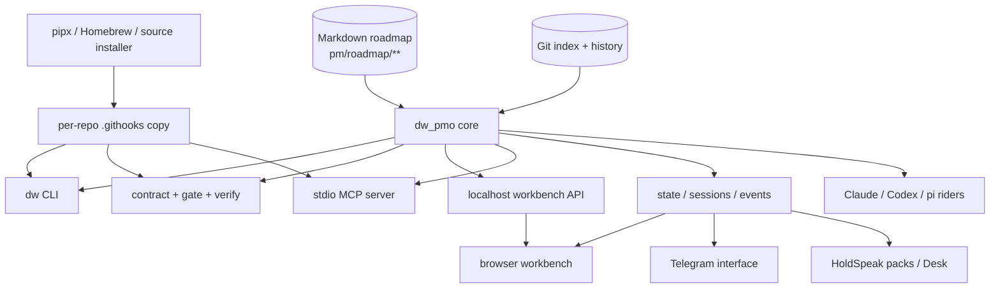

# Delivery Workbench — solution overview

**Assessment date:** 2026-07-18. **Product version assessed:** v1.14.0.
This is the map of the whole solution. Exact subsystem protocols remain
owned by the linked specialist documents.

## Executive view

Delivery Workbench is a local-first control plane for software delivery
in repositories where agents perform substantial work. Its central idea
is simple: intent, execution proof, and commit certification must form a
chain that Git can retain and another machine can audit later.

The product is well beyond an MVP. Phases 0–21 shipped a stdlib-only
Python core, Markdown roadmap, evidence capture, machine-verified commit
gate, pushed-history verifier, terminal and browser workbenches, MCP
tools, generated agent riders, contribution and distribution rails, and
remote mission-control clients. The system runs its own development
through those same rails.

The strongest property is not any individual interface. It is that the
interfaces share one parser, vocabulary, mutation planner, and gate while
Markdown and Git remain the durable state. The primary weakness found at
the start of this assessment was connective: a user or agent could obtain
every fact, but had to combine several commands and documents to answer “is
this clone ready, what work owns these changes, and what is the next safe
transition?” Phase 22 closed that gap with one versioned status briefing. The
follow-on observation was equally practical: status named an exact action but
left the operator to carry an unbound argv across the read→act boundary.
Phase 23 now closes that gap with a separate, state-bound one-step handrail
while preserving manual certification and commit. Its contracts are
[status-briefing.md](./status-briefing.md) and
[deliberate-step.md](./deliberate-step.md).

Phase 24 closes the next connective layer: Delivery Workbench **can
coordinate** a configured multi-agent run. The product center is a rich visual
editor for an exact score—research agents, dependencies, context, typed output
conventions, checks, fail routes, budgets, concurrency, approvals, and
terminal conditions. A score is tracked configuration, not consent; a
separate revocable grant over its compiled hash authorizes a deterministic
conductor. The architecture contract is
[orchestration.md](./orchestration.md).

## What problem it solves

Agent-driven delivery commonly fails in two ways:

1. completion becomes a conversational claim rather than a state backed
   by reproducible evidence; and
2. the repository loses the explanation of which unit of intent a commit
   shipped and which verification justified it.

Delivery Workbench turns those into repository invariants:

- planned work is a phase/story graph in Markdown;
- a story cannot be moved to done through supported mutations without a
  paired evidence artifact;
- captured runs record command, exit code, index tree, and bounded output;
- a generated commit contract stamps branch, HEAD, staged tree, declared
  stories, and ceremony tier;
- the pre-commit gate re-derives those facts and structural rules;
- commit trailers name the story and certified contract digest;
- the certified contract is archived under Git metadata; and
- `dw verify` re-derives the remotely observable rules from pushed
  history, catching commits that bypassed local hooks.

The exact gate and remote-verification policies live in
[architecture.md](./architecture.md) and
[remote-verification.md](./remote-verification.md). The passing parity
fixtures are `pmo-roadmap/tests/gate-parity.sh` and
`pmo-roadmap/tests/verify-range.sh`.

## Architecture and ownership



The ownership boundaries are deliberate:

| Concern | Owner | Durable state | Important boundary |
|---|---|---|---|
| Intent and progress | `parse`, `model`, `api`, `board` | `pm/roadmap/**/*.md` | no database or cached truth |
| Safe roadmap writes | `mutations`, `render` | atomic Markdown writes | preview → fingerprint → apply → revalidate |
| Delivery proof | `evidence` | paired `evidence-story-NN.md` | commands run for real; output is bounded, not invented |
| Commit certification | `contract`, `gate` | index facts, trailers, `.git/pmo-contract-archive/` | certification checkboxes remain a deliberate human/agent attestation |
| Remote audit | `verify` | pushed Git history | re-derives only what history can prove |
| Human operation | CLI and workbench | none beyond core state | workbench never stages or commits |
| Agent operation | MCP and generated riders | none beyond core state | tools may mutate through guarded core; no certify/commit tool exists |
| Mission control | state feed, sessions, events | versioned reads plus local JSONL telemetry | steering is separately paired/armed; gate retains final say |
| Distribution | package/bootstrap and vendored rails | `.githooks/` in each repo | the repo-local copy, not the global install, gates commits |

The source implementation is `pmo-roadmap/lib/dw_pmo/`; installed
repositories receive the same package under `.githooks/dw_pmo/`. The
shell hooks are adapters, not a second rule engine. This boundary is
test-enforced by the core suite and `gate-parity.sh`.

## The primary operating loops

### 1. Plan and deliver a story

```text
orient → select/start story → implement → capture proof → mark done
       → stage → generate contract → certify → gate → commit → verify history
```

Today the specialist commands are `dw doctor`, `dw check`, `dw next`,
`dw holds`, `dw story status`, `dw evidence capture`, `dw contract new`,
`dw gate`, and `dw verify`. The supported lifecycle and its refusal
paths are executed end-to-end by `pmo-roadmap/tests/agent-surface.sh`,
`roadmap-cli.sh`, `mcp-server.sh`, `guided-status-loop.sh`, and
`deliberate-step-loop.sh`.

Phase 22 adds `dw status` in front of that loop. It does not replace the
specialist commands; it composes their state and names the next safe one.
Phase 23 adds `dw step`: preview a token over that complete observation,
explicitly authorize it, execute at most one closed-table recommendation, and
stop. CLI, MCP, and HTTP return the same preview/receipt. The browser exposes
that lease through a separate review→confirm act boundary, and generated
riders require a fresh exact token and stop after every receipt. Commit and
certification stay outside every seam.

### 2. Browse and understand work

Operators can move from portfolio to receipt without knowing the on-disk
layout:

```text
projects / board / holds → story detail → evidence → trace → commit trailers
```

CLI, workbench HTTP, and MCP expose the same read core. Board cards and
hold entries carry repository-relative receipt paths and workbench links.
The complete surface and versioning policy are
[interop.md](./interop.md); `test_interop_doc_names_every_surface` fails
when code grows an undocumented read route or tool.

### 3. Change roadmap state safely

CLI commands and the workbench editor share mutation plans. A plan reads
the current content, applies domain refusals, and produces a diff plus a
content-bound fingerprint. Apply re-checks that fingerprint, writes
atomically, rolls back partial failure, and revalidates. Done without
evidence, on-hold without a reason, stale previews, ambiguous selectors,
and writes outside the roadmap are refused. The mutation and rollback
matrix is in `pmo-roadmap/tests/dw-core-tests.py`; HTTP containment and
read-only guarantees are exercised by `workbench-explorer.sh`.

### 4. Contribute through GitHub

Contributors install the repo-local hooks, ship one story per review unit,
and preserve the gated commits through a rebase merge. CI runs a full
history sweep because hooks can be bypassed locally. Squash merge is
deliberately unsupported: it can displace trailers and collapse several
story flips into one commit. The policy and executable green/red paths are
[contribution-rails.md](./contribution-rails.md) and
`pmo-roadmap/tests/contributor-flow.sh`.

### 5. Steer from another surface

`dw state --json`, `dw sessions --json`, and `dw events` form the
mission-control substrate. The browser renders it read-only; Telegram can
propose rails mutations and steer a precisely bound tmux pane only after
pairing and time-bounded arming; HoldSpeak consumes the same state through
packs. Story mutations still travel through the workbench core and the
commit gate remains the last authority. The consent rings and schemas are
owned by [mission-control.md](./mission-control.md); Telegram layering and
consent-floor fitness tests run independently of its 147 interface tests.

## Interfaces and interoperability

| Surface | Best for | Stable/machine form | Mutation stance |
|---|---|---|---|
| `dw` CLI | humans, scripts, fallback for every agent | JSON or porcelain on orientation/verification verbs; stable exit codes | full guarded roadmap lifecycle plus contract generation; one-step apply never certifies or commits |
| `dw-mcp` | tool-capable agents | JSON-RPC tools with `structuredContent` | guarded story/evidence/contract mutations; never certification or commit |
| `dw-workbench` HTTP | browser and local clients | stamped response envelope around shared models | guarded roadmap mutations plus exact-token one-step apply; never stage/certify/commit |
| Browser workbench | visual browse, board, trace, health, mission control, editor | consumes HTTP only | editor preview/diff/apply plus separate step review/confirm; no generic command input |
| State/session/event documents | mission-control clients | versioned JSON/JSONL | read substrate only |
| Agent riders | Claude Code, Codex, pi | generated managed docs/skills/commands | describes the same CLI/MCP rails; drift is a check error |
| HoldSpeak packs | meeting alignment and approved story acts | host plugin contracts | proposes/executes through allow-listed rails seams |
| Telegram | remote read and explicitly consented steering | Bot API adapter over the substrate | owner-bound, proposal/approval or armed-pane controls |

The key interoperability achievement is semantic reuse: transports do not
parse Markdown independently. Phase 22 made aggregate orientation one shared
CLI/MCP/HTTP model rather than a transport-specific dashboard. Phase 23 now
carries the deliberate step through the same three adapters and browser front
door without copying token, allowlist, or consent logic. Its packaged exit
exam proves the whole repeated-authorization loop rather than inventing
another surface.

## Trust and safety model

Five rules explain most design choices:

1. **Markdown and Git are authoritative.** Generated views can disappear
   without losing delivery state.
2. **Derive what a machine can derive.** Branch, HEAD, index tree, staged
   paths, story flips, evidence pairing, and trailers are verified rather
   than asserted.
3. **Keep judgment visible.** Test adequacy, scope fidelity, and consent
   remain explicit certification acts; no MCP tool clicks them away.
4. **Unknown beats guessed.** Ambiguous session/story/project correlation
   is reported, not silently resolved.
5. **Refusals are part of the interface.** A failed operation names the
   rule and remediation; tests assert the banner, not only the exit code.

The workbench is localhost/tailnet-scoped, validates Host headers, blocks
path traversal, and has no stage/commit endpoint. Telegram secrets live
outside the repository, pairing tokens are hashed and single-use, group
consent belongs to the person who paired, and all keystrokes pass through
one pane-ownership-checking driver. See [mcp.md](./mcp.md),
[architecture.md](./architecture.md), and
[absorption-ccgram.md](./absorption-ccgram.md) for the exact exclusions.

## Packaging and operation

The published package has no runtime dependencies and supports Python
3.9+. `pipx install delivery-workbench` and the Homebrew formula install a
bootstrap launcher. `dw install` vendors the executable rails into a
repository and sets `core.hooksPath`; `dw update --check` detects stale
vendored content. When the global launcher is invoked inside an adopted
repo, it defers to that repo's version so a global upgrade cannot silently
change a project's gate. Package, upgrade-from-v1.5.0, and Homebrew paths
have dedicated smoke tests described in [distribution.md](./distribution.md).

## Current evidence snapshot

The following is a dated verification snapshot, not an evergreen claim.
On 2026-07-18 in this checkout:

- version v1.14.0 is single-sourced across Python, CLI, plugin manifest,
  formula, and the latest published changelog heading; Phases 22 and 23 are
  recorded under an explicitly unpublished changelog section;
- phases 0–24 are closed; the orientation, deliberate-step, and visual
  orchestration advances are evidence-backed but not published as a new
  release;
- `python3 pmo-roadmap/tests/dw-core-tests.py` passed 297 tests on the local
  interpreter and on the declared Python 3.9 floor;
- every shipped shell parsed and passed ShellCheck; every locally runnable
  non-Homebrew CI integration passed, including gate parity, contribution,
  MCP, step transport parity, agent/rider/plugin drift, package-facing docs,
  workbench explorer, upgrade-from-v1.5.0, history-range fixtures, demo assets,
  credentials, and work-log lifecycle;
- the package smoke built sdist and wheel on Python 3.9, installed the wheel,
  completed the guided-status and deliberate-step loops, and then passed the
  packaged multi-agent orchestration exam through an operator-certified,
  history-verified fixture commit;
- that exam started two research agents concurrently, recovered a planted
  crash with zero duplicate starts, validated typed and citation-bound fan-in,
  ran implementation in an isolated worktree, followed one configured
  fail→repair→recheck route, exercised six compiler and five runtime red cases,
  proved CLI/MCP/HTTP/Run-view parity, and stopped at
  `awaiting-certification`;
- a provisioned authenticated live Codex specimen separately passed the real
  read-only driver seam while keeping the operator tree clean;
- the workbench viewport smoke rendered 14 views at desktop and mobile sizes
  plus attention and ambiguous-project states (32 renders), including active,
  repair, and terminal orchestration views;
- Telegram architecture fitness passed 10 tests and its interface suite
  passed 147 tests in a Python 3.9 + Pillow environment (one Python-3.11-only
  `tomllib` lock test abstained on the declared floor);
- all 23 HoldSpeak pack tests passed in the same pinned v0.4.0/no-runtime-
  dependencies plus NumPy environment provisioned by CI;
- `dw check work-log-automation` passed; and
- the pre-close `dw verify --all` sweep verified 136 gated commits
  and skipped 17 pre-epoch commits under the documented epoch policy.

The Homebrew smoke deliberately refused to disturb the already installed
user formula on this workstation; its clean-machine macOS CI leg remains
wired. That environment limitation is recorded rather than translated into
a false local pass.

The complete CI job inventory is `.github/workflows/validation.yml`.

## Assessment: what is strong

- **The trust chain is real.** Story, evidence, contract, trailers, archive,
  and remote verification reinforce one another instead of relying on an
  agent's completion prose.
- **One core serves many surfaces.** CLI, HTTP, MCP, browser, and remote
  clients mostly adapt shared domain models rather than fork rules.
- **Mutation safety is unusually explicit.** Preview, fingerprints,
  containment, rollback, revalidation, and refusal parity are tested.
- **The product dogfoods itself.** The repository's history is a specimen
  of the system, not only a demonstration fixture.
- **Operational failure is designed.** Optional capabilities degrade
  honestly, ambiguous states remain ambiguous, and errors tell the user
  how to recover.
- **Distribution preserves project authority.** Vendored rails make the
  gate reproducible and prevent global-tool drift at commit time.

## Assessment: gaps and observations

### 1. Orientation was fragmented — addressed in Phase 22

`doctor`, `check`, `next`, `holds`, context, Git status, contract facts,
and gate readiness each answer one part of the opening question. Agent
docs previously asked for three orientation calls before workspace state
was considered. `dw status` now composes those authorities into one bounded
answer, and generated riders open with that answer before specialist calls.

### 2. The broad context payload is comprehensive but not economical

`dw context --compact` includes the full phase/story history. That is
valuable for machines doing deep analysis, but grows with every shipped
phase and is a costly first read for an agent that needs only readiness,
focus, and one action. Status should be a bounded briefing; context should
remain the deep document.

### 3. Structural docs checks do not guarantee semantic freshness

All links and snippets passed while the roadmap front door still claimed
Phase 18 and v1.8.0 were current after Phase 21/v1.14.0. The stale text did
not violate Markdown structure or version-single-source tests. This
overview fixes the instance; the status model reduces dependence on prose
for live facts. A future semantic-freshness policy may still be useful.

### 4. Product breadth raises discoverability cost — front door addressed

The CLI has planning, evidence, gate, verification, board, holds,
adoption, riders, hooks, state, sessions, events, and contract families.
The breadth is earned, but `--help` remains an inventory. `dw status` now
provides the obvious guided entry point while preserving the specialist
commands for depth.

### 5. Schema discipline is strong but uneven by age

Context, board, feed, sessions, events, and HTTP envelopes are versioned;
some smaller read shapes are documented/test-pinned without their own
stamp. This is acceptable under the current interop policy but makes
composition harder for external clients. The new aggregate status model
starts stamped and exact-key pinned.

### 6. Local health and external readiness are separate

The tool can prove clone wiring, roadmap consistency, local gate state,
and pushed-history structure. It does not fetch current CI, required-check,
release-channel, or latest-package status. That is a sound offline-first
boundary, but the product should call the result “local readiness” rather
than imply the forge is green.

### 7. Integration confidence depends on provisioned optional runtimes

Pillow and HoldSpeak paths are honestly optional, with CI provisioning
their tests. A local all-green run can therefore include explicit skips.
The operator-facing briefing should surface capabilities as observed
facts in a later phase if those integrations become central to daily use.

### 8. Evidence capture exposed an intentional but unguided transition

The validator correctly considers evidence attached to a non-done story
premature, yet `dw evidence capture` necessarily creates that state before
the guarded done flip. The fresh-consumer exam caught that a generic
`repair-roadmap` answer stranded an agent at the exact point it needed the
rails most. Status now specializes only the single unambiguous case for the
selected in-progress story as `finish-story`, carrying the existing guarded
`story status ... done` argv. Any other roadmap issue retains the generic
blocking repair path.

### 9. A recommendation was still an unbound handoff — addressed in Phase 23

Phase 22 could return an exact argv, but a caller still copied or
reconstructed it after the observation that justified it. Checking only the
action id would not be enough: HEAD, contract facts, or the selected story can
move while the id remains `start-story` or `continue-story`. Phase 23 now
previews `delivery-workbench-step@1`, whose SHA-256 token binds the entire
status document, then permits exactly one action only when both id and complete
argv shape match a second closed table. Atomic claims close replay for
read-only actions; bounded receipts and content-safe events explain started
work; stale, manual, unknown, modified, commit, and certification paths refuse
before process start. CLI, MCP, HTTP, the browser, and generated riders share
that boundary, and the wheel-installed exit exam proves it through a real
story.

### 10. Multi-agent coordination had no exact, inspectable score — addressed through Phase 24

The system could expose state, correlate sessions, steer an armed agent, and
apply one fresh rail step, but it could not describe a whole coordinated run:
which research/worker/review agents participate, what context and outputs they
use, which checks must pass, how failures route, what may run concurrently,
which budgets apply, or where humans approve. A hard-coded loop would merely
hide those decisions. Phase 24 makes them a versioned score with a rich visual
editor and pure compiler, then separates that configuration from a revocable
run grant. The conductor can interpret only compiled rules and structured
driver/check receipts; agent harnesses retain model/sandbox authority, and
certification/commit remain explicit.

Eight delivered slices now cover that complete local product loop: the exact
score/compiler, rich Design/Validate/JSON editor, hash-bound grants and
ledger, provider-neutral drivers and isolated worktrees, deterministic
conductor/check/repair runtime, and byte-equivalent CLI/MCP/HTTP/Workbench Run
surfaces. The Run tab is the explanation and consent center: it shows live
node attempts, research/work sessions, fail checks, typed artifact lineage,
budgets, routes, checkpoints, and hash-chained receipts, but refreshes and
opens streams only when explicitly requested. The final wheel-installed exam
proved the whole score—including parallel research, isolated implementation,
fail/repair, restart, red paths, live-driver seam, and human terminal handoff—
as one coherent capability.

## Phase 22: delivered product step

Phase 22 is **The briefing — one answer before agents act**. It is a
usability and interoperability phase, not a new source of truth.

Its five slices are:

1. make this solution map and the briefing contract durable;
2. implement a deterministic, read-only status core and `dw status` CLI;
3. expose the identical model as `dw_status` and `GET /api/status`;
4. make the workbench and generated agent brief open on the answer; and
5. prove the recommendation sequence through a fresh packaged consumer's
   full evidence-backed, gated delivery loop.

All five slices are implemented and evidence-backed: the core object travels
unchanged through CLI JSON, MCP `structuredContent`, and the workbench HTTP
envelope; the browser and generated Claude/Codex/pi/plugin instructions open
on that answer; and the packaged-consumer exit exam follows every successive
recommendation through a real gated commit while asserting read purity and
adapter equality.

The desired result is a shorter safe path into all the power already
present:

```text
dw status
  ├─ attention → repair the named rail
  ├─ select-project → human/agent chooses; the tool does not guess
  ├─ start/continue/capture/finish → use the guarded story loop
  ├─ stage/contract/certify/gate → preserve the consent spine
  └─ commit → only after live gate inspection passes
```

The phase plan, evidence, and closeout live under
`pmo-roadmap/pm/roadmap/work-log-automation/phase-22-agent-briefing/`.

## Phase 23: delivered product step

Phase 23 is **The handrail — one deliberate step**. It advances usability
without turning the product into an autonomous shell:

1. core and CLI preview/apply with a complete-state token and closed argv
   table;
2. bounded, versioned success/failure receipts, atomic replay prevention,
   and safe event correlation;
3. identical MCP and HTTP preview/result models;
4. an explicit workbench confirmation and updated generated riders; and
5. a wheel-installed exit exam that repeatedly authorizes one transition at
   a time and proves stale-token and prohibited-commit red paths.

The trust boundary is the feature: every invocation stops after one child;
callers never provide argv; and project choice, certification, commit,
evidence-command invention, and automatic loops remain deliberate operator
work. All five slices are implemented, evidence-backed, and closed. The
[Phase 23 final summary](../pmo-roadmap/pm/roadmap/work-log-automation/phase-23-deliberate-step/final-summary.md)
holds the measured matrix and decision record.

## Phase 24: delivered product step

Phase 24 is **The conductor's score — visual orchestration**. Its eight slices
are:

1. contract the score, editor, authority rings, runtime, threat model, and exit
   proof;
2. compile and validate exact orchestration rules and simulate scheduling;
3. build the rich Design/Validate visual editor with lossless JSON and guarded
   save;
4. bind an exact score to an expiring/revocable run grant and append-only
   ledger;
5. drive parallel research and isolated writer agents through structured,
   provider-neutral work packets and typed outputs;
6. schedule checks, failure/repair routes, budgets, recovery, and cancellation
   deterministically;
7. expose and monitor the same run over CLI, MCP, HTTP, and the Workbench; and
8. prove the whole score in a wheel-installed consumer through a human
   `awaiting-certification` handoff and gated commit.

The phase does not make a score executable by existence. Saving and validating
remain pure; starting needs a separate exact grant. All eight slices are
implemented, evidence-backed, and closed. The measured outcome and audit trail
are in the
[Phase 24 final summary](../pmo-roadmap/pm/roadmap/work-log-automation/phase-24-bounded-orchestration/final-summary.md).

## Phase 25 and the optional Phase 26 layer

Phase 25 delivered authority-free outward facts, bounded granted nudges,
driver activity, durable requests, notifications, and replayable streams over
the same finite run spine. Phase 26 now contracts an additional opt-in program
layer above bounded runs: deterministic multi-phase selection, reusable
hierarchical workflows, logical delivery organizations, independent per-story
verification, and now a replayable bounded council protocol for typed
propose→critique→rebut→judge rounds, distinct-principal quorum, preserved
dissent, meta-review, and read-only architect verdicts. The remaining program
grant/conductor slices will place that protocol behind separately granted
integration and roadmap advancement.

This does not redefine the product's ordinary mode. Vanilla Delivery Workbench
remains complete with no program configured, and a Phase 24 score remains an
independent one-run capability. The exact capability ladder, policy kinds,
verdict taxonomy, grant, state, refusal, and threat model are in the
[optional autonomous-program contract](./programs.md).

## Where to go deeper

- [Architecture and executable claims](./architecture.md)
- [Status briefing contract](./status-briefing.md)
- [Deliberate step contract](./deliberate-step.md)
- [Visual orchestration contract](./orchestration.md)
- [Optional autonomous-program contract](./programs.md)
- [Interop inventory and schema policy](./interop.md)
- [MCP tool contract and exclusions](./mcp.md)
- [Mission-control substrate and consent rings](./mission-control.md)
- [Agent riders and HoldSpeak seams](./riders.md)
- [Distribution model](./distribution.md)
- [Contribution rails](./contribution-rails.md)
- [Remote verification](./remote-verification.md)
- [Canonical roadmap and evidence trail](../pmo-roadmap/pm/roadmap/work-log-automation/README.md)
