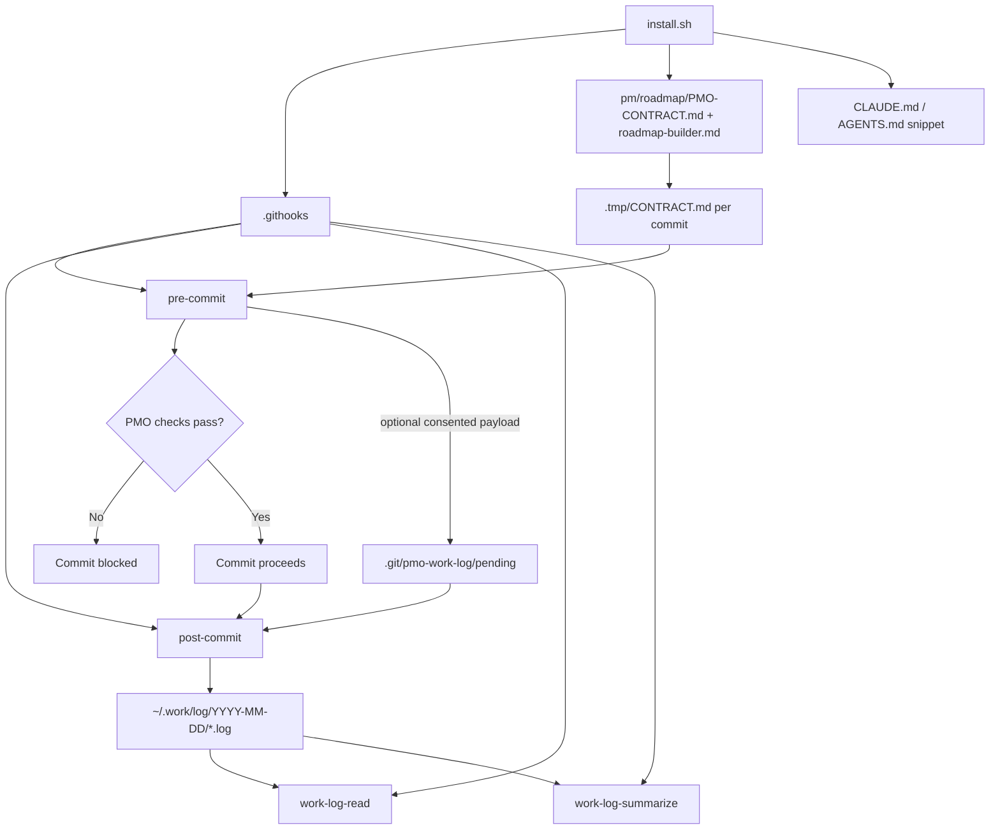
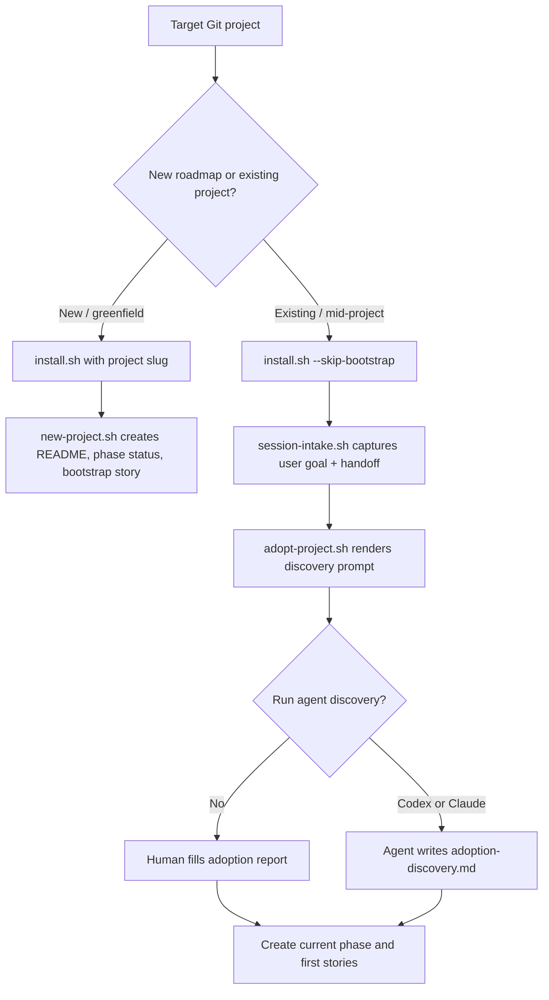
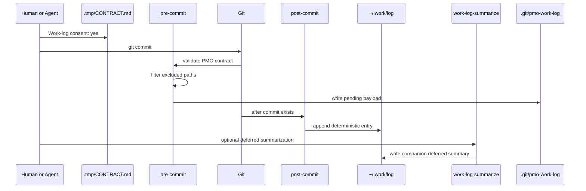
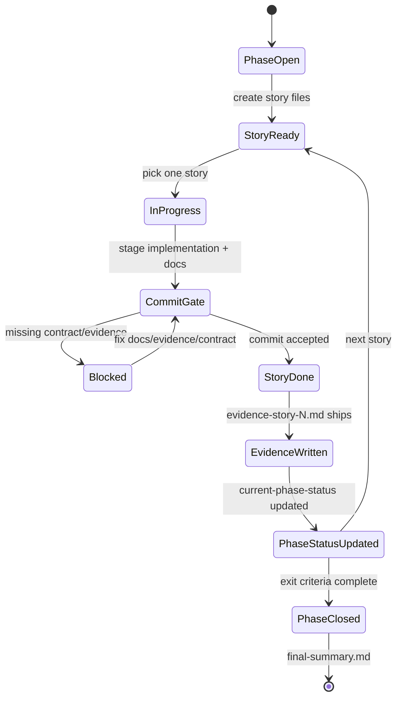

# pmo-roadmap


A drop-in PMO framework for any git project. Provides:

1. **Methodology** — phase-based, evidence-rich roadmap structure under
   `pm/roadmap/{project}/`. See `templates/roadmap-builder.md`.
2. **Hygiene gate** — a `pre-commit` hook that blocks commits until the
   committing agent (or human) writes a fresh `.tmp/CONTRACT.md` with
   per-rule checkboxes acknowledging the operating principles.
3. **Work log finalizer** — optional consent-gated `pre-commit` capture plus
   `post-commit` append into a local daily architect log.
4. **Deferred summarizer** — optional CLI adapter that can run `codex` or
   another command over deterministic logs after commits finish.
5. **Log reader** — small helper for listing or reading local daily logs.
6. **Bootstrapping** — scripts to scaffold a new project's roadmap tree.
7. **Updater** — pull methodology / contract / hook updates back into a
   project that already installed.

## Why

Plans rot when "done" is asserted, not evidenced. This package enforces
two things mechanically:

- A **directory contract** (each phase has its own folder with a known
  set of files: `current-phase-status.md`, `story-{n}-*.md`,
  `evidence-story-{n}.md`, `final-summary.md`).
- A **commit-time gate** that forces the committing agent to re-read the
  rules and certify (per-checkbox) that this commit complies. Stale
  contracts are rejected via mtime checks. The contract file is deleted
  on success so each commit needs a fresh one.

The hygiene gate works for human commits too. CI is unaffected (hooks
don't run server-side).

## How the pieces fit



## Install into a target project

```bash
cd ~/dev/reusable-processes/pmo-roadmap
./install.sh /path/to/target-project
```

Optional flags:

- `--project-name "Pantrybot"` — human name (used in scaffold)
- `--project-slug pantrybot` — kebab slug (used in `pm/roadmap/{slug}/`)
- `--project-prefix PB` — story-ID prefix (`PB-0-01`, …)
- `--skip-bootstrap` — install methodology + hook only; don't scaffold
  `pm/roadmap/{slug}/`
- `--force` — overwrite existing methodology/contract files

The installer:

1. Copies `templates/roadmap-builder.md` → `target/pm/roadmap/roadmap-builder.md`
2. Copies `templates/PMO-CONTRACT.md` → `target/pm/roadmap/PMO-CONTRACT.md`
3. Copies `hooks/pre-commit` → `target/.githooks/pre-commit` (chmod +x)
4. Copies `hooks/post-commit` → `target/.githooks/post-commit` (chmod +x)
5. Copies `bin/work-log-summarize` → `target/.githooks/work-log-summarize`
6. Copies `bin/work-log-read` → `target/.githooks/work-log-read`
7. Sets `git config core.hooksPath .githooks` in target
8. Adds `.tmp/` to target `.gitignore` if missing
9. (Optional) scaffolds `pm/roadmap/{slug}/` with `README.md` + a starter
   `phase-0-setup/` folder
10. Prints a snippet to add to target's `CLAUDE.md` / `AGENTS.md`

Re-running is safe (idempotent) but will refuse to overwrite existing
methodology/contract without `--force`.

## Installation Decision Tree



## Update an installed project

```bash
cd ~/dev/reusable-processes/pmo-roadmap
./update.sh /path/to/target-project
```

This re-copies the methodology and hook (overwriting). It refuses to
overwrite `PMO-CONTRACT.md` if it has been customized locally — pass
`--force` only after reconciling project-extension rules manually.

It never touches:

- `pm/roadmap/{slug}/` content (your phases and stories).
- `.githooks/pre-commit.local` (your project-specific rule checks).
- `.githooks/pre-commit.config` (your project-specific config).
- `.gitignore`.

If a target already has a non-framework `.githooks/post-commit`, install/update
refuses to replace it unless you pass `--force` after deciding how to preserve
or compose the existing behavior.

## Optional daily work log

Work logging is off by default. To enable deterministic local architect-log
entries for a project, add this to `.githooks/pre-commit.config`:

```bash
PMO_WORK_LOG_ENABLED=1
# Optional. Defaults to a roadmap slug or repo basename plus a path hash.
PMO_WORK_LOG_PROJECT_SLUG=myproject
# Optional. Defaults to "$HOME/.work/log".
PMO_WORK_LOG_DIR="$HOME/.work/log"
# Optional. Excludes matching staged paths from work-log payloads.
PMO_WORK_LOG_EXCLUDE_REGEX='(^secrets/|\\.env$|private-fixtures/)'
```

Then fill the contract's work-log block for each commit:

```markdown
**Work-log consent:** yes

**Work-log reasons:**
- Shipped MP-1-02 with evidence and test output.

**Work-log exclusions:**
- none
```

Only explicit `yes` consent creates a log entry. `pre-commit` captures the
staged payload under `.git/pmo-work-log/`; `post-commit` appends after Git
creates the commit. The MVP writes deterministic markdown and does not call an
LLM in the commit path.



`PMO_WORK_LOG_EXCLUDE_REGEX` is the mechanical privacy/noise control. Matching
paths are omitted from captured name/status, diff stat, and diff payloads, and
the final log lists them under "Omitted Paths". Contract exclusions remain the
human rationale; the regex is what the hook enforces.

Logs land under:

```bash
~/.work/log/$(date +%F)/{log-identity}-work-summary.log
```

To read today's entries:

```bash
.githooks/work-log-read --date "$(date +%F)" --list
.githooks/work-log-read --date "$(date +%F)" --identity myproject-123456789
```

To create a deferred LLM digest after commits are complete, configure a command
and run the helper:

```bash
PMO_WORK_LOG_SUMMARIZER='codex -p --model gpt-5.5'
.githooks/work-log-summarize --date "$(date +%F)" --timeout-seconds 120
```

The helper writes `{log-identity}-deferred-summary.md` beside the source log.
It does not rewrite deterministic commit entries.

## Project-specific rules

The canonical contract owns 7 rules. To add an 8th rule (or more) for
a specific project — for example, "every UI-facing change must update
the design handoff" — see
[`templates/PMO-CONTRACT.md` §"Extending"](./templates/PMO-CONTRACT.md).
The pattern: append the rule to your project's `PMO-CONTRACT.md`,
add a checkbox to the contract template, and put the structural
enforcement in `.githooks/pre-commit.local`. The canonical hook
sources that file after its own checks; `update.sh` never touches it.

## Bootstrap a new project's roadmap (post-install)

```bash
./bootstrap/new-project.sh /path/to/target-project myproject "My Project" MP
```

Creates `target/pm/roadmap/myproject/` with the project README and
`phase-0-setup/current-phase-status.md` ready to extend.

## Adopt an existing project

For a running project, install the mechanics first, then run session intake and
adoption discovery before writing stories:

```bash
./install.sh /path/to/target-project --skip-bootstrap
./bootstrap/session-intake.sh /path/to/target-project \
  --project-name "My Project" \
  --project-slug myproject \
  --project-prefix MP
./bootstrap/adopt-project.sh /path/to/target-project \
  --project-name "My Project" \
  --project-slug myproject \
  --project-prefix MP \
  --require-intake
```

The intake asks what the user wants to accomplish in the session, desired
direction, success evidence, constraints, and handoff expectations. The
discovery step then anchors repository research to that intent instead of
producing generic reconnaissance.

That creates:

```text
pm/roadmap/myproject/adoption/session-intake.md
pm/roadmap/myproject/adoption/adoption-discovery-prompt.md
```

To have an agent perform the read-only discovery:

```bash
./bootstrap/adopt-project.sh /path/to/target-project \
  --project-name "My Project" \
  --project-slug myproject \
  --project-prefix MP \
  --with-intake \
  --agent codex \
  --model gpt-5.5 \
  --dangerous \
  --force
```

or:

```bash
./bootstrap/adopt-project.sh /path/to/target-project \
  --project-slug myproject \
  --project-prefix MP \
  --with-intake \
  --agent claude \
  --model opus \
  --dangerous \
  --force
```

The report is written to:

```text
pm/roadmap/myproject/adoption/adoption-discovery.md
```

Use that report to decide whether to run `bootstrap/new-project.sh`, how to
name the current phase, which source canon matters, which tests prove health,
and whether the project needs local PMO contract extensions.

## Roadmap Lifecycle



## File map

```
pmo-roadmap/
├── README.md                     ← this file
├── install.sh                    ← initial install into a target project
├── update.sh                     ← re-pull methodology/contract/hook
├── bootstrap/
│   ├── adopt-project.sh          ← mid-project adoption discovery runner
│   ├── new-project.sh            ← scaffold pm/roadmap/{slug}/ skeleton
│   └── session-intake.sh         ← capture user goal, direction, handoff
├── hooks/
│   ├── pre-commit                ← hygiene gate + optional work-log capture
│   └── post-commit               ← optional daily work-log finalizer
├── bin/
│   ├── work-log-read             ← daily work-log reader
│   └── work-log-summarize        ← deferred summarizer helper
├── tests/
│   └── work-log-mvp.sh           ← temp-repo integration coverage
└── templates/
    ├── roadmap-builder.md        ← canonical methodology
    ├── adoption-discovery-prompt.md ← mid-project discovery prompt
    ├── session-intake.md.tmpl    ← user/session intake template
    ├── PMO-CONTRACT.md           ← rules + contract template
    ├── CLAUDE-snippet.md         ← snippet to add to target CLAUDE.md
    ├── project-README.md.tmpl    ← stub for pm/roadmap/{slug}/README.md
    ├── phase-status.md.tmpl      ← stub for current-phase-status.md
    └── story.md.tmpl             ← stub for story-{n}-*.md
```

## First real consumer

`~/dev/projects/pantrybot/` — installed 2026-04-25.

## Conventions

- Bash 3.2 compatible (default macOS shell).
- POSIX `stat` differences (macOS `-f %m` vs Linux `-c %Y`) handled.
- No external runtime dependencies; the hooks are pure bash + `git` + `grep`.
- Hook never auto-stages or auto-commits anything; it only blocks or passes.

## Maintenance

- Edit canonical files here, then run `update.sh` against each consumer
  project to roll the change forward.
- Keep `templates/PMO-CONTRACT.md`, `hooks/pre-commit`, and
  `hooks/post-commit` in sync when changing work-log contract behavior.
