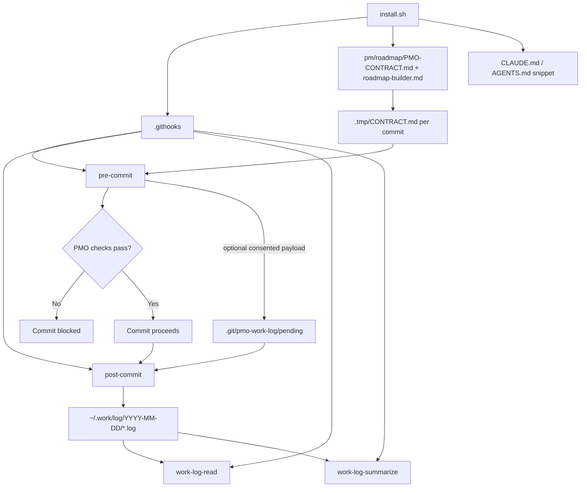
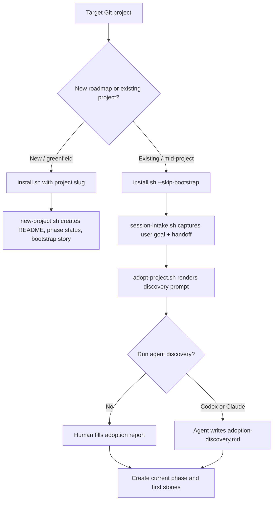
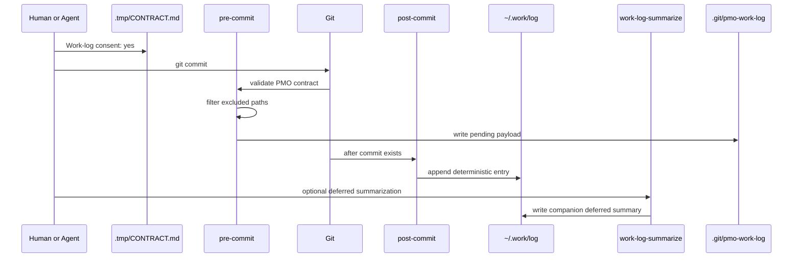
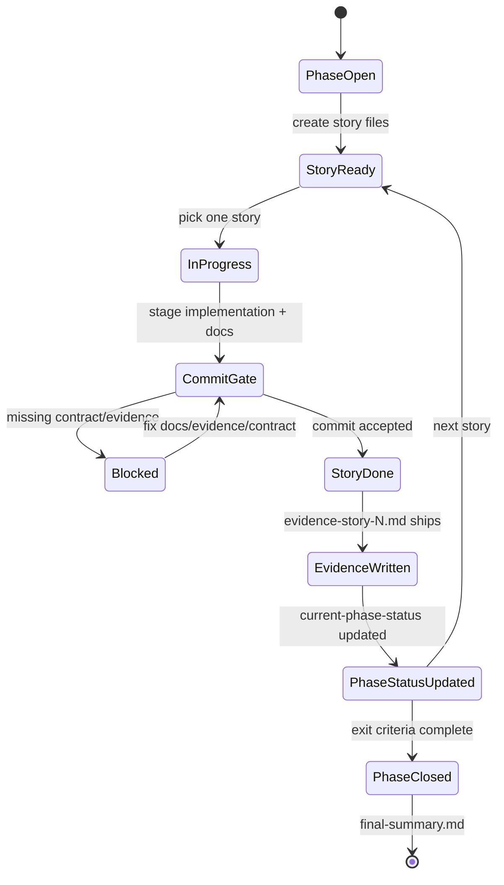

# pmo-roadmap


A drop-in PMO framework for any git project. Provides:

1. **Methodology** — phase-based, evidence-rich roadmap structure under
   `pm/roadmap/{project}/`. See `templates/roadmap-builder.md`.
2. **Hygiene gate** — a `pre-commit` hook that blocks commits until the
   committing agent (or human) writes a fresh `.tmp/CONTRACT.md` with
   per-rule checkboxes acknowledging the operating principles.
3. **Work log finalizer** — optional consent-gated `pre-commit` capture plus
   `post-commit` append into a local daily architect log.
4. **Deferred summarizer** — optional CLI adapter that can run `codex` or
   another command over deterministic logs after commits finish.
5. **Log reader** — small helper for listing or reading local daily logs.
6. **Bootstrapping** — scripts to scaffold a new project's roadmap tree.
7. **Updater** — pull methodology / contract / hook updates back into a
   project that already installed.

## Why

Plans rot when "done" is asserted, not evidenced. This package enforces
two things mechanically:

- A **directory contract** (each phase has its own folder with a known
  set of files: `current-phase-status.md`, `story-{n}-*.md`,
  `evidence-story-{n}.md`, `final-summary.md`).
- A **commit-time gate** that forces the committing agent to re-read the
  rules and certify (per-checkbox) that this commit complies. Stale
  contracts are rejected via mtime checks. The contract file is deleted
  on success so each commit needs a fresh one.

The hygiene gate works for human commits too. CI is unaffected (hooks
don't run server-side).

## How the pieces fit


```mermaid
flowchart TD
  Install[install.sh] --> Hooks[.githooks]
  Install --> Canon[pm/roadmap/PMO-CONTRACT.md + roadmap-builder.md]
  Install --> Snippet[CLAUDE.md / AGENTS.md snippet]
  Hooks --> Pre[pre-commit]
  Hooks --> Post[post-commit]
  Hooks --> Read[work-log-read]
  Hooks --> Summarize[work-log-summarize]

  Canon --> Contract[.tmp/CONTRACT.md per commit]
  Contract --> Pre
  Pre --> Gate{PMO checks pass?}
  Gate -->|No| Block[Commit blocked]
  Gate -->|Yes| Commit[Commit proceeds]
  Pre -->|optional consented payload| Pending[.git/pmo-work-log/pending]
  Commit --> Post
  Pending --> Post
  Post --> Log[~/.work/log/YYYY-MM-DD/*.log]
  Log --> Read
  Log --> Summarize
```

## Install into a target project

```bash
cd /path/to/delivery-workbench/pmo-roadmap
./install.sh /path/to/target-project
```

Optional flags:

- `--project-name "My Project"` — human name (used in scaffold)
- `--project-slug myproject` — kebab slug (used in `pm/roadmap/{slug}/`)
- `--project-prefix MP` — story-ID prefix (`MP-0-01`, …)
- `--skip-bootstrap` — install methodology + hook only; don't scaffold
  `pm/roadmap/{slug}/`
- `--force` — overwrite existing methodology/contract files

The installer:

1. Copies `templates/roadmap-builder.md` → `target/pm/roadmap/roadmap-builder.md`
2. Copies `templates/PMO-CONTRACT.md` → `target/pm/roadmap/PMO-CONTRACT.md`
3. Copies `hooks/pre-commit` → `target/.githooks/pre-commit` (chmod +x)
4. Copies `hooks/post-commit` → `target/.githooks/post-commit` (chmod +x)
5. Copies `bin/dw` → `target/.githooks/dw` and the `lib/dw_pmo/` core
   package → `target/.githooks/dw_pmo/`
6. Copies `bin/work-log-summarize` → `target/.githooks/work-log-summarize`
7. Copies `bin/work-log-read` → `target/.githooks/work-log-read`
8. Copies `agent/dw-*.md` → `target/.claude/commands/` (agent slash
   commands: `/dw-next`, `/dw-contract`, `/dw-story-done`, `/dw-adopt`)
9. Writes the managed Delivery Workbench block into `CLAUDE.md` (or an
   existing `AGENTS.md`) between markers; `update.sh` refreshes only
   inside them, user content is never touched (`--no-agent-docs` to opt
   out; `dw agent-docs` to re-run it any time)
10. Sets `git config core.hooksPath .githooks` in target
11. Adds `.tmp/` to target `.gitignore` if missing
12. (Optional) scaffolds `pm/roadmap/{slug}/` with `README.md` + a starter
    `phase-0-setup/` folder

Verify any clone's wiring with `.githooks/dw doctor` — it names unset
`core.hooksPath`, missing hooks, a missing dw/core install, a missing or
stale agent-docs block, and a missing python3.

Re-running is safe (idempotent) but will refuse to overwrite existing
methodology/contract without `--force`.

## Installation Decision Tree


```mermaid
flowchart TD
  A[Target Git project] --> B{New roadmap or existing project?}
  B -->|New / greenfield| C[install.sh with project slug]
  C --> D[new-project.sh creates README, phase status, bootstrap story]
  B -->|Existing / mid-project| E[install.sh --skip-bootstrap]
  E --> U[session-intake.sh captures user goal + handoff]
  U --> F[adopt-project.sh renders discovery prompt]
  F --> G{Run agent discovery?}
  G -->|No| H[Human fills adoption report]
  G -->|Codex or Claude| I[Agent writes adoption-discovery.md]
  H --> J[Create current phase and first stories]
  I --> J
```

## Update an installed project

```bash
cd /path/to/delivery-workbench/pmo-roadmap
./update.sh /path/to/target-project
```

This re-copies the methodology and hook (overwriting). It refuses to
overwrite `PMO-CONTRACT.md` if it has been customized locally — pass
`--force` only after reconciling project-extension rules manually.

It never touches:

- `pm/roadmap/{slug}/` content (your phases and stories).
- `.githooks/pre-commit.local` (your project-specific rule checks).
- `.githooks/pre-commit.config` (your project-specific config).
- `.gitignore`.

If a target already has a non-framework `.githooks/post-commit`, install/update
refuses to replace it unless you pass `--force` after deciding how to preserve
or compose the existing behavior.

For a project with a customized `pm/roadmap/PMO-CONTRACT.md`, run `update.sh`
without `--force` first. If it reports a contract difference, compare the
project file with `pmo-roadmap/templates/PMO-CONTRACT.md`, manually merge the
canonical consent block and any new framework language around your
project-specific extensions, then rerun with `--force` only if you intend to
replace the whole target contract.

## Optional daily work log

Work logging is off by default. To enable deterministic local architect-log
entries for a project, add this to `.githooks/pre-commit.config`:

```bash
PMO_WORK_LOG_ENABLED=1
# Optional. Defaults to a roadmap slug or repo basename plus a path hash.
PMO_WORK_LOG_PROJECT_SLUG=myproject
# Optional. Defaults to "$HOME/.work/log".
PMO_WORK_LOG_DIR="$HOME/.work/log"
# Optional. Excludes matching staged paths from work-log payloads.
PMO_WORK_LOG_EXCLUDE_REGEX='(^secrets/|\\.env$|private-fixtures/)'
```

Then fill the contract's work-log block for each commit:

```markdown
**Work-log consent:** yes

**Work-log reasons:**
- Shipped MP-1-02 with evidence and test output.

**Work-log exclusions:**
- none
```

Only explicit `yes` consent creates a log entry. `pre-commit` captures the
staged payload under `.git/pmo-work-log/`; `post-commit` appends after Git
creates the commit. The MVP writes deterministic markdown and does not call an
LLM in the commit path.


```mermaid
sequenceDiagram
  participant Dev as Human or Agent
  participant Contract as .tmp/CONTRACT.md
  participant Pre as pre-commit
  participant Git as Git
  participant Post as post-commit
  participant Log as ~/.work/log
  participant Summ as work-log-summarize

  Dev->>Contract: Work-log consent: yes
  Dev->>Git: git commit
  Git->>Pre: validate PMO contract
  Pre->>Pre: filter excluded paths
  Pre->>.git/pmo-work-log: write pending payload
  Git->>Post: after commit exists
  Post->>Log: append deterministic entry
  Dev->>Summ: optional deferred summarization
  Summ->>Log: write companion deferred summary
```

`PMO_WORK_LOG_EXCLUDE_REGEX` is the mechanical privacy/noise control. Matching
paths are omitted from captured name/status, diff stat, and diff payloads, and
the final log lists them under "Omitted Paths". Contract exclusions remain the
human rationale; the regex is what the hook enforces.

Treat consent and exclusions as the privacy boundary. Delivery Workbench does
not perform general-purpose secret scanning. Best-effort omission by path
cannot reliably catch base64 blobs, JWT payloads, generated credentials,
environment-expanded values, screenshots, binary files, or secrets pasted into
otherwise safe paths. If the material should not be preserved in a local daily
log, deny consent or exclude the path mechanically before committing.

Logs land under:

```bash
~/.work/log/$(date +%F)/{log-identity}-work-summary.log
```

To read today's entries:

```bash
.githooks/work-log-read --date "$(date +%F)" --list
.githooks/work-log-read --date "$(date +%F)" --identity myproject-123456789
```

To create a deferred LLM digest after commits are complete, configure a command
and run the helper:

```bash
PMO_WORK_LOG_SUMMARIZER='codex -p --model gpt-5.5'
.githooks/work-log-summarize --date "$(date +%F)" --timeout-seconds 120
```

The helper writes `{log-identity}-deferred-summary.md` beside the source log.
It does not rewrite deterministic commit entries. If the configured command
times out or exits nonzero, the deterministic log remains untouched and the
helper reports the failure. If the command returns empty output, the helper
writes a small deterministic fallback digest instead of inventing a model
summary. Oversized output is capped and marked with
`[PMO_WORK_LOG_SUMMARY_TRUNCATED]`.

### Troubleshooting work logs

- **No log entry:** confirm `.githooks/pre-commit.config` contains
  `PMO_WORK_LOG_ENABLED=1`, the commit contract says
  `**Work-log consent:** yes`, and the commit actually completed.
- **Stale pending payload:** an editor-aborted commit can leave
  `.git/pmo-work-log/pending`; the next consented `pre-commit` overwrites it
  with a warning before finalization.
- **Unexpected log path:** check `PMO_WORK_LOG_DIR`, `PMO_WORK_LOG_ID`, and
  `PMO_WORK_LOG_PROJECT_SLUG`. By default the filename includes a stable hash
  of the absolute repo path to avoid collisions.
- **Summarizer failure:** rerun `.githooks/work-log-summarize` after fixing the
  configured command. The source `*-work-summary.log` is append-only and is not
  deleted or rewritten by summarizer failures.

For a multi-day review, list each day's directory and read the same identity
across dates:

```bash
find "${PMO_WORK_LOG_DIR:-$HOME/.work/log}" -maxdepth 2 -name '*-work-summary.log' | sort
.githooks/work-log-read --date "$(date +%F)" --identity myproject-123456789
```

## Project-specific rules

The canonical contract owns 7 rules. To add an 8th rule (or more) for
a specific project — for example, "every UI-facing change must update
the design handoff" — see
[`templates/PMO-CONTRACT.md` §"Extending"](./templates/PMO-CONTRACT.md).
The pattern: append the rule to your project's `PMO-CONTRACT.md`,
add a checkbox to the contract template, and put the structural
enforcement in `.githooks/pre-commit.local`. The canonical hook
sources that file after its own checks; `update.sh` never touches it.

## Bootstrap a new project's roadmap (post-install)

```bash
./bootstrap/new-project.sh /path/to/target-project myproject "My Project" MP
```

Creates `target/pm/roadmap/myproject/` with the project README and
`phase-0-setup/current-phase-status.md` ready to extend.

## Roadmap maintenance CLI

The installed `.githooks/dw` helper performs routine roadmap maintenance over
the existing markdown files; it does not create a separate tracker.

```bash
.githooks/dw projects
.githooks/dw tree myproject
.githooks/dw tree myproject --done
.githooks/dw context myproject --trace
.githooks/dw phase list myproject
.githooks/dw phase create myproject 1 "MVP" \
  --goal "Ship the smallest useful release."
.githooks/dw story create myproject 1 "Add the first feature"
.githooks/dw story status myproject 1 PRJ-1-01 done \
  --evidence-body "- Test output and implementation notes."
.githooks/dw story evidence myproject 1 PRJ-1-01 \
  --body "- Additional verification detail."
.githooks/dw evidence capture myproject 1 PRJ-1-01 -- npm test
.githooks/dw next myproject --json
.githooks/dw doctor
.githooks/dw agent-docs
.githooks/dw phase close myproject 1 \
  --summary "Phase closed with all stories evidenced."
.githooks/dw check myproject
```

`next` follows a strict exit contract for agents: 0 = story found,
2 = nothing actionable, 1 = error; `--json` emits the story as one JSON
object (or `{"next_story": null}`). Story write commands validate the
status vocabulary (`backlog | ready | in-progress | blocked | done`,
plus the done synonyms `complete | closed | shipped`) and reject
anything else with the allowed list in the error.

Use `tree` to see what is in a phase, `tree --done` to see completed work, and
`check` before a status update to catch broken links or story/table status
mismatches. Use `context` when an agent needs a JSON snapshot with projects,
active phases, stories, evidence presence, next story, stale-pointer issues,
drift warnings, supplemental canon, hook compatibility, trace paths, optional
recent commits, and work-log entries before it chooses a write operation.

Write commands are intentionally narrow. `story status ... done` refuses to
proceed unless paired evidence already exists or evidence text is provided in
the same command. `story evidence` only creates or attaches
`evidence-story-N.md` in the story's phase folder. `phase close` refuses open
stories unless forced and writes only `final-summary.md` plus the project README
phase-index status. These commands compute all affected file contents before
writing and restore already-touched files if a later write fails. The CLI treats
generated JSON as disposable context; the markdown files remain the source of
truth.

### The commit gate (`dw gate`) and contract v2

Every structural commit rule lives in one place: `dw gate`, backed by
the `dw_pmo` core. The installed `pre-commit` is a thin shim that wires
`.githooks/pre-commit.config`, invokes the gate, exposes the
`pre-commit.local` seam, and captures the consented work-log payload.
python3 is a hard runtime dependency of the gate; the shim fails closed
with a clear message when it is missing.

The contract is generated, not hand-typed. After staging:

```bash
.githooks/dw contract new [--story ID] [--consent yes --reasons "…"]
```

stamps machine-verified facts — branch, HEAD, `git write-tree` index
tree, staged sample, detected story IDs — and the gate re-derives each
one at commit time. The index tree is the freshness proof: restaging
invalidates the contract and `touch` cannot refresh it. Checked boxes
are verified by rule title against the project's `PMO-CONTRACT.md`
template fence (canonical plus extensions).

The trail is durable: the `commit-msg` shim stamps `PMO-Story:` and
`PMO-Contract-Digest:` trailers from the live contract, and
`post-commit` archives the exact contract (plus any `BUNDLE-OK.md`
rationale) under `.git/pmo-contract-archive/<sha>` before clearing the
working files — so an aborted commit leaves the contract in place for
the retry.

Run the gate directly for a non-consuming preflight (only a completed
commit archives and clears `.tmp/CONTRACT.md`):

```bash
.githooks/dw gate              # human verdict
.githooks/dw gate --porcelain  # stable key=value lines for machines
```

Porcelain output is one `key=value` per line, in this order — scalars,
then repeated list keys, then failure keys (only when `gate=fail`):

```text
gate=pass|fail
expected_boxes=<int>
checked_boxes=<int>
shipped_count=<int>
worklog_capture=yes|no
contract_digest=sha256:<hex>|none
declared_story=<id>      # repeated, from the contract's Story fact
staged=<path>            # repeated, staged-diff order
staged_story=<path>      # repeated
staged_evidence=<path>   # repeated
shipped_story=<path>     # repeated
rule=<failed-rule-id>    # contract-missing | contract-facts-missing |
                         # contract-index-tree-mismatch |
                         # contract-head-mismatch |
                         # contract-branch-mismatch |
                         # contract-sample-mismatch |
                         # contract-unchecked | contract-unknown-box |
                         # contract-missing-box | contract-boxes |
                         # contract-story-mismatch |
                         # contract-tests-capture-mismatch | atomicity |
                         # evidence-missing | orphan-evidence |
                         # evidence-deletion-orphans-story
message=<one line>
remediation=<one line>
```

### Evidence capture (`dw evidence capture`)

Evidence should carry proof, not prose. After running a verification
command through:

```bash
.githooks/dw evidence capture <project> <phase> <story> -- <command…>
```

the story's evidence file gains an appended, machine-parseable block —
`### Captured run — <UTC timestamp>` with the exact command, cwd, exit
code, `git write-tree` index tree, and fenced combined output
(byte-capped via `--max-output-bytes`, default 20000, with an explicit
`[PMO_EVIDENCE_OUTPUT_TRUNCATED]` marker). Nonzero exits are recorded
honestly and mirrored as the CLI's exit code. Capture touches only the
evidence file (creating it when missing); linking it in the phase table
remains `dw story status`'s job.

`dw check` enforces evidence content for done stories: an ERROR when
the evidence still carries the generator placeholder or has no body,
and an ERROR for broken asset references — screenshots and binary
artifacts belong under `assets/` next to the evidence file and are
referenced relatively (``), so `dw check`
can existence-check them. Done stories whose evidence has no captured
run are named in a `narrative-only evidence` warning (visible in
`dw context`), not an error.

A passing captured run can discharge the "Tests ran." contract rule
mechanically:

```bash
.githooks/dw contract new --tests-capture <evidence-path>[#timestamp]
```

stamps a `**Tests-ran capture:**` fact and pre-checks the box; the gate
re-verifies at commit time that the referenced block exists in the
**staged** evidence with exit code 0
(`contract-tests-capture-mismatch` otherwise).

Gate semantics (shared vocabulary with `dw`): a story "ships" when its
`**Status:**` header flips from a non-done value in `HEAD` to any of
`done|complete|closed|shipped` in the index — renames and reformatting
of already-done stories are not flips. Evidence numbers pair as
integers (`evidence-story-1.md` matches `story-01-*`). Evidence
deletions pass unless they orphan a story that remains done in the
index; modified evidence is legal while its story is done; added
evidence still requires its story to flip in the same commit. Paths
with spaces are handled. `EXPECTED_BOXES` and work-log settings resolve
as: simple assignments in `pre-commit.config` beat the environment,
which beats defaults (`PMO_WORK_LOG_DIR` follows the same precedence in
the hooks, `work-log-read`, `work-log-summarize`, and `dw context`).

## Workbench: the local web view

Browse and safely edit the roadmap as an operational surface instead
of a directory tree. `install.sh`/`update.sh` distribute it into
consumer repos as `.githooks/dw-workbench` (with the UI under
`.githooks/workbench/`); in this repo run it from source:

```bash
pmo-roadmap/bin/dw-workbench --root /path/to/repo [--port 8377] [--quiet]
# then open http://127.0.0.1:8377/
```

The runtime boundary is deliberately boring: binds 127.0.0.1 only and
prints the served root, URL, and write policy at startup; refuses to
start without a `pm/roadmap` tree under the root or when the port is
in use (with remediation in the message); serves exactly that one
root; rejects non-local `Host` headers (DNS-rebinding guard), CORS
preflights (no CORS headers are ever emitted), path traversal in
every file endpoint, and slugs outside the `[a-z0-9-]` alphabet;
writes only through preview→apply inside `pm/roadmap/**` with
rollback protection; has no endpoint that stages or commits (the
suite proves the git index stays empty); logs each request to stderr
(`--quiet` to silence); and shuts down cleanly on SIGINT/SIGTERM.
Views: project overview (health, story counts, next actionable
story), phase board, story/evidence pair, health console, trace
timeline with agent handoff, work-log viewer, and the guarded editor.
`?snapshot=1` switches the UI to synchronous loading for headless
screenshot tools.

JSON API (stable envelope `delivery-workbench-workbench-response`,
schema_version 1): `/api/context`, `/api/projects`,
`/api/projects/{slug}`, `/api/projects/{slug}/phases/{n}`,
`/api/projects/{slug}/stories/{id}`, `/api/health` (structured
drift/validation report with the `mutation_safe` flag),
`/api/projects/{slug}/trace/{id}` (the intent-to-proof timeline:
chain hops with explicit absent states, plus commit events carrying
`PMO-Story`/`PMO-Contract-Digest` trailers merged with work-log
entries — this endpoint IS the agent-facing JSON export),
`/api/projects/{slug}/phases/{n}/events`, `/api/file?path=…`, and
the write-tier workflow: `POST /api/mutations/preview` accepts
structured mutation requests (`create_phase`, `create_story`,
`update_story_status`, `attach_evidence`, `close_phase` — one-to-one
with the core plan builders) and returns planned file contents,
unified diffs, validation before the write, projected validation
after it, and a deterministic content-bound fingerprint — writing
nothing. `POST /api/mutations/apply` requires that fingerprint and
refuses with 409 when the source files changed after the preview;
writes are rollback-protected and followed by revalidation. Both
routes are guarded while the project has validation issues, except
for mutations whose projected issue set strictly shrinks the current
one — a fix is never ambiguous — or requests that explicitly
acknowledge the issues. The server never commits.

### Workbench adoption guidance (consumer repos)

- **Source of truth:** Markdown under `pm/roadmap/**` is authoritative;
  every workbench response derives from it live. There is no database
  or cache to migrate, back up, or trust — delete nothing, sync
  nothing.
- **Permission boundary:** localhost only, one repo root per process,
  writes only through preview→apply inside `pm/roadmap/**`, no
  staging, no commits — committing (and the commit gate) stays in your
  hands and hooks. Anything outside that boundary is a bug; the
  refusal states above are tested per push.
- **Work-log caveat:** the work-log viewer reads `PMO_WORK_LOG_DIR`
  (config > environment > default `~/.work/log`) and serves only
  capture/digest artifacts from inside it. Logs are supplementary
  evidence — never a substitute for `evidence-story-NN.md`, and the UI
  says so wherever they appear.
- **Proving health:** `.githooks/dw doctor` proves the wiring;
  `.githooks/dw check <project>` (or the workbench health console /
  `GET /api/health`, which embeds the same output copyably) proves
  roadmap integrity — `dw check: ok` is the green signal. The full
  validation matrix for this repo is in the root README and runs in CI
  on every push: core unit tests, CLI/gate/agent/adoption integration,
  workbench server/API integration, the viewport smoke, shellcheck,
  and the python-3.9 floor.

## Adopt an existing project

For a running project, install the mechanics first, then run session intake and
adoption discovery before writing stories:

```bash
./install.sh /path/to/target-project --skip-bootstrap
./bootstrap/session-intake.sh /path/to/target-project \
  --project-name "My Project" \
  --project-slug myproject \
  --project-prefix MP
./bootstrap/adopt-project.sh /path/to/target-project \
  --project-name "My Project" \
  --project-slug myproject \
  --project-prefix MP \
  --require-intake
```

The intake runs as a guided terminal interview when attached to a TTY. It keeps
the tone light but practical: a small banner, numbered choices, checkbox-style
priorities and deliverables, risk posture, discovery depth, session goal,
desired direction, success evidence, constraints, and handoff expectations.
The discovery step then anchors repository research to that intent instead of
producing generic reconnaissance.

For automation, pass the same values as flags and add `--no-prompt`:

```bash
./bootstrap/session-intake.sh /path/to/target-project \
  --project-name "My Project" \
  --project-slug myproject \
  --project-prefix MP \
  --mode "Delivery slice: identify and execute the next valuable change" \
  --priorities "- [x] Create a durable handoff" \
  --risk "Read-only until the plan is explicit" \
  --depth "Standard: repo map, commands, risks, first stories" \
  --deliverables "- [x] Immediate session plan" \
  --handoff-audience "Future agent" \
  --goal "Turn discovery into a first actionable roadmap" \
  --no-prompt
```

That creates:

```text
pm/roadmap/myproject/adoption/session-intake.md
pm/roadmap/myproject/adoption/adoption-discovery-prompt.md
```

To have an agent perform the read-only discovery (safe by default:
codex runs in a read-only sandbox, claude runs non-interactively behind
its permission gate — `--dangerous` exists but is the exception and
bypasses those protections):

```bash
./bootstrap/adopt-project.sh /path/to/target-project \
  --project-slug myproject \
  --project-prefix MP \
  --with-intake \
  --agent claude
```

The report is written to:

```text
pm/roadmap/myproject/adoption/adoption-discovery.md
```

Its "Proposed Phase Index" and "Proposed First Stories" tables are
machine-consumed — close the loop with the third command:

```bash
cd /path/to/target-project
.githooks/dw adopt --from-report pm/roadmap/myproject/adoption/adoption-discovery.md
.githooks/dw adopt --from-report pm/roadmap/myproject/adoption/adoption-discovery.md --apply
.githooks/dw doctor
```

`dw adopt` previews the exact files it will create (project README if
missing, phase folders, story stubs) and writes nothing until
`--apply`; malformed tables are refused with line-numbered errors, not
partial scaffolds. Finish with `dw doctor` to prove the rails are live,
then pick up work with `dw next`. The whole adoption is three commands:
install → intake+discovery → adopt.

## Roadmap Lifecycle


```mermaid
stateDiagram-v2
  [*] --> PhaseOpen
  PhaseOpen --> StoryReady: create story files
  StoryReady --> InProgress: pick one story
  InProgress --> CommitGate: stage implementation + docs
  CommitGate --> Blocked: missing contract/evidence
  Blocked --> CommitGate: fix docs/evidence/contract
  CommitGate --> StoryDone: commit accepted
  StoryDone --> EvidenceWritten: evidence-story-N.md ships
  EvidenceWritten --> PhaseStatusUpdated: current-phase-status updated
  PhaseStatusUpdated --> StoryReady: next story
  PhaseStatusUpdated --> PhaseClosed: exit criteria complete
  PhaseClosed --> [*]: final-summary.md
```

## File map

```
pmo-roadmap/
├── README.md                     ← this file
├── install.sh                    ← initial install into a target project
├── update.sh                     ← re-pull methodology/contract/hook
├── bootstrap/
│   ├── adopt-project.sh          ← mid-project adoption discovery runner
│   ├── new-project.sh            ← scaffold pm/roadmap/{slug}/ skeleton
│   └── session-intake.sh         ← capture user goal, direction, handoff
├── hooks/
│   ├── pre-commit                ← hygiene gate + optional work-log capture
│   └── post-commit               ← optional daily work-log finalizer
├── bin/
│   ├── dw                       ← roadmap maintenance CLI (adapter)
│   ├── work-log-read             ← daily work-log reader
│   └── work-log-summarize        ← deferred summarizer helper
├── lib/
│   └── dw_pmo/                   ← reusable PMO core: model, paths, parse,
│                                    validate, trace, render, mutations, api
├── tests/
│   ├── dw-core-tests.py          ← dw_pmo core unit tests
│   ├── roadmap-cli.sh            ← temp-roadmap CLI coverage
│   └── work-log-mvp.sh           ← temp-repo integration coverage
└── templates/
    ├── roadmap-builder.md        ← canonical methodology
    ├── adoption-discovery-prompt.md ← mid-project discovery prompt
    ├── session-intake.md.tmpl    ← user/session intake template
    ├── PMO-CONTRACT.md           ← rules + contract template
    ├── CLAUDE-snippet.md         ← snippet to add to target CLAUDE.md
    ├── project-README.md.tmpl    ← stub for pm/roadmap/{slug}/README.md
    ├── phase-status.md.tmpl      ← stub for current-phase-status.md
    └── story.md.tmpl             ← stub for story-{n}-*.md
```

## Conventions

- Shell pieces are Bash 3.2 compatible (default macOS shell) and pass
  shellcheck; CI runs the full suite on ubuntu and macos so BSD/GNU
  tool differences and bash-version quirks (e.g. 5.2's
  `patsub_replacement`) are exercised on every push.
- python3 ≥ 3.9 (stdlib only) is a hard dependency of the commit gate;
  the pre-commit shim fails closed when it is missing, and CI verifies
  the core on the declared 3.9 floor. Helper hooks and readers remain
  bash + `git` + `grep`.
- Hook never auto-stages or auto-commits anything; it only blocks or passes.

## Maintenance

- Edit canonical files here, then run `update.sh` against each consumer
  project to roll the change forward.
- Keep `templates/PMO-CONTRACT.md`, `hooks/pre-commit`, and
  `hooks/post-commit` in sync when changing work-log contract behavior.
