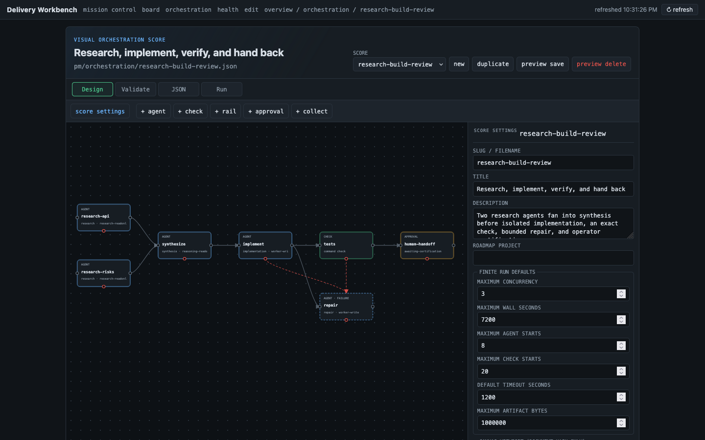

# Evidence - WLA-24-03

- **Story:** WLA-24-03 - Build the rich visual orchestration editor
- **Status:** done
- **Date:** 2026-07-17

## Proof

`#/orchestration` is now the authoring center for the exact shared score
contract. Its dependency-free SVG graph exposes typed success and failure
edges, five node types, complete score/node/output/check/failure/budget
inspectors, live compiler diagnostics, deterministic simulation, and a
lossless canonical JSON surface. Dedicated score endpoints provide pure reads
and a separate preview→diff→fingerprint apply boundary; stale, invalid,
escaped, concurrent, or unverifiable writes refuse or roll back and no editor
operation creates a run, agent, check, or rail event.



### Captured run — 2026-07-18T04:35:49Z

- **Command:** `bash -o pipefail -c set -e
python3 pmo-roadmap/tests/dw-core-tests.py -q
/usr/bin/python3 pmo-roadmap/tests/dw-core-tests.py -q
bash pmo-roadmap/tests/workbench-explorer.sh
bash pmo-roadmap/tests/workbench-ui-smoke.sh
bash pmo-roadmap/tests/package-smoke.sh
bash pmo-roadmap/tests/roadmap-cli.sh
bash pmo-roadmap/tests/docs-lint.sh
bash pmo-roadmap/tests/docs-snippet-smoke.sh
bash pmo-roadmap/tests/canon-lint.sh
bash pmo-roadmap/tests/agent-surface.sh
node --check pmo-roadmap/workbench/app.js
python3 -m py_compile pmo-roadmap/lib/dw_pmo/orchestration.py pmo-roadmap/lib/dw_pmo/orchestration_edit.py pmo-roadmap/lib/dw_pmo/workbench.py
.githooks/dw check work-log-automation
.githooks/dw rider docs --check
pmo-roadmap/update.sh . --check
git diff --check
git diff --cached --check`
- **Cwd:** .
- **Exit code:** 0
- **Index-tree:** 246f9e6ae343c7c3b7aa9223e50cd88c5bdce168

```text
dw hook: codex_hooks is explicitly false in /var/folders/q7/5dzz5g2116b3lq8rhg7hwjrr0000gn/T/dw-hooks-test.8a9s3rje/config.toml; respecting the opt-out
----------------------------------------------------------------------
Ran 250 tests in 26.612s

OK
dw hook: claude — 4 installed, 0 already present in /var/folders/q7/5dzz5g2116b3lq8rhg7hwjrr0000gn/T/dw-hooks-test.a6u_h0g7/settings.json
dw hook: claude — 0 installed, 4 already present in /var/folders/q7/5dzz5g2116b3lq8rhg7hwjrr0000gn/T/dw-hooks-test.a6u_h0g7/settings.json
dw hook: claude — 4 installed, 0 already present in /var/folders/q7/5dzz5g2116b3lq8rhg7hwjrr0000gn/T/dw-hooks-test.e8wqipbd/settings.json
dw hook: claude — 4 installed, 0 already present in /var/folders/q7/5dzz5g2116b3lq8rhg7hwjrr0000gn/T/dw-hooks-test.5t4d9xo9/settings.json
dw hook: claude — 4 removed from /var/folders/q7/5dzz5g2116b3lq8rhg7hwjrr0000gn/T/dw-hooks-test.5t4d9xo9/settings.json
dw hook: codex_hooks is explicitly false in /var/folders/q7/5dzz5g2116b3lq8rhg7hwjrr0000gn/T/dw-hooks-test.jwzngs4t/config.toml; respecting the opt-out
----------------------------------------------------------------------
Ran 250 tests in 24.477s

OK
dw hook: claude — 4 installed, 0 already present in /var/folders/q7/5dzz5g2116b3lq8rhg7hwjrr0000gn/T/dw-hooks-test.vwhhuoim/settings.json
dw hook: claude — 0 installed, 4 already present in /var/folders/q7/5dzz5g2116b3lq8rhg7hwjrr0000gn/T/dw-hooks-test.vwhhuoim/settings.json
dw hook: claude — 4 installed, 0 already present in /var/folders/q7/5dzz5g2116b3lq8rhg7hwjrr0000gn/T/dw-hooks-test.9jnk5849/settings.json
dw hook: claude — 4 installed, 0 already present in /var/folders/q7/5dzz5g2116b3lq8rhg7hwjrr0000gn/T/dw-hooks-test.3lbwmga4/settings.json
dw hook: claude — 4 removed from /var/folders/q7/5dzz5g2116b3lq8rhg7hwjrr0000gn/T/dw-hooks-test.3lbwmga4/settings.json
dw-workbench: serving /private/var/folders/q7/5dzz5g2116b3lq8rhg7hwjrr0000gn/T/pmo-workbench-test.XKJnCj/repo
dw-workbench: http://127.0.0.1:19281/ (localhost or your own .ts.net tailnet; Ctrl-C to stop)
dw-workbench: writes require /api/mutations preview→apply or an exact /api/step/apply token; never stages, certifies, or commits
dw-workbench: shutting down
dw-workbench: serving /private/var/folders/q7/5dzz5g2116b3lq8rhg7hwjrr0000gn/T/pmo-workbench-test.XKJnCj/installed
dw-workbench: http://127.0.0.1:19282/ (localhost or your own .ts.net tailnet; Ctrl-C to stop)
dw-workbench: writes require /api/mutations preview→apply or an exact /api/step/apply token; never stages, certifies, or commits
workbench-explorer.sh: ok
dw-workbench: shutting down
dw-workbench: serving /private/var/folders/q7/5dzz5g2116b3lq8rhg7hwjrr0000gn/T/pmo-workbench-test.XKJnCj/repo
dw-workbench: http://127.0.0.1:19281/ (localhost or your own .ts.net tailnet; Ctrl-C to stop)
dw-workbench: writes require /api/mutations preview→apply or an exact /api/step/apply token; never stages, certifies, or commits
workbench-ui-smoke.sh: ok (26 viewport renders: 11 views + attention + ambiguity, desktop+mobile)
dw-workbench: shutting down
dw-workbench: serving /private/var/folders/q7/5dzz5g2116b3lq8rhg7hwjrr0000gn/T/pmo-ui-smoke.mUAJow/repo
dw-workbench: http://127.0.0.1:21758/ (localhost or your own .ts.net tailnet; Ctrl-C to stop)
dw-workbench: writes require /api/mutations preview→apply or an exact /api/step/apply token; never stages, certifies, or commits
package-smoke.sh: skipping unhealthy interpreter: python3
package-smoke.sh: building with: /usr/bin/python3 (Python 3.9.6)
* Creating isolated environment: venv+pip...
* Installing packages in isolated environment:
  - setuptools>=77
* Getting build dependencies for sdist...
warning: no previously-included files matching '*.pyc' found anywhere in distribution
* Building sdist...
warning: no previously-included files matching '*.pyc' found anywhere in distribution
* Building wheel from sdist
* Creating isolated environment: venv+pip...
* Installing packages in isolated environment:
  - setuptools>=77
* Getting build dependencies for wheel...
warning: no previously-included files matching '__pycache__/*' found anywhere in distribution
warning: no previously-included files matching '*.pyc' found anywhere in distribution
* Building wheel...
warning: no previously-included files matching '__pycache__/*' found anywhere in distribution
warning: no previously-included files matching '*.pyc' found anywhere in distribution
package-smoke.sh: built delivery_workbench-1.14.0-py3-none-any.whl and delivery_workbench-1.14.0.tar.gz
package-smoke.sh: pipx cannot create environments here; falling back to venv+pip
WARNING: You are using pip version 21.2.4; however, version 26.0.1 is available.
You should consider upgrading via the '/private/var/folders/q7/5dzz5g2116b3lq8rhg7hwjrr0000gn/T/pmo-package-smoke.nMwJBz/appenv/bin/python -m pip install --upgrade pip' command.
package-smoke.sh: installed via venv+pip
ready     review-workspace   absent     not-applicable
ready     generate-contract  absent     fail
ready     certify-contract   unchecked  fail
ready     commit             passing    pass
ready     start-story        absent     not-applicable
ready     continue-story     absent     not-applicable
attention repair-roadmap     absent     not-applicable
ready     continue-story     absent     not-applicable
ready     continue-story     absent     not-applicable
attention finish-story       absent     not-applicable
ready     review-workspace   absent     not-applicable
ready     generate-contract  absent     fail
ready     certify-contract   unchecked  fail
ready     generate-contract  stale      fail
ready     certify-contract   unchecked  fail
ready     commit             passing    pass
ready     start-story        absent     not-applicable
commit     60e979582fbb         trailers+archive+verify=ok
guided-status-loop.sh: ok (packaged CLI/MCP/HTTP recommendation sequence)
authorize 01 cli  review-workspace   -> review-workspace
authorize 02 mcp  generate-contract  -> certify-contract
refuse   bootstrap certification started=0 step_events=+0
refuse   bootstrap commit       started=0 step_events=+0
authorize 03 http start-story        -> continue-story
refuse   same-id stale token    started=0 step_events=+0
authorize 04 mcp  continue-story     -> continue-story
authorize 05 cli  finish-story       -> review-workspace
authorize 06 http review-workspace   -> review-workspace
authorize 07 cli  generate-contract  -> certify-contract
refuse   story certification    started=0 step_events=+0
refuse   story commit           started=0 step_events=+0
bootstrap  57151360507f         certification+commit=manual
commit     a15908cc4c30         trailers+archive+verify=ok
handoff    start-story        authorizations=7
deliberate-step-loop.sh: ok (fresh token per action; no argv reconstruction or consent shortcut)
package-smoke.sh: ok
roadmap-cli.sh: ok
docs-lint: ok (391 markdown files)
docs-lint.sh: ok (1s)
ok: CONTRIBUTING.md snippet 'contributor-setup' ran as printed
ok: CONTRIBUTING.md snippet 'contributor-gated-commit' ran as printed
ok: pmo-roadmap/README.md snippet 'install' ran as printed
ok: pmo-roadmap/README.md snippet 'update' ran as printed
ok: pmo-roadmap/README.md snippet 'new-project' ran as printed
ok: pmo-roadmap/README.md snippet 'adopt-three-step' ran as printed
ok: pmo-roadmap/README.md snippet 'intake-no-prompt' ran as printed
ok: pmo-roadmap/README.md snippet 'adopt-close-loop' ran as printed
docs-lint snippets: ok
docs-snippet-smoke.sh: ok
canon-lint.sh: ok
agent-surface.sh: ok
dw check: ok
dw rider docs: all rendered surfaces match canon
update.sh: up to date (vendored rails match source v1.14.0)
```

## Manual diagnostic review

- Inspected the retained 1440×900 Firefox render and confirmed both parallel
  research nodes, synthesis fan-in, isolated implementation, required check,
  prominent dashed red repair routes, and the human handoff are legible in one
  frame with finite defaults visible in the adjacent inspector.
- Exercised Design, Validate, and JSON at 1440×900 and 390×844. Node controls
  remain keyboard focusable; arrow keys move layout only, while compiler
  errors remain attached to node/field context and block apply.
- Confirmed the installed server reloads an applied score byte-for-byte,
  rejects an unknown field without dropping it, refuses replay after the file
  changes, restores the prior bytes after a planted read-back failure, and
  leaves `.git/pmo-orchestration` absent throughout editor reads and writes.
