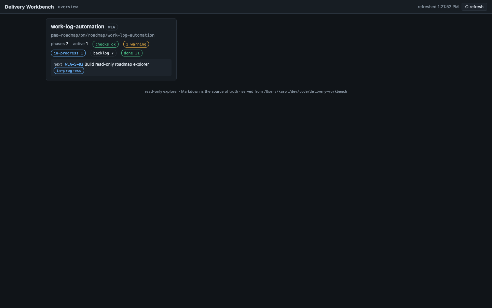
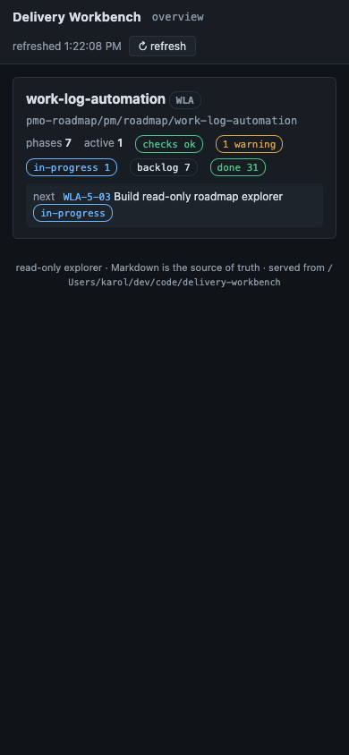
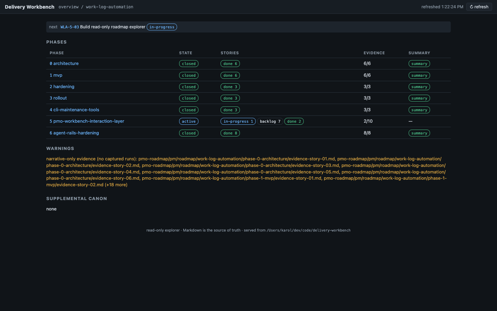
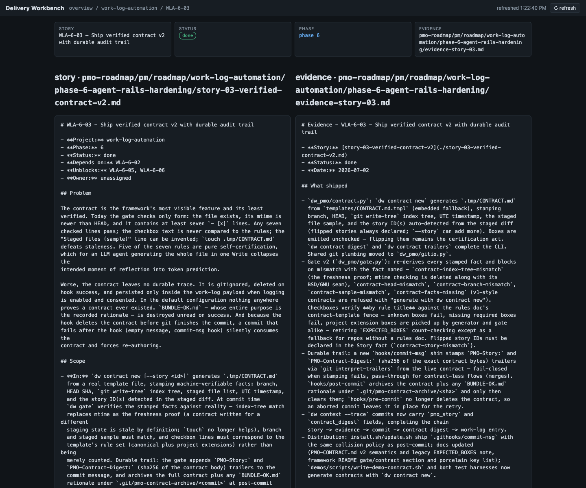

# Evidence - WLA-5-03

- **Story:** WLA-5-03 - Build read-only roadmap explorer
- **Status:** done
- **Date:** 2026-07-02

## What shipped

- **`dw_pmo/workbench.py`** — the local server: a stable JSON envelope
  (`delivery-workbench-workbench-response`, schema_version 1) over
  read endpoints (`/api/context`, `/api/projects`,
  `/api/projects/{slug}`, `…/phases/{n}`, `…/stories/{id}`,
  `/api/file?path=…`), every byte computed live through the same
  `dw_pmo` functions the CLI uses — no second parser, no cache, no
  database. Binds 127.0.0.1 only; GET only (405 otherwise); the file
  endpoint and static handler are containment-checked. Route logic is
  a pure function (`handle_api`) so view models unit-test without
  sockets.
- **`bin/dw-workbench`** — the documented command:
  `dw-workbench --root PATH [--port N]` (source-repo only until the
  Phase 5 permission-hardening story; documented in the framework
  README).
- **`pmo-roadmap/workbench/`** — the static explorer (vanilla JS, hash
  routing, dense operational surface): overview cards (project,
  prefix, phase/active counts, validation and warning badges, story
  status counts, next actionable story), project phase board (state,
  per-status story counts, evidence tallies, final-summary badges,
  validation issues, warnings, supplemental canon as read-only indexed
  links), phase story table normalized from
  `current-phase-status.md` with source links and header/table
  mismatch badges, story/evidence pair view with source-faithful
  Markdown (`<pre>`, exact bytes), file view for canon, loading/empty/
  error states, last-refresh time, and a refresh button. `?snapshot=1`
  switches to synchronous loading for headless screenshot tools.

## Screenshots (desktop + mobile, headless Firefox, this repository)






The first viewport is the operational overview (project card with
health badges and the next actionable story), not a landing page; the
phase board shows all seven phases with evidence tallies and even
surfaces the core's narrative-only-evidence warning.

## Acceptance proof

Unit (in the 55-test core suite): overview/project/phase/story view
models, envelope shape, 404s, file-endpoint traversal refusals (403),
and the read-only guarantee via sha256 checksums across repeated API
loads. Integration (`workbench-explorer.sh`, CI-run on ubuntu and
macos): the documented command starts against an explicit `--root`,
serves the shell and API against a fixture roadmap, asserts the
normalized payloads (statuses, evidence presence, markdown content),
rejects POST (405) and traversal (403), and proves the roadmap tree is
cksum-identical after repeated loads. Browser-DOM viewport tests
remain with WLA-5-10 per the phase plan; the screenshots above are the
real rendered UI at 1440×900 and 390×844.

## Proof — captured runs (appended by `dw evidence capture`)

### Captured run — 2026-07-02T19:26:22Z

- **Command:** `pmo-roadmap/tests/workbench-explorer.sh`
- **Cwd:** .
- **Exit code:** 0
- **Index-tree:** 60e4419f127cb523e30f9f1b674cb0669b6d36b2

```text
workbench-explorer.sh: ok
```

### Captured run — 2026-07-02T19:26:23Z

- **Command:** `python3 pmo-roadmap/tests/dw-core-tests.py`
- **Cwd:** .
- **Exit code:** 0
- **Index-tree:** 60e4419f127cb523e30f9f1b674cb0669b6d36b2

```text
test_agent_docs_block_lifecycle (__main__.DwCoreTest.test_agent_docs_block_lifecycle) ... ok
test_apply_returns_changes_and_validation (__main__.DwCoreTest.test_apply_returns_changes_and_validation) ... ok
test_capture_appends_and_records (__main__.DwCoreTest.test_capture_appends_and_records) ... ok
test_capture_truncation_marker (__main__.DwCoreTest.test_capture_truncation_marker) ... ok
test_check_broken (__main__.DwCoreTest.test_check_broken) ... ok
test_check_clean (__main__.DwCoreTest.test_
[PMO_EVIDENCE_OUTPUT_TRUNCATED]
```
