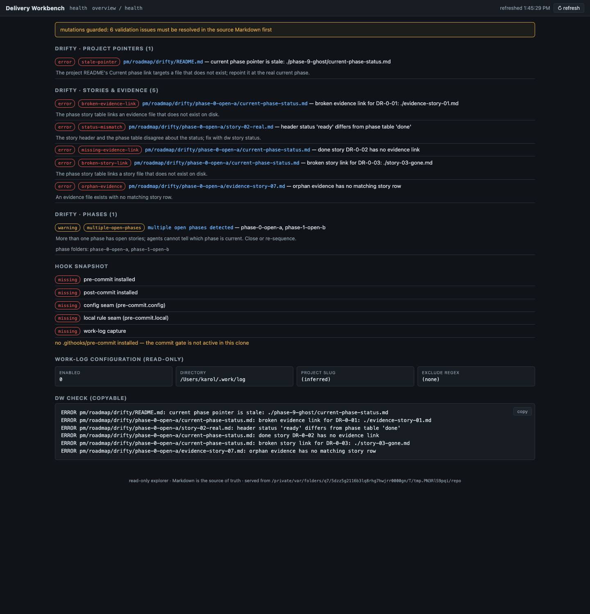
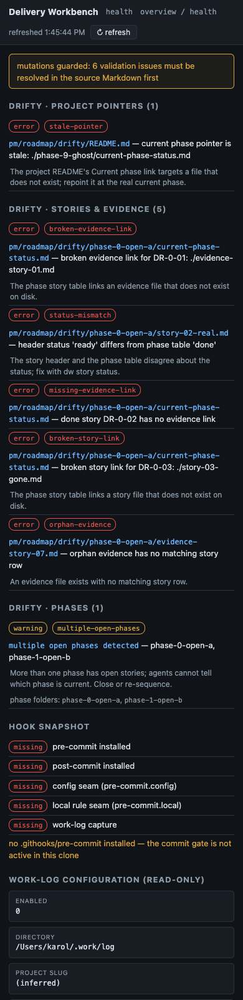
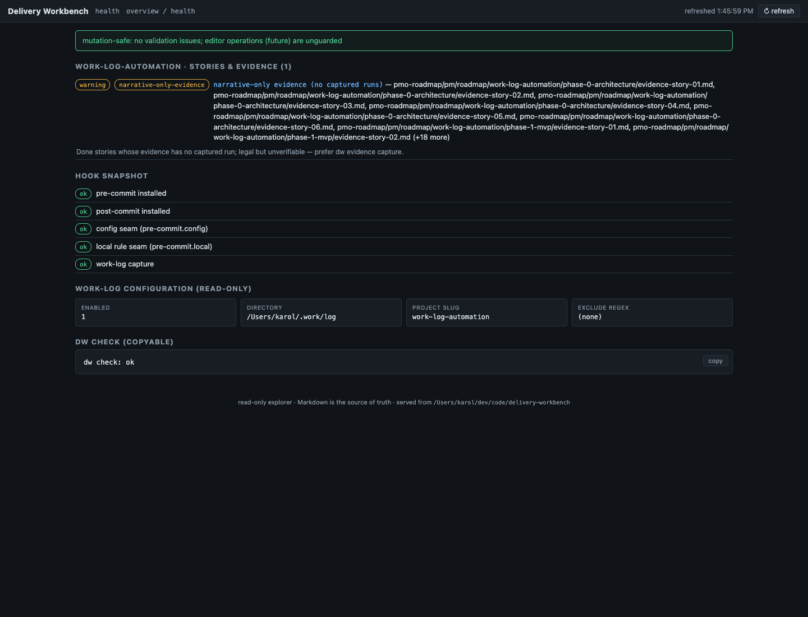

# Evidence - WLA-5-04

- **Story:** WLA-5-04 - Build health drift and validation console
- **Status:** done
- **Date:** 2026-07-02

## What shipped

- **Structured health classification in the core**
  (`dw_pmo/validate.py`): `classify_issue` / `classify_warning` map
  every string `check_project` and `project_warnings` emit to a stable
  kind + category (project / phase / story-evidence / hook-runtime),
  with severities, source paths, human explanations for the
  drift-prone kinds, and parsed `phase_folders` on the
  multiple-open-phases warning. `hook_seam_explanations` names exactly
  which seams an older hook snapshot is missing and points at
  `update.sh` (never overwriting hooks). `health_report` aggregates it
  all — including a `mutation_safe` flag per project and overall (the
  refusal-state handoff the editor stories consume) and a copyable
  `dw check`-format output block. A unit test guards the
  string-to-kind coupling for every issue and warning type.
- **`GET /api/health`** on the workbench server, and the **health
  console** view (`#/health`, linked from the topbar and from every
  project's guard banner): issues grouped by project and category with
  severity + kind chips (stale pointers visibly distinct from broken
  links), explanation lines, source-file links, the hook snapshot
  panel with per-seam status and remediation notes, the read-only
  work-log configuration panel, and the copyable `dw check` block with
  a clipboard button. Project views now show a "mutations guarded"
  banner linking here whenever validation issues exist — drift is
  never hidden to make the UI look clean.

## Screenshots (headless Firefox)





The drift-fixture shot shows the console at its noisiest and most
accurate: six errors across stale-pointer, broken-evidence-link,
status-mismatch, missing-evidence-link, broken-story-link, and
orphan-evidence kinds, the multiple-open-phases warning with both
folders named, a fully missing hook snapshot with the explanation, and
the copyable ERROR block.

## Acceptance proof

Unit (58-test core suite): a classifier case per issue/warning kind,
`health_report` shape and the `mutation_safe` guard flipping on
introduced drift, and `hook_seam_explanations` for missing/partial
hooks. Integration (`workbench-explorer.sh`, CI-run on both OSes): a
drift fixture with a stale pointer, two open phases, broken story and
evidence links, missing evidence, and orphan evidence asserts every
kind, the parsed phase folders, the explanations, the ERROR block, and
that the clean project stays `mutation_safe`. Keyboard navigation is
anchor-based throughout (all issue paths are tab-reachable links);
density verified in the desktop and mobile screenshots.

## Proof — captured runs (appended by `dw evidence capture`)

### Captured run — 2026-07-02T19:47:04Z

- **Command:** `pmo-roadmap/tests/workbench-explorer.sh`
- **Cwd:** .
- **Exit code:** 0
- **Index-tree:** 61a99cad71bd9bcd532a002825285db6abde7b48

```text
workbench-explorer.sh: ok
```

### Captured run — 2026-07-02T19:47:05Z

- **Command:** `python3 pmo-roadmap/tests/dw-core-tests.py`
- **Cwd:** .
- **Exit code:** 0
- **Index-tree:** 61a99cad71bd9bcd532a002825285db6abde7b48

```text
test_agent_docs_block_lifecycle (__main__.DwCoreTest.test_agent_docs_block_lifecycle) ... ok
test_apply_returns_changes_and_validation (__main__.DwCoreTest.test_apply_returns_changes_and_validation) ... ok
test_capture_appends_and_records (__main__.DwCoreTest.test_capture_appends_and_records) ... ok
test_capture_truncation_marker (__main__.DwCoreTest.test_capture_truncation_marker) ... ok
test_check_broken (__main__.DwCoreTest.test_check_broken) ... ok
test_check_clean (__main__.DwCoreTest.test_
[PMO_EVIDENCE_OUTPUT_TRUNCATED]
```
