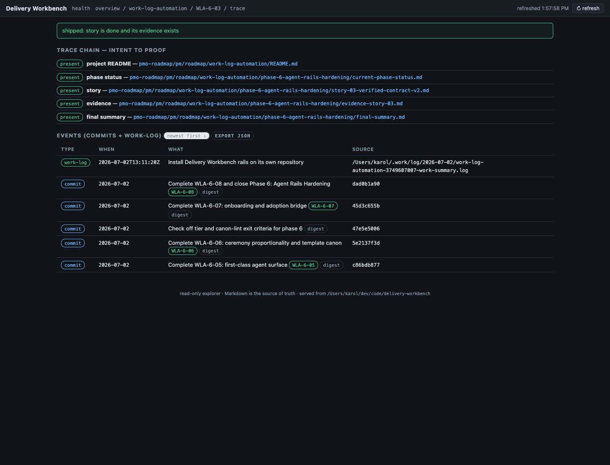
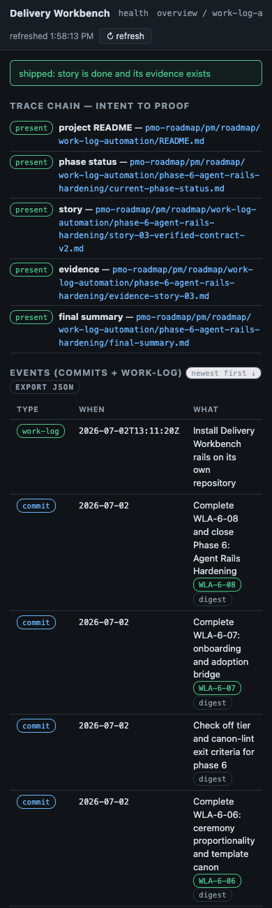
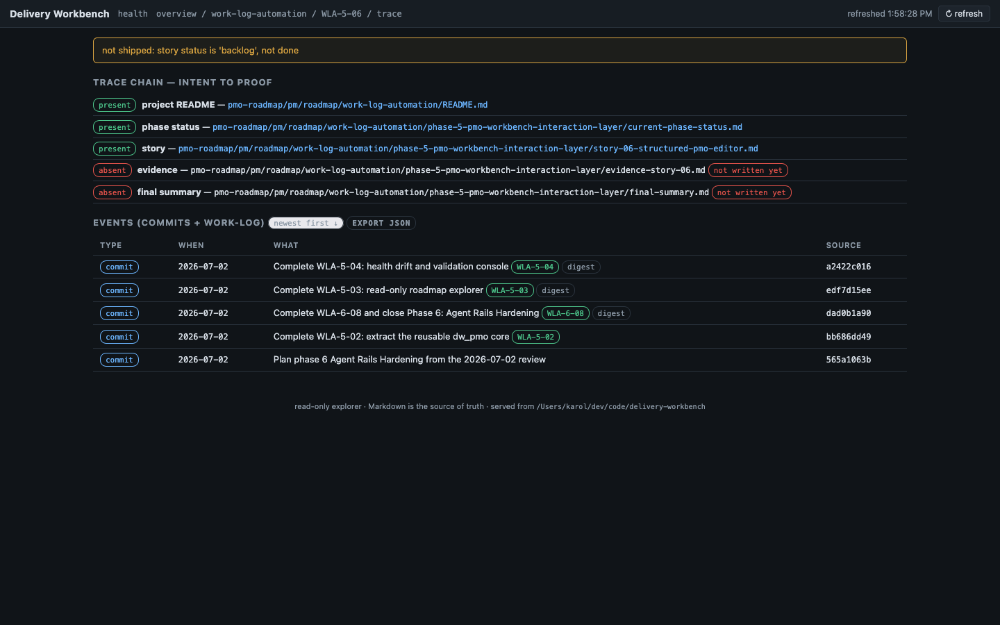

# Evidence - WLA-5-05

- **Story:** WLA-5-05 - Build traceability timeline
- **Status:** done
- **Date:** 2026-07-02

## What shipped

- **`story_timeline` in the core** (`dw_pmo/api.py`): the normalized
  intent-to-proof model. The chain names all five hops (README, phase
  status, story, evidence, final summary) with explicit exists flags —
  absent links render as absent states, never disappear. Events merge
  recent commits (scoped to the story's PMO files via `git log --`,
  carrying `PMO-Story` and `PMO-Contract-Digest` trailers where
  stamped) with work-log entries (honoring the
  config > environment > default `PMO_WORK_LOG_DIR` resolution,
  degrading to empty when no log root exists), normalized to a common
  sortable shape and ordered newest-first. `shipped` is asserted only
  when story status is done AND evidence exists; otherwise
  `not_shipped_reason` says exactly which half is missing.
  `phase_events` scopes recent commits to the phase directory for the
  phase trace view.
- **API:** `GET /api/projects/{slug}/trace/{id}` (this endpoint IS the
  agent-facing JSON export — the UI's "export JSON" button links
  straight to it) and `GET /api/projects/{slug}/phases/{n}/events`.
  (The plan sketched `/api/trace/{story}`; the shipped route is
  project-scoped to avoid cross-project story-ID ambiguity.)
- **UI:** the `#/p/{slug}/t/{id}` timeline — shipped/not-shipped
  banner, the five-hop chain with present/absent chips and source
  links, and the merged events table with type chips, PMO-Story
  badges, digest chips (full digest on hover), a newest/oldest sort
  toggle, and the export-JSON link. Story detail and phase story rows
  link to the trace; the phase view gains a recent-commits section
  that degrades to an explicit no-git message.

## Screenshots (headless Firefox, this repository)





The shipped shot traces WLA-6-03: all five hops present, and the
events table shows the Phase 6 audit trail live — trailer-stamped
commits with story badges and digest chips merged with the day's
work-log entry, newest first. The unshipped shot proves the guard:
WLA-5-06 renders "not shipped: story status is 'backlog'" with the
evidence hop explicitly absent.

## Acceptance proof

Unit (62-test core suite, all four trace quadrants): no-git fixture —
chain complete, absent final-summary explicit, events empty; work-log
only — entry normalized with timestamp sort key; git+work-log — a
trailer-stamped commit event (PMO-Story matches, digest present)
merges with a work-log entry, sorted newest-first; and the
never-claims-shipped matrix (ready story → status reason; done story
with evidence deleted → evidence reason). Integration
(`workbench-explorer.sh`, both OSes): trace before the log root exists
(clean degrade), live pickup of a work-log entry written after server
start, the unshipped state, 404 for unknown stories, and phase events
degrading without git.

## Proof — captured runs (appended by `dw evidence capture`)

### Captured run — 2026-07-02T19:59:33Z

- **Command:** `pmo-roadmap/tests/workbench-explorer.sh`
- **Cwd:** .
- **Exit code:** 0
- **Index-tree:** 338e8dd381dbd5584cccda4d2849d3b7d0181398

```text
workbench-explorer.sh: ok
```

### Captured run — 2026-07-02T19:59:35Z

- **Command:** `python3 pmo-roadmap/tests/dw-core-tests.py`
- **Cwd:** .
- **Exit code:** 0
- **Index-tree:** 338e8dd381dbd5584cccda4d2849d3b7d0181398

```text
test_agent_docs_block_lifecycle (__main__.DwCoreTest.test_agent_docs_block_lifecycle) ... ok
test_apply_returns_changes_and_validation (__main__.DwCoreTest.test_apply_returns_changes_and_validation) ... ok
test_capture_appends_and_records (__main__.DwCoreTest.test_capture_appends_and_records) ... ok
test_capture_truncation_marker (__main__.DwCoreTest.test_capture_truncation_marker) ... ok
test_check_broken (__main__.DwCoreTest.test_check_broken) ... ok
test_check_clean (__main__.DwCoreTest.test_
[PMO_EVIDENCE_OUTPUT_TRUNCATED]
```
