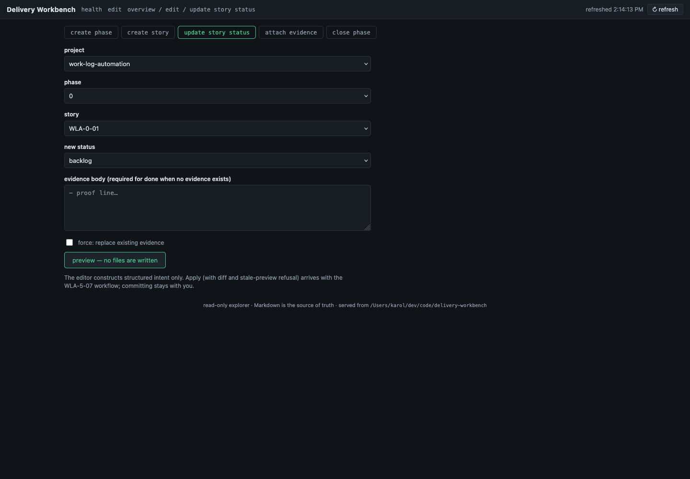
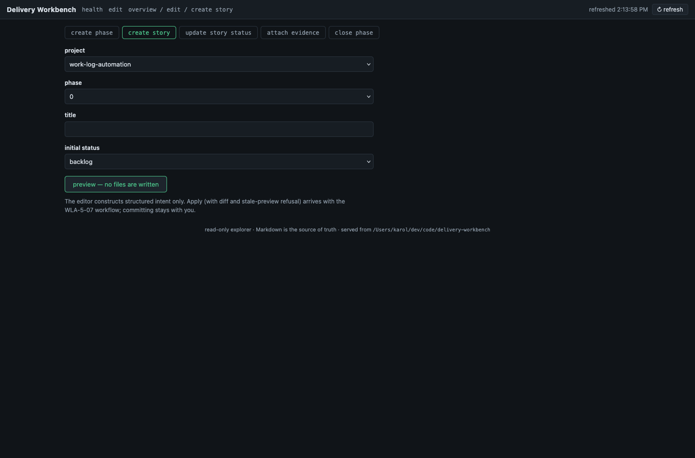
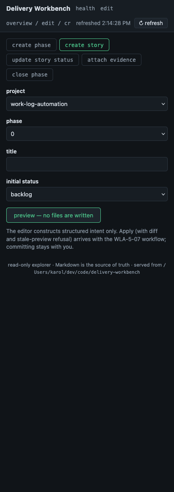

# Evidence - WLA-5-06

- **Story:** WLA-5-06 - Build structured PMO editor
- **Status:** done
- **Date:** 2026-07-02

## What shipped

- **The mutation-intent layer** (`dw_pmo/workbench.py`):
  `build_mutation_plan` maps five request kinds — `create_phase`,
  `create_story`, `update_story_status`, `attach_evidence`,
  `close_phase` — one-to-one onto the core plan builders
  (`plan_phase_create`, `plan_story_create`, `plan_story_status`,
  `plan_story_evidence`, `plan_phase_close`). No editor-side rewriting
  of Markdown: the same render/replace primitives that own the
  metadata and table regions produce every byte, so hand-authored
  prose outside owned regions is preserved by construction.
- **`POST /api/mutations/preview`** — the only POST route in this
  slice, and it writes nothing (plan builders are pure reads; the
  suite proves checksum invariance across previews). The response
  carries the planned per-file contents (`new_content`), create/update
  actions, byte deltas, and a **deterministic fingerprint**
  (`plan_fingerprint`: sha256 over kind + every target's before/after
  content) — the token WLA-5-07's apply will verify for stale-preview
  refusal. All other POST paths, including `/api/mutations/apply`,
  still 405.
- **Refusals live server-side in core semantics:** done-without-
  evidence, unknown status vocabulary, phase-directory collisions,
  non-integer phase numbers, evidence-replacement without force, and
  close-with-open-stories without force all return the core's own
  error messages. The 5-04 handoff is enforced: previews return 409
  while the project has validation issues unless the request carries
  `acknowledge_issues: true` (so remediation edits stay possible).
- **The `#/edit` UI:** five tabbed forms with populated selects
  (project, phase, story, status vocabulary), client-side refusal for
  the done-without-evidence case, force checkboxes labeled with the
  core's force semantics, the mutations-guarded banner with an
  explicit acknowledgment checkbox, and a preview renderer showing
  the plan summary, fingerprint, created directories, and collapsible
  source previews per file. The submit button says what it does:
  "preview — no files are written"; the footer note names the 5-07
  handoff. Committing stays with the operator.

## Screenshots (headless Firefox, this repository)





## Acceptance proof

Unit (66-test core suite): the one-to-one dispatch map for all five
kinds with checksum-proved write-nothing previews; the refusal matrix
(unknown kind, missing fields, integer validation, collisions,
done-without-evidence, bad vocabulary, open-story close, force
semantics); the 409 guard flipping on introduced drift and unlocking
with acknowledgment; fingerprint determinism (identical intent on an
identical tree) and content-binding (target edits change it); and
apply's 405 absence. Integration (both OSes): live preview of
create_story with content assertions, server-side done refusal,
malformed JSON 400, the 409/acknowledge cycle against an orphan-
evidence fixture, and tree checksums held across all previews. The
captured run below shows a real preview response against this
repository.

## Proof — captured runs (appended by `dw evidence capture`)

### Captured run — 2026-07-02T20:15:36Z

- **Command:** `pmo-roadmap/tests/workbench-explorer.sh`
- **Cwd:** .
- **Exit code:** 0
- **Index-tree:** f82570c6c0ff52a821ebe95f65f0a755762f0647

```text
workbench-explorer.sh: ok
```

### Captured run — 2026-07-02T20:15:37Z

- **Command:** `sh -c 
python3 pmo-roadmap/bin/dw-workbench --root . --port 8383 & SPID=$!
sleep 1.5
curl -s -X POST -H "Content-Type: application/json" \
  -d "{\"kind\":\"create_story\",\"project\":\"work-log-automation\",\"phase\":\"5\",\"title\":\"Preview demo story\"}" \
  http://127.0.0.1:8383/api/mutations/preview | python3 -m json.tool | head -28
kill $SPID`
- **Cwd:** .
- **Exit code:** 0
- **Index-tree:** f82570c6c0ff52a821ebe95f65f0a755762f0647

```text
{
    "data": {
        "error": "project has validation issues; mutations are guarded",
        "hint": "resolve them in the source Markdown (see /api/health) or resend with acknowledge_issues: true",
        "issues": [
            "pmo-roadmap/pm/roadmap/work-log-automation/phase-5-pmo-workbench-interaction-layer/evidence-story-06.md: evidence exists but matching story is not done"
        ]
    },
    "generated_at": "2026-07-02T20:15:38Z",
    "issues": [
        "pmo-roadmap/pm/roadmap/work-log-automation/phase-5-pmo-workbench-interaction-layer/evidence-story-06.md: evidence exists but matching story is not done"
    ],
    "kind": "delivery-workbench-workbench-response",
    "ok": false,
    "schema_version": 1,
    "warnings": []
}
```
