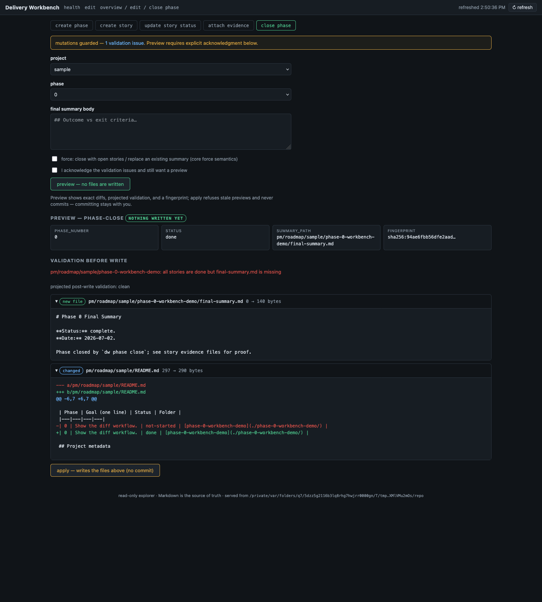
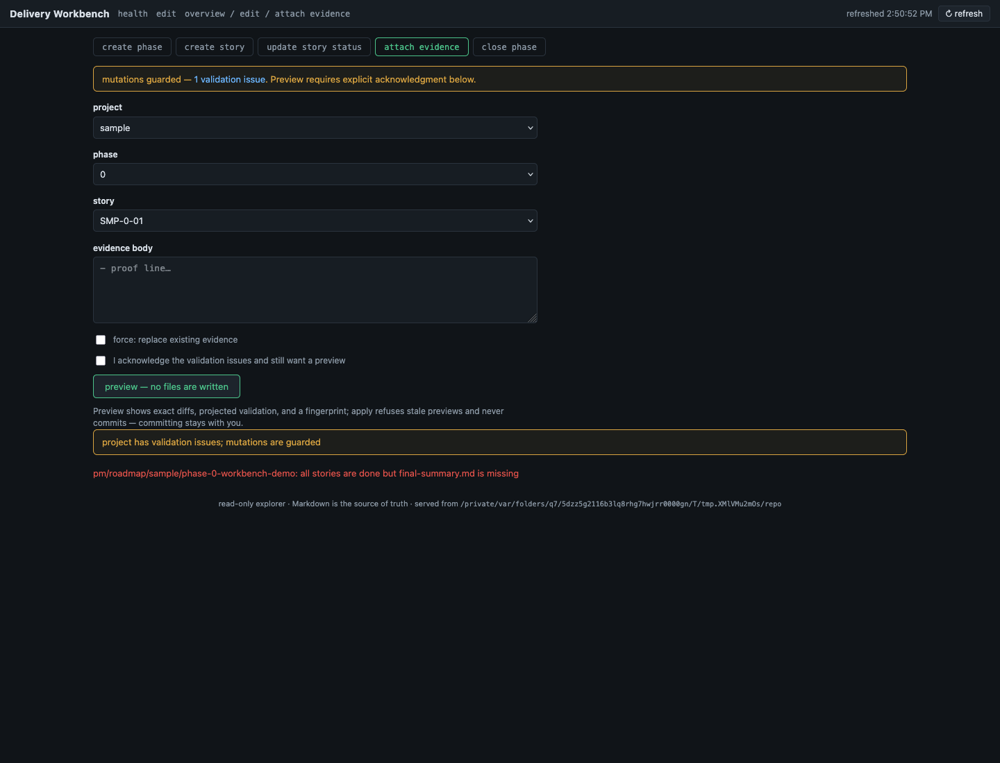
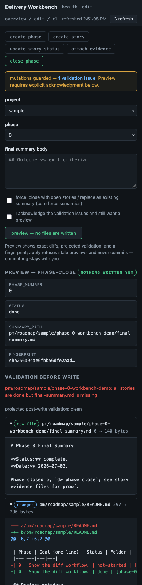

# Evidence - WLA-5-07

- **Story:** WLA-5-07 - Build safe mutation preview and diff workflow
- **Status:** done
- **Date:** 2026-07-02

## What shipped

- **Diffs and projections in the preview** (`dw_pmo/mutations.py`):
  `preview_plan` gains unified diffs per changed file and a top-level
  `no_op` flag; `projected_issues` mirrors the project's roadmap tree
  into a scratch directory, overlays the planned contents, and runs
  the same validator — so every preview carries `issues_before` and
  `issues_after` (or an explicit "projection unavailable" null; it
  never blocks a preview).
- **`POST /api/mutations/apply`**: requires the preview's fingerprint;
  rebuilds the plan against the current tree and refuses with 409
  when the recomputed fingerprint differs — which catches both source
  drift after the preview AND tampered intent, since the fingerprint
  binds kind + every target's before/after content. Writes go through
  the core's rollback-protected `apply_plan` (fingerprint re-checked a
  second time at write level), and non-core failures return a
  `rolled_back: true` envelope. Post-apply revalidation runs the same
  `check_project` and ships in the response.
- **A design decision worth recording — the remediation exemption:**
  the validation-issues guard deadlocked against itself the moment all
  stories were done (`dw check` flags the missing final summary, which
  guarded the close_phase that writes it). Rather than forcing
  acknowledgment for fixes, the guard now computes the plan's
  projected issues first: a mutation whose projected issue set is a
  **strict subset** of the current one is a fix, and a fix is never
  ambiguous — it passes without acknowledgment. Unrelated mutations
  under drift still 409.
- **UI:** the preview now renders new-file panels (full content),
  changed-file panels (colored unified diff), and unchanged-owned
  files distinctly; validation-before-write in red, projected
  post-write validation, the no-op badge ("repeating this mutation
  changes nothing"), and the apply button ("writes the files above —
  no commit"). Apply renders the post-apply state: files written with
  source links, revalidation results, and the stale-refusal banner on
  409. A `&autopreview=1` snapshot affordance renders the workflow for
  headless capture.

## Screenshots (headless Firefox, fixture repo)





The desktop shot shows the whole story on one screen: the guard
banner, the fingerprint, the missing-final-summary error before the
write, the clean projection after it, the new final-summary file, the
colored README diff (not-started → done), and the apply button.

## Acceptance proof

Unit (72-test core suite): the full apply cycle with post-apply
revalidation; stale refusal after the tree changes under a
fingerprint; tampered-intent refusal (same fingerprint, different
title); explicit no-op idempotence (byte-identical tree after a no-op
apply); projection seeing the future (attaching evidence to a
non-done story projects the premature-evidence issue); the
remediation exemption (unrelated mutation 409s under drift, the
healing mutation passes and lands clean); and the core rollback path
(first write restored when a later write fails). Integration (both
OSes): live preview→apply cycles for create story, done-with-evidence
(twice), close phase (through the remediation exemption, without
acknowledgment), stale-fingerprint refusal, missing-fingerprint 400,
and `dw check` green after every apply.

## Proof — captured runs (appended by `dw evidence capture`)

### Captured run — 2026-07-02T20:51:58Z

- **Command:** `pmo-roadmap/tests/workbench-explorer.sh`
- **Cwd:** .
- **Exit code:** 0
- **Index-tree:** 5d8531c6e0590d3ed962f562f879ae0563fa7a16

```text
workbench-explorer.sh: ok
```

### Captured run — 2026-07-02T20:52:00Z

- **Command:** `python3 pmo-roadmap/tests/dw-core-tests.py`
- **Cwd:** .
- **Exit code:** 0
- **Index-tree:** 5d8531c6e0590d3ed962f562f879ae0563fa7a16

```text
test_agent_docs_block_lifecycle (__main__.DwCoreTest.test_agent_docs_block_lifecycle) ... ok
test_apply_cycle_and_stale_refusal (__main__.DwCoreTest.test_apply_cycle_and_stale_refusal) ... ok
test_apply_refuses_tampered_intent (__main__.DwCoreTest.test_apply_refuses_tampered_intent) ... ok
test_apply_returns_changes_and_validation (__main__.DwCoreTest.test_apply_returns_changes_and_validation) ... ok
test_apply_rolls_back_on_write_failure (__main__.DwCoreTest.test_apply_rolls_back_on_write_failu
[PMO_EVIDENCE_OUTPUT_TRUNCATED]
```
