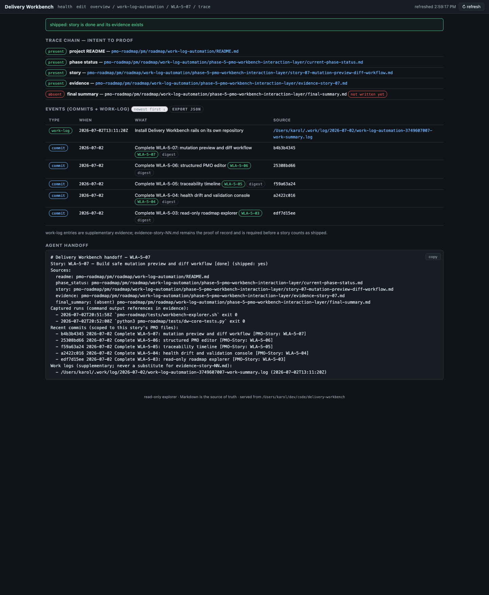
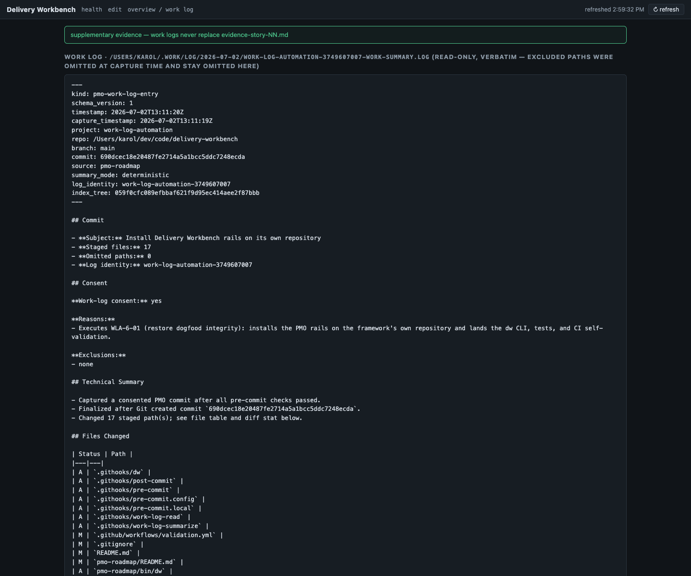

# Evidence - WLA-5-08

- **Story:** WLA-5-08 - Integrate commit and work-log evidence views
- **Status:** done
- **Date:** 2026-07-02

## What shipped

- **`GET /api/worklog?path=…`** — reads work-log artifacts from
  *outside* the repo under strict containment: only files inside the
  resolved `PMO_WORK_LOG_DIR` root (config > environment > default),
  only the capture/digest naming patterns
  (`*-work-summary.log` / `*-deferred-summary.md`), tolerant of
  hash-router slash-stripping. Repo files and stray names get 403; an
  absent log root answers "work logs are optional evidence", not an
  error. Content is verbatim — excluded paths were omitted at capture
  time and stay omitted, because their content never existed in the
  log (proved by the omission unit test).
- **`GET /api/projects/{slug}/handoff/{id}`** — the concise agent
  handoff (`handoff_summary` in the core): story identity and shipped
  verdict, all five PMO source paths with explicit absent markers,
  **captured-run references from the evidence file** (timestamp,
  command, exit code — or "narrative-only" / "no evidence file exists
  yet — required before done"), PMO-scoped recent commits with their
  `PMO-Story` trailers, and work-log pointers labeled
  "supplementary; never a substitute for evidence-story-NN.md".
  Deterministic text, ready to paste into a task or commit-contract
  context.
- **UI:** trace-view work-log events are now links into a `#/wl/…`
  viewer (verbatim content under the supplementary-evidence banner);
  the events table carries the proof-of-record note; the empty state
  reads "optional evidence — absent, not an error"; and every story
  trace ends in an **Agent handoff** panel with a copy button.

## Screenshots (headless Firefox, this repository)




The handoff shot is this afternoon in one frame: WLA-5-07's trace with
five trailer-stamped story commits, today's work-log entry linked as a
source, and the handoff block quoting the evidence file's actual
captured runs (integration and unit suites, exit 0).

## Acceptance proof

Unit (76-test core suite): work-log containment (absolute, slashless,
and relative resolution all inside the log root; repo paths and
non-log names 403; missing entries 404), the omitted-paths guarantee,
the optional-not-error absent root, and handoff text assertions for
both a shipped story (paths, captured runs, commits, supplementary
labeling) and an evidence-less story (requirement stated, shipped:
no). Integration (both OSes): the endpoint serving the fixture entry,
non-log refusal, and handoff content over HTTP. The captured run below
is the real handoff for WLA-5-07 produced against this repository.

## Proof — captured runs (appended by `dw evidence capture`)

### Captured run — 2026-07-02T21:00:37Z

- **Command:** `pmo-roadmap/tests/workbench-explorer.sh`
- **Cwd:** .
- **Exit code:** 0
- **Index-tree:** 7764f1757cd0bc934e3bda61f0e08048b819a6bb

```text
workbench-explorer.sh: ok
```

### Captured run — 2026-07-02T21:00:39Z

- **Command:** `sh -c 
python3 pmo-roadmap/bin/dw-workbench --root . --port 8387 & SPID=$!
sleep 1.5
curl -s http://127.0.0.1:8387/api/projects/work-log-automation/handoff/WLA-5-07 | python3 -c "import json,sys; print(json.load(sys.stdin)[\"data\"][\"text\"])" | head -22
kill $SPID`
- **Cwd:** .
- **Exit code:** 0
- **Index-tree:** 7764f1757cd0bc934e3bda61f0e08048b819a6bb

```text
# Delivery Workbench handoff — WLA-5-07
Story: WLA-5-07 — Build safe mutation preview and diff workflow [done] (shipped: yes)
Sources:
  readme: pmo-roadmap/pm/roadmap/work-log-automation/README.md
  phase_status: pmo-roadmap/pm/roadmap/work-log-automation/phase-5-pmo-workbench-interaction-layer/current-phase-status.md
  story: pmo-roadmap/pm/roadmap/work-log-automation/phase-5-pmo-workbench-interaction-layer/story-07-mutation-preview-diff-workflow.md
  evidence: pmo-roadmap/pm/roadmap/work-log-automation/phase-5-pmo-workbench-interaction-layer/evidence-story-07.md
  final_summary: (absent) pmo-roadmap/pm/roadmap/work-log-automation/phase-5-pmo-workbench-interaction-layer/final-summary.md
Captured runs (command output references in evidence):
  - 2026-07-02T20:51:58Z `pmo-roadmap/tests/workbench-explorer.sh` exit 0
  - 2026-07-02T20:52:00Z `python3 pmo-roadmap/tests/dw-core-tests.py`
[PMO_EVIDENCE_OUTPUT_TRUNCATED]
```
